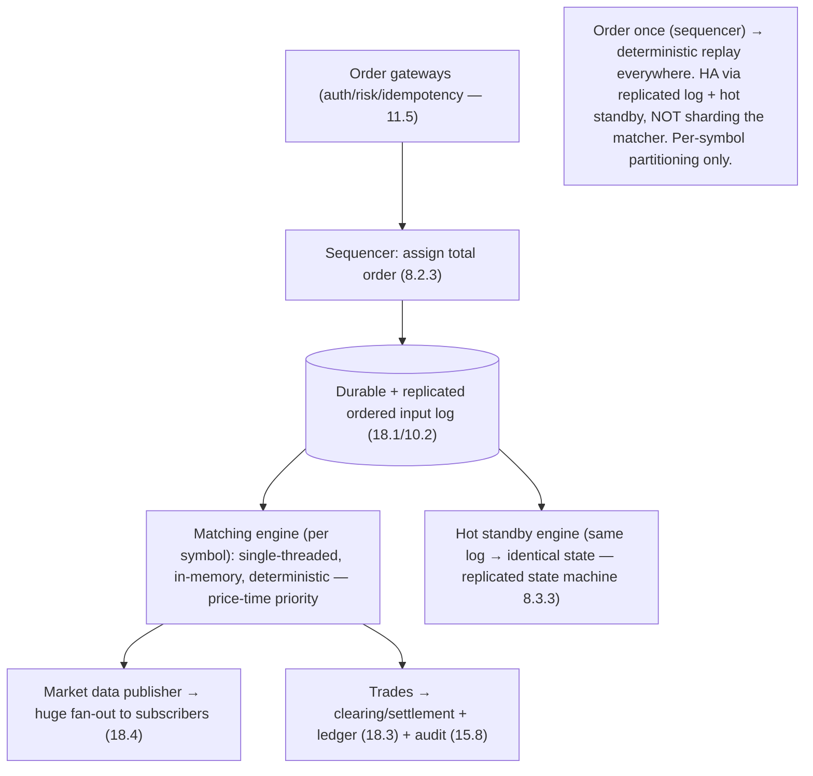

# Lesson 19.2.10 — Design a Stock Exchange / Matching Engine

> Part 19 · Module 19.2 (Volume 2) · Difficulty: ⚫ · *Interview design*
>
> **Prerequisites:** [8.2.3 Total vs Partial Order], [10.6 Linearizability], [11.5 Idempotency], [11.2 Failover], [18.3 Ledger], [17.2 Tail Latency], [1.3.1 Framework].
> **Unlocks:** [Part 20 Capstone].

---

## 1. Learning Objectives

After this lesson you will be able to:

- Design a **stock exchange / order matching engine** end-to-end (framework — 1.3.1) — a **low-latency + strict-correctness + strict-ordering** design.
- Design the **matching engine** (limit order book, price-time priority) and why it's often a **single-threaded, in-memory, deterministic** component.
- Explain why **deterministic total ordering** (8.2.3) + a **sequenced input log** is the backbone (replay, fault tolerance, audit).
- Achieve **fault tolerance for a single logical engine** via a **replicated state machine** (deterministic replay from the ordered input log — 11.2/8.3.3).
- Handle deep dives: **fairness/ordering**, **ultra-low latency** (17.2), **market data fan-out**, and **correctness/audit** (18.3).

---

## 2. Problem statement

Design a **stock exchange / matching engine**: accept **buy/sell orders**, **match** them according to strict rules (price-time priority), execute **trades**, and publish **market data** (order book + trade feed). This is the extreme corner of system design: **microsecond-latency**, **absolute correctness** (money + regulated fairness), and **strict deterministic ordering** — you cannot lose, reorder, duplicate, or mis-match orders. It flips the usual "scale horizontally" instinct: the matching core is often a **single deterministic sequenced component**, made fault-tolerant by **replication of an ordered input log**, not by sharding the match logic.

---

## 3. The design (framework — 1.3.1)

### 3.1 Requirements

`[BP]`
- **Functional:** submit/cancel orders (limit, market); **match** by **price-time priority** (best price first, then earliest — fairness); execute trades; maintain the **order book** per symbol; publish **market data** (book + trades).
- **Non-functional:** **ultra-low latency + determinism** (microseconds, predictable — 17.2); **absolute correctness** (no lost/duplicate/mis-ordered orders — money + regulation); **strict ordering + fairness** (order arrival order is legally meaningful — 8.2.3); **durability + auditability** (18.3); **HA** (an exchange outage is catastrophic).
- `[BP]` **Key signal:** this is **not** a "scale-out throughput" problem — it's **latency + determinism + strict total ordering + correctness**. Drive to a **sequenced input log + deterministic matching engine + replicated state machine**.

### 3.2 The matching engine (the core)

`[CS]` `[BP]`:
- **Limit order book** per symbol: bids + asks sorted by **price**, then **time** (price-time priority). An incoming order matches against the best opposite price; partial fills, remainder rests on the book.
- **Single-threaded, in-memory, deterministic per symbol:** the matching logic runs as a **fast in-memory** structure. Making it **single-threaded per symbol** removes locking/concurrency nondeterminism → **deterministic** (same input order → same output) and **extremely fast** (no lock contention, cache-friendly — 17.3). Different symbols run on different engines (partition by symbol — the *only* clean sharding axis — 7.3).
- `[BP]` **Deterministic single-threaded in-memory matching per symbol** — counterintuitive but standard for exchanges (correctness + latency > raw parallelism).

### 3.3 Sequencing + the input log (total order — 8.2.3)

`[CS]` The backbone `[BP]`:
- All incoming orders for a symbol pass through a **sequencer** that assigns a **strict total order** (a monotonic sequence number — 8.2.3) and appends them to a **durable, ordered input log** (18.1) **before** matching.
- The matching engine consumes the log **in order**; because matching is **deterministic**, the **(ordered input log + deterministic engine) fully determines all trades** → you can **replay** the log to reconstruct exact state (recovery, audit, testing).
- `[BP]` **Sequenced input log + deterministic engine = a replicated state machine (8.3.3):** ordering is decided **once** (at the sequencer), then everything downstream is deterministic replay. This is *the* architectural idea.

### 3.4 Fault tolerance — replicated state machine (11.2 / 8.3.3)

`[BP]`
- You can't shard the match logic for a symbol (ordering must be total), so HA comes from **replication of the deterministic state machine**: replicate the **ordered input log** to **standby engines** that consume the **same sequence** and thus reach the **identical state**. On primary failure, a **hot standby** (already caught up via the same log) **takes over** (11.2 failover) with **no state loss** — deterministic replay guarantees they agree.
- Persist the log durably (+ replicate synchronously — 10.2 — for zero RPO on committed orders). Sequencing itself may use consensus (8.3.3) for a fault-tolerant total order.
- `[BP]` **HA = replicate the ordered input + deterministic replay + hot-standby failover** (not sharding the matcher).

### 3.5 HLD

`[BP]`
- **Gateways** (order entry): validate, authenticate, risk-check → forward to the **sequencer**.
- **Sequencer:** assign total order + append to the **durable, replicated input log** (§3.3).
- **Matching engine(s):** per-symbol deterministic in-memory matcher consuming the log (§3.2); emits trades + book updates.
- **Market data publisher:** fan-out the trade + order-book feed to many subscribers (huge read fan-out — 18.4/multicast) — the read-heavy side.
- **Post-trade:** clearing/settlement + the **ledger** (18.3) + audit (immutable log — 15.8).

### 3.6 Deep dives + bottlenecks

`[BP]`
- **Ordering/fairness** (§3.3): the sequencer's total order **is** fairness (price-time priority depends on a well-defined arrival order — legally significant — 8.2.3).
- **Ultra-low latency** (17.2): in-memory, single-threaded (no locks), kernel-bypass networking, colocation, tail-latency obsession (p99.9 matters — 17.2); determinism aids predictability.
- **Market data fan-out:** the trade/book feed goes to **enormous numbers of subscribers** → read-side scale-out (multicast/fan-out — 18.4/18.8) — decoupled from the matching core.
- **Correctness + audit** (18.3/15.8): replayable ordered log = perfect audit trail + deterministic recovery; the ledger records settlements.
- **Idempotency** (11.5): order gateways dedup resends by client order ID (no duplicate orders).
- **Bottleneck:** the single per-symbol engine's throughput → mitigated by **per-symbol partitioning** (7.3, different symbols on different engines) + raw in-memory speed; you **cannot** parallelize a single symbol's matching (ordering). This is the deliberate design constraint.
- `[BP]` **The lesson:** matching engine = **sequenced total-order input log (8.2.3) + deterministic single-threaded in-memory matching per symbol + replicated-state-machine HA (deterministic replay — 11.2/8.3.3) + massive read-side market-data fan-out + ledger/audit (18.3)**. Correctness + latency + strict ordering trump horizontal parallelism.

---

## 4. Visual Intuition

---

## 5. Real-World Analogy

Think of a **single, scrupulously fair auctioneer** for one item, whose every call is tape-recorded.

- **Sequencer = a ticket-stamping clerk at the door:** every bid gets a **strict sequence number** the instant it arrives, so there's **one undisputed order** of who bid when — fairness is decided **at the door**, once.
- **Deterministic matching = the auctioneer follows fixed rules exactly:** best price wins, ties broken by who was first. Given the **same ordered stream of bids**, the auctioneer **always** produces the **same trades** — no improvisation, no coin-flips.
- **Single auctioneer per item = no committee confusion:** one item, one auctioneer, one thread of decisions — so there's never disagreement about what happened. Different items get different auctioneers (partition by symbol).
- **Replicated state machine = an understudy watching the same tape:** a backup auctioneer listens to the **exact same stamped bid stream** and, following the identical rules, arrives at the **identical book**. If the main auctioneer collapses, the understudy — already in perfect sync — **takes over instantly** with nothing lost.
- **Market data fan-out = the giant scoreboard:** while the auction core is one careful voice, its results are **broadcast to a huge crowd** — that broadcasting scales out separately.
- **Why not many auctioneers for one item?** Because two auctioneers selling the same item at once would **disagree on order and fairness** — the one thing an exchange can never allow.

---

## 6. Industry Example

- **Exchange matching engines (NASDAQ/NYSE/LSE-style)** `[CONV]`: deterministic in-memory price-time-priority matching per symbol (§3.2). *(Representative.)*
- **Sequenced input log + deterministic replay** `[CONV]`: order-once-then-replay as the backbone (§3.3, 8.2.3/18.1). *(Representative.)*
- **Replicated state machine HA** `[CONV]`: hot standbys consuming the same ordered log (§3.4, 8.3.3/11.2). *(Representative.)*
- **Ultra-low-latency engineering** `[CONV]`: in-memory, single-threaded, kernel-bypass, colocation, tail-latency focus (§3.6, 17.2). *(Representative.)*
- **Market-data multicast fan-out** `[CONV]`: broadcasting the book/trade feed at scale (§3.6, 18.4). *(Representative.)*

---

## 7. Implementation Details

- **Sequencer** assigns a strict total order → **durable, replicated ordered input log** (8.2.3/18.1/10.2) (§3.3).
- **Per-symbol deterministic single-threaded in-memory matcher** (price-time priority); partition by symbol (7.3) (§3.2).
- **Replicated state machine** HA: standbys replay the same log → identical state → instant failover (8.3.3/11.2) (§3.4).
- **Idempotent order gateways** (dedup by client order ID — 11.5); risk/auth checks (§3.5).
- **Market-data fan-out** (18.4) decoupled from matching; **ledger + immutable audit** (18.3/15.8) post-trade (§3.5/3.6).
- Ultra-low-latency techniques (17.2/17.3) throughout the hot path.

---

## 8–14. (Condensed)

**Advantages:** deterministic correctness + auditability (replay); strict fairness (sequenced total order); ultra-low predictable latency (in-memory single-thread); clean HA (replicated state machine, no data loss); read-side scales independently.
**Disadvantages/cautions:** a single symbol's matching can't be parallelized (ordering) — throughput capped by one engine (mitigated by per-symbol partitioning + speed); demands extreme engineering (latency, determinism); replication must be tight (zero RPO).
**When NOT to:** don't apply this to ordinary web systems (massive over-engineering); it's for latency-and-ordering-critical financial cores only. Conversely, don't try to horizontally shard a single symbol's matching.
**Common mistakes:** trying to scale-out a single matcher (breaks ordering); nondeterministic matching (can't replay/recover); losing/reordering orders (fairness + correctness violation); coupling market-data fan-out to the matching core; no idempotency (duplicate orders on resend).
**Interview Qs:** 🟢 What's price-time priority + the order book? 🟡 Why single-threaded in-memory deterministic matching? 🔴 How do you make it fault-tolerant without sharding the matcher (replicated state machine + ordered log)? ⚫ Full design: sequencer/total order, deterministic engine, replicated-state-machine HA, ultra-low latency, market-data fan-out, ledger/audit — and why correctness+ordering beat parallelism.
**Production pitfalls:** ordering/fairness violations; tail-latency spikes (GC/jitter — 17.2); failover state divergence (nondeterminism); market-data feed overload; recovery correctness.
**Optimizations:** in-memory lock-free single-thread; kernel-bypass/colocation; per-symbol partitioning; deterministic replay for recovery/testing; decoupled multicast market data; batch/pipeline persistence off the hot path.

---

## 15. Summary

A **stock exchange / matching engine** is the **extreme corner** of system design: **microsecond latency**, **absolute correctness** (money + regulated fairness), and **strict deterministic ordering** — orders must never be lost, reordered, duplicated, or mis-matched. It **inverts the usual scale-out instinct**: the matching core is a **single deterministic sequenced component**, made fault-tolerant by **replicating an ordered input log**, not by sharding the match logic. **Requirements:** submit/cancel orders, **match by price-time priority** (best price, then earliest — fairness), execute trades, maintain the **order book** per symbol, and publish **market data** — with ultra-low predictable latency (17.2), absolute correctness, strict ordering/fairness (arrival order is **legally meaningful** — 8.2.3), durability/auditability (18.3), and HA. The **matching engine** is a **limit order book** per symbol (bids/asks sorted by price then time), run **single-threaded, in-memory, and deterministically** — single-threading **removes concurrency nondeterminism** (same input order → same output) and is **extremely fast** (no lock contention, cache-friendly — 17.3); different symbols run on different engines (**partition by symbol — the only clean sharding axis** — 7.3). The **backbone** is a **sequencer** that assigns a **strict total order** (monotonic sequence number — 8.2.3) and appends every order to a **durable, ordered input log** (18.1) **before** matching; because matching is **deterministic**, the **(ordered log + deterministic engine) fully determines all trades**, so you can **replay** the log to reconstruct exact state — the essence of a **replicated state machine** (8.3.3): **decide ordering once (at the sequencer), then everything downstream is deterministic replay**. **Fault tolerance** follows: since you can't shard a symbol's matching (ordering must be total), replicate the **ordered input log** to **hot-standby engines** that consume the **same sequence** and reach the **identical state**, so on primary failure a caught-up standby **takes over with no state loss** (11.2), with the log persisted + synchronously replicated for **zero RPO** (10.2) and consensus for a fault-tolerant sequence (8.3.3). The **HLD**: order gateways (auth/risk/**idempotent** dedup by client order ID — 11.5) → sequencer → replicated log → per-symbol deterministic matchers → a **market-data publisher fanning the book/trade feed out to enormous numbers of subscribers** (the read-heavy side, scaled independently — 18.4) → post-trade clearing/settlement + **ledger** (18.3) + immutable **audit** (15.8). **Deep dives:** ordering/fairness (the sequencer's total order **is** fairness), ultra-low latency (in-memory, lock-free, kernel-bypass, colocation, tail-latency obsession — 17.2), market-data fan-out (decoupled), correctness/audit (replay + ledger), and idempotency. The **deliberate bottleneck** — a single per-symbol engine's throughput — is accepted (you **cannot** parallelize one symbol's matching) and mitigated by **per-symbol partitioning + raw in-memory speed**. In one line: **sequenced total-order input log + deterministic single-threaded in-memory matching per symbol + replicated-state-machine HA + massive read-side market-data fan-out + ledger/audit — correctness, latency, and strict ordering over horizontal parallelism**.

---

## 16. Revision Notes (flashcard-ready)

- **Q:** What makes this design unusual? **A:** Latency + determinism + strict total ordering + correctness over scale-out; the matcher is a single deterministic component, not sharded.
- **Q:** Matching engine shape? **A:** Per-symbol limit order book, single-threaded, in-memory, deterministic (price-time priority).
- **Q:** Why single-threaded in-memory? **A:** Removes concurrency nondeterminism (deterministic replay) + fastest (no locks, cache-friendly — 17.3).
- **Q:** Backbone? **A:** Sequencer assigns a strict total order (8.2.3) → durable ordered input log (18.1); deterministic engine replays it.
- **Q:** Why does ordered-log + deterministic engine matter? **A:** Fully determines all trades → replay for recovery/audit/testing = a replicated state machine.
- **Q:** Fault tolerance without sharding the matcher? **A:** Replicate the ordered log to hot standbys that replay the same sequence → identical state → instant failover, no loss (11.2/8.3.3).
- **Q:** Only sharding axis? **A:** By symbol (7.3) — you can't parallelize one symbol's matching (ordering).
- **Q:** Read-side scale? **A:** Market-data fan-out (book/trade feed) to many subscribers — decoupled, multicast (18.4).
- **Q:** Fairness = ? **A:** The sequencer's total arrival order (legally significant — 8.2.3) + price-time priority.
- **Q:** Latency techniques? **A:** In-memory, lock-free single-thread, kernel-bypass, colocation, tail-latency focus (17.2).

---

## 17. Further Reading + Knowledge-Graph Links

**Foundations:** [8.2.3 Total Order] · [10.6 Linearizability] · [8.3.3 Raft/RSM] · [11.2 Failover] · [18.3 Ledger] · [17.2 Tail Latency] · [11.5 Idempotency].
**External:** LMAX Disruptor (single-threaded deterministic core); exchange architecture literature. *(Representative.)*

> **Knowledge-graph:** `8.2.3 total order` + `8.3.3 RSM` + `17.2 latency` + `18.3 ledger` → **`19.2.10 matching engine`** (sequenced input log + deterministic in-memory matcher + replicated-state-machine HA + market-data fan-out).
