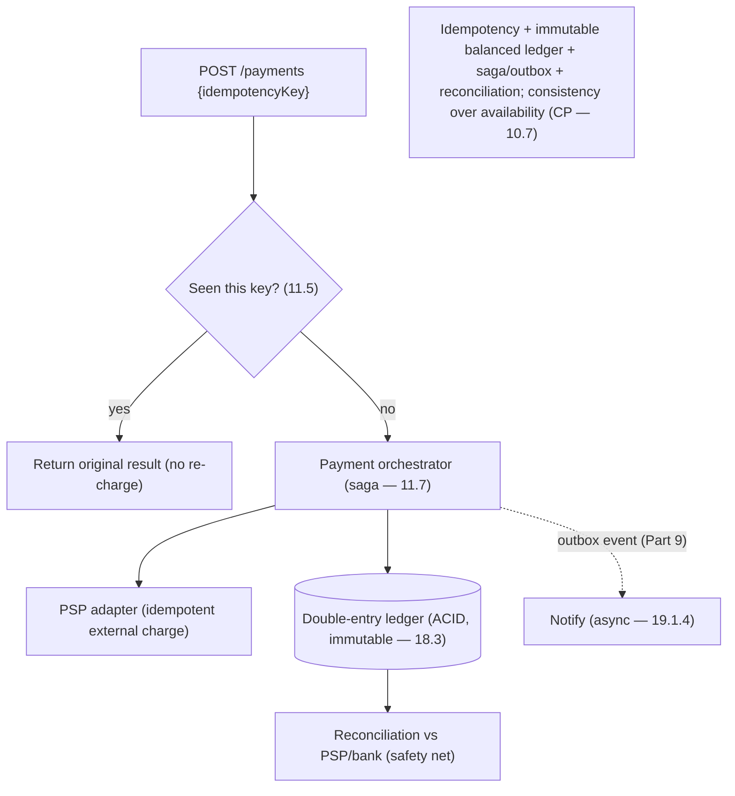

# Lesson 19.2.3 — Design a Payment System

> Part 19 · Module 19.2 (Volume 2) · Difficulty: 🔴⚫ · *Interview design*
>
> **Prerequisites:** [1.3.1 Framework], [11.5 Idempotency/Exactly-Once Effects], [11.7 Sagas], [18.3 Ledger/Globally-Distributed SQL], [5.2.1 ACID], [Part 9 Messaging/Outbox].
> **Unlocks:** [19.2.10 Matching Engine], [Part 20 Capstone (ledger)].

---

## 1. Learning Objectives

After this lesson you will be able to:

- Design a **payment system / payment gateway** end-to-end (framework — 1.3.1) where **correctness beats performance** — money must never be lost, double-charged, or created.
- Apply **idempotency** (11.5) as the central pattern — the **idempotency key** that makes retries safe (exactly-once *effects*).
- Design a **double-entry ledger** (18.3) as the source of truth (immutable, auditable, balanced).
- Orchestrate a payment across external processors + internal accounts with a **saga** (11.7) and the **outbox** (Part 9) — no dual writes.
- Handle deep dives: **reconciliation**, **consistency vs availability** (choose consistency — 10.7), **PCI scope** (15.8), and **failure/retry semantics**.

---

## 2. Problem statement

Design a **payment system** (process a customer payment: charge a card / move money, record it, notify the merchant). The dominant requirement is **financial correctness**: **no double charges, no lost payments, no money created or destroyed**, with a **complete audit trail**. Unlike most designs, **you trade latency and even availability for correctness** (10.7) — a payment that's slow is annoying; a payment that's wrong is a lawsuit. Central patterns: **idempotency (11.5)**, a **double-entry ledger (18.3)**, and a **saga (11.7)** over external processors.

---

## 3. The design (framework — 1.3.1)

### 3.1 Requirements

`[BP]`
- **Functional:** accept a payment request; charge via a **payment service provider (PSP)** (Stripe/Adyen/bank); record the transaction; handle refunds; notify merchant/user; support reconciliation.
- **Non-functional (correctness-first):** **exactly-once effects** (never double-charge — 11.5); **durability** (never lose a recorded payment); **strong consistency** for balances/ledger (10.7 — pick C over A); **auditability** (immutable record — 15.8); acceptable (not extreme) latency.
- `[BP]` **Key signal:** this is a **correctness/consistency** design, not a throughput design. The words to say: **idempotency, ledger, saga, reconciliation, exactly-once effects**. When in doubt, **favor consistency + safety** (10.7/11.4 fail-closed).

### 3.2 API + idempotency (the central pattern — 11.5)

`[BP]`
- `POST /payments { idempotencyKey, amount, currency, source, merchantId }` → payment result.
- **Idempotency key** (client-generated, unique per intended payment): the server **records the key + result**; a **retry with the same key returns the original result instead of charging again** (11.5). This is **the** defense against the fundamental problem: **the network is unreliable (8.1.1)** — a client that times out and retries must **not** double-charge. **At-least-once delivery + idempotency = exactly-once effects** (11.5/9.4).
- `[BP]` **Every state-changing payment call must be idempotent** — internally and toward the PSP (pass an idempotency key to the PSP too).

### 3.3 Data model — the double-entry ledger (18.3)

`[CS]` The source of truth is a **double-entry ledger** `[BP]`:
- Every transaction is recorded as **balanced debit + credit entries** (money moves *from* one account *to* another; totals always sum to zero). This makes the system **self-checking** (the books must balance — 18.3) and **auditable**.
- **Append-only / immutable** entries (never update/delete — corrections are new compensating entries — event-sourcing flavor — 18.1/20.7). Balances are derived (or maintained as a materialized total).
- Store in a **strongly-consistent, ACID** store (5.2.1) — a relational or NewSQL/distributed-SQL DB (18.3) — because balance correctness needs real transactions, not eventual consistency.
- `[BP]` **The ledger is sacred:** immutable, balanced, ACID, audited. It's the counterpart to 18.3 and central to Part 20.

### 3.4 Orchestration — saga + outbox (11.7 / Part 9)

`[CS]` A payment spans **multiple steps** across systems (validate → reserve/authorize → capture via PSP → record in ledger → notify) that **can't be one ACID transaction** (external PSP, multiple services — 11.6/12.4) `[BP]`:
- Use a **saga** (11.7): a sequence of **local transactions** with **compensating actions** (e.g., if capture fails after authorize, **void the authorization**; if ledger-write fails, **refund**). **Orchestration** (a payment orchestrator drives the steps) is usually preferred here for a clear, auditable flow (11.7).
- **No dual writes:** to atomically "update the DB **and** emit an event/call the next step," use the **transactional outbox** (Part 9/12.5) — write the state change + an outbox row in one local transaction; a relay publishes the event. Avoids the classic "DB committed but event lost (or vice-versa)" bug.
- **Irreversible steps last** (11.7): do reversible/internal steps before the hard-to-undo external charge where possible.

### 3.5 HLD

`[BP]`
- **Payment API** (idempotency check — §3.2) → **payment orchestrator** (saga — §3.4) → **PSP adapter** (external charge, idempotent) → **ledger service** (double-entry, ACID — §3.3) → **notification** (async — 19.1.4) → **reconciliation** (§3.6).
- **Strong consistency** on the ledger (ACID/consensus — 18.3); async only for non-critical steps (notifications).
- Everything wrapped in **resilience** (timeout/retry+idempotency/circuit-breaker — 11.3) — especially around the PSP.

### 3.6 Deep dives + bottlenecks

`[BP]`
- **Idempotency** (§3.2): the #1 correctness mechanism — keys stored, retries deduplicated (11.5).
- **Reconciliation:** periodically **compare your ledger against the PSP's/bank's records** and fix discrepancies — because distributed systems drift (a charge succeeded at the PSP but your ledger write failed, etc.). **Reconciliation is mandatory** in real payment systems — the safety net for exactly-once-effects gaps.
- **Consistency vs availability** (10.7): choose **consistency** — better to **reject/delay** a payment than to process it wrong (fail-closed — 11.4). A payment system is **CP**.
- **Exactly-once effects, not exactly-once delivery** (9.4/11.5): you can't guarantee a message is delivered exactly once, but idempotency makes the **effect** happen once.
- **PCI-DSS scope** (15.8): **don't store raw card numbers** — tokenize via the PSP; minimize the systems that touch card data to shrink compliance scope (15.8).
- **Audit trail** (15.8): immutable ledger + event log = complete, tamper-evident history.
- **Bottleneck/tradeoff:** the ledger's strong consistency limits raw throughput vs an AP system — **accepted deliberately** (correctness > speed). Scale by partitioning accounts (7.3) while keeping each account's transactions ACID.
- `[BP]` **The lesson:** payment system = **idempotency (11.5) + immutable double-entry ledger (18.3, ACID) + saga/outbox orchestration (11.7/Part 9) + reconciliation + consistency-over-availability (10.7)**. Correctness is the whole point.

---

## 4. Visual Intuition

---

## 5. Real-World Analogy

Think of a **bank's accounting department** where **every cent must be accounted for**.

- **Double-entry ledger = the accountant's balanced books:** money never appears or vanishes — it **moves** from one account to another, recorded as a matching debit and credit. If the books don't balance, something's wrong, and you catch it immediately. Entries are written in **ink, never erased** — a mistake is fixed with a **new correcting entry**, leaving a perfect audit trail.
- **Idempotency key = a reference number on a payment slip:** if you submit the same slip twice (because you weren't sure the first went through), the clerk sees the reference number, says "already processed," and hands you the original receipt — **not a second charge**.
- **Saga = a checklist across departments:** authorize the card, capture the funds, post to the ledger, notify the merchant — each a separate step, each with an **"undo"** (void the authorization, issue a refund) if a later step fails.
- **Reconciliation = end-of-day balancing:** the department compares its books against the bank's statement and investigates every discrepancy — because in the real world, messages get lost and systems disagree, and money is too important to assume it all worked.
- **Consistency over availability:** if the accountant isn't sure, they **stop and verify** rather than guess — a delayed payment beats a wrong one.

---

## 6. Industry Example

- **Idempotency keys** `[CONV]`: PSPs (Stripe-style) expose idempotency keys so client retries don't double-charge (§3.2, 11.5). *(Representative.)*
- **Double-entry ledger** `[CONV]`: the standard financial source of truth — immutable, balanced, auditable (§3.3, 18.3). *(Representative.)*
- **Saga orchestration + outbox** `[CONV]`: multi-step payment flows with compensations and no dual writes (§3.4, 11.7/Part 9). *(Representative.)*
- **Reconciliation** `[CONV]`: comparing internal ledger vs PSP/bank records (§3.6). *(Representative.)*
- **PCI tokenization** `[CONV]`: never storing raw PANs; tokenize via the processor to shrink scope (§3.6, 15.8). *(Representative.)*

---

## 7. Implementation Details

- **Idempotency keys** on every state-changing call, internally + to the PSP (§3.2, 11.5).
- **Double-entry, immutable, ACID ledger** (18.3/5.2.1) as source of truth; balances derived/materialized (§3.3).
- **Saga orchestration** with compensations, irreversible-last (11.7); **transactional outbox** for atomic state-change+event (Part 9/12.5) (§3.4).
- **Consistency over availability** (CP — 10.7); fail-closed on doubt (11.4).
- **Reconciliation** job vs PSP/bank (§3.6); **PCI tokenization** (15.8); immutable **audit log** (15.8).
- Resilience around the PSP: timeout/retry+idempotency/circuit-breaker (11.3).

---

## 8–14. (Condensed)

**Advantages:** correctness guarantees (exactly-once effects, balanced auditable ledger), safe retries, clear auditable flow, compliance-friendly.
**Disadvantages/cautions:** lower throughput than an AP design (accepted); saga complexity + compensations; reconciliation is extra machinery; strong consistency costs latency.
**When NOT to relax:** never trade correctness for speed in money movement; don't use eventual consistency for balances; don't skip idempotency or reconciliation.
**Common mistakes:** no idempotency key → double charges on retry; mutable ledger / updating balances in place (no audit); dual writes (DB + event non-atomic → lost/duplicate — use outbox); choosing availability over consistency for balances; storing raw card data (PCI blowup).
**Interview Qs:** 🟢 How do you prevent double charges on a retry? 🟡 Why a double-entry ledger + why immutable? 🔴 Orchestrate the multi-step payment (saga + compensations + outbox); why CP not AP? ⚫ Full design: idempotency, ledger, saga/outbox, reconciliation, PCI scope, exactly-once effects, and the correctness-over-throughput tradeoff.
**Production pitfalls:** duplicate charges (missing/weak idempotency); ledger imbalance from partial failures (reconcile); dual-write inconsistencies; PSP timeouts leaving unknown state (reconcile + idempotent retry); PCI scope creep.
**Optimizations:** partition accounts (7.3) keeping per-account ACID; batch reconciliation; async non-critical steps (notifications); cache read-only balances carefully (never authorize off a stale cache).

---

## 15. Summary

A **payment system** is the archetypal **correctness-over-performance** design: the non-negotiable requirement is **financial correctness** — **no double charges, no lost payments, no money created or destroyed**, with a **complete, immutable audit trail** — so you deliberately **trade latency and even availability for consistency** (this is a **CP** system — 10.7; **fail-closed** on doubt — 11.4). The **central pattern is idempotency (11.5)**: an **idempotency key** (client-generated, unique per intended payment) lets the server **deduplicate retries** — recording the key+result so a repeated request **returns the original result instead of charging again** — because the network is unreliable (8.1.1) and **at-least-once delivery + idempotency = exactly-once effects** (9.4). The **source of truth is a double-entry ledger (18.3)**: every transaction is **balanced debit+credit** entries (money moves, never appears/vanishes — self-checking), **immutable/append-only** (corrections are new compensating entries — event-sourcing flavor — 18.1/20.7), stored in a **strongly-consistent ACID** store (5.2.1) because balance correctness needs real transactions. Orchestration spans multiple systems (validate → authorize → capture via PSP → record → notify) that **can't be one ACID transaction**, so use a **saga (11.7)** — local transactions with **compensations** (void/refund on failure), **irreversible steps last** — driven by an orchestrator, and the **transactional outbox (Part 9/12.5)** to atomically persist a state change **and** emit the next event (**no dual writes**). **Deep dives:** **reconciliation** (periodically compare your ledger against the PSP/bank and fix drift — mandatory, the safety net), **consistency vs availability** (choose consistency), **exactly-once effects not delivery** (9.4), **PCI-DSS scope reduction** (tokenize — never store raw card numbers — 15.8), and the **immutable audit trail** (15.8). The deliberate **bottleneck** — the ledger's strong consistency caps throughput vs an AP design — is **accepted** because **correctness is the entire point**; scale by partitioning accounts (7.3) while keeping each account's transactions ACID. In one line: **idempotency + immutable double-entry ACID ledger + saga/outbox + reconciliation + consistency-over-availability**.

---

## 16. Revision Notes (flashcard-ready)

- **Q:** Dominant requirement? **A:** Financial correctness — no double charge/lost/created money + audit trail; correctness over performance/availability (CP).
- **Q:** How to prevent double charges on retry? **A:** Idempotency key — record key+result, return original on repeat (11.5); at-least-once + idempotency = exactly-once effects.
- **Q:** Source of truth? **A:** Double-entry ledger (18.3) — balanced debit/credit, immutable/append-only, ACID, auditable.
- **Q:** Why immutable ledger? **A:** Audit trail + correctness; corrections are new compensating entries, never in-place updates.
- **Q:** Multi-step orchestration? **A:** Saga (11.7) — local txns + compensations (void/refund), irreversible-last, orchestrated.
- **Q:** Atomic DB-change + event? **A:** Transactional outbox (Part 9/12.5) — no dual writes.
- **Q:** Reconciliation? **A:** Periodically compare ledger vs PSP/bank, fix discrepancies — the mandatory safety net.
- **Q:** C or A? **A:** Consistency (CP) — reject/delay over process-wrong; fail-closed (11.4/10.7).
- **Q:** PCI? **A:** Tokenize; never store raw card numbers; minimize systems touching card data (15.8).

---

## 17. Further Reading + Knowledge-Graph Links

**Foundations:** [11.5 Idempotency/Exactly-Once] · [11.7 Sagas] · [18.3 Distributed SQL/Ledger] · [5.2.1 ACID] · [Part 9 Outbox] · [15.8 Compliance/PCI].
**External:** Stripe idempotency; double-entry accounting; payment reconciliation practices. *(Representative.)*

> **Knowledge-graph:** `11.5 idempotency` + `18.3 ledger` + `11.7 saga` + `Part 9 outbox` → **`19.2.3 payment system`** (exactly-once effects, immutable ACID ledger, saga+outbox, reconciliation, CP).
