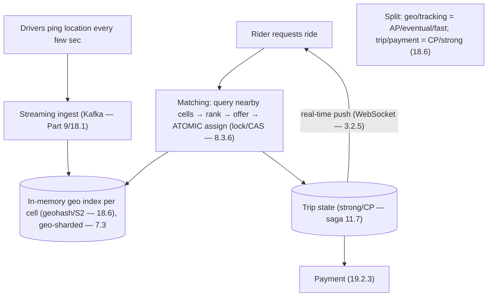

# Lesson 19.2.4 — Design Ride-Sharing (Uber/Lyft)

> Part 19 · Module 19.2 (Volume 2) · Difficulty: 🔴⚫ · *Interview design*
>
> **Prerequisites:** [18.6 Ride-Sharing & Geo (Uber)], [19.2.8 Proximity (related)], [11.7 Sagas], [Part 9 Messaging], [3.2.5 WebSockets], [7.3 Sharding].
> **Unlocks:** [19.2.8 Proximity], [Part 20 Capstone].

---

## 1. Learning Objectives

After this lesson you will be able to:

- Design **ride-sharing** (Uber/Lyft) end-to-end (framework — 1.3.1), reusing the **18.6 case study** as a concrete interview design.
- Design **geospatial indexing** (geohash/S2/H3) for "find nearby drivers" and **geo-sharding** for high-write location updates (18.6).
- Design the **matching** flow (rider request → nearby drivers → offer → accept) and the **trip lifecycle as a saga** (11.7).
- Handle the **high-write location-ingestion** stream (every driver pinging location every few seconds — Part 9) and **real-time push** to clients (3.2.5).
- Split the system by **consistency/latency profile**: real-time geo (fast, eventual) vs trip/payment state (strong — 18.6).

---

## 2. Problem statement

Design **Uber/Lyft**: riders request rides; the system **finds nearby available drivers**, **matches** one, tracks the **trip** in real-time, and handles **payment** at the end. This is the canonical **geospatial + real-time + high-write-ingestion** design; it directly reuses the **18.6** case study. The crux: **"find nearby drivers" efficiently** at scale, **ingest millions of location pings**, and **match atomically** (one driver, one rider).

---

## 3. The design (framework — 1.3.1)

### 3.1 Requirements

`[BP]`
- **Functional:** drivers publish location continuously; riders request a ride (pickup/destination); system finds nearby drivers + matches; both track the trip live; fare + payment at completion.
- **Non-functional:** **real-time low latency** (matching + tracking); **very high write throughput** (driver location updates — millions of pings — 18.6); **geospatial queries** ("nearby" — 18.6); **atomic matching** (no double-booking a driver); **availability** for the geo/tracking path (eventual OK), **consistency** for trip/payment state (18.6).
- `[BP]` **Key signal:** two very different workloads — a **high-write, eventually-consistent, real-time geo** subsystem and a **lower-volume, strongly-consistent trip/transaction** subsystem. **Split them** (18.6).

### 3.2 Estimation (1.1.4)

`[BP]` Illustrative: the **location-update stream dominates** — each active driver pings every few seconds → millions of writes/sec globally (18.6). Ride requests are far fewer. → Optimize the **location ingestion + nearby-query** path hardest; it's the write firehose.

### 3.3 Geospatial indexing (the core — 18.6)

`[CS]` "Find drivers near (lat, lng)" — naive scanning is impossible at scale `[BP]`:
- Encode locations with a **geospatial index**: **geohash** (recursively subdivide the map into a grid; nearby points share prefixes → range-query a cell + neighbors), or **S2 (Google)** / **H3 (Uber)** cell systems. This turns "nearby" into a **cell lookup** (18.6).
- Maintain a **live index of drivers per cell** (in-memory / Redis geo — 6.6): drivers update their cell as they move; a nearby-query fetches the rider's cell + adjacent cells and filters by distance.
- `[BP]` **Geospatial indexing = the enabling trick** (same as 19.2.8 proximity). Query is bounded to a few cells, not the whole map.

### 3.4 High-write location ingestion (18.6 / Part 9)

`[BP]`
- Millions of drivers pinging every few seconds → a **high-write stream**. Don't write each ping to a durable DB synchronously. Ingest via a **streaming pipeline** (Kafka-style — 18.1/Part 9), update the **in-memory geo index** (current position is **soft, recent state** — losing a ping is fine, the next arrives in seconds), and **geo-shard** by region (7.3) so no single node takes the global firehose (18.6).
- Current location is **the latest value** (idempotent last-write — 9.5), eventually consistent — perfect for AP treatment.

### 3.5 Matching + trip lifecycle (saga — 11.7)

`[BP]`
- **Matching:** rider request → query nearby drivers (§3.3) → rank (ETA/rating) → **offer to a driver** → on accept, **atomically assign** (the driver must not be offered to two riders at once → a lock / atomic compare-and-set on driver state — 8.3.6/11.5). If declined/timeout, offer the next.
- **Trip lifecycle = a saga** (11.7): requested → matched → en route → started → completed → paid. Each state transition is a step; failures compensate (e.g., driver cancels → re-match). Trip/payment state is **strongly consistent** (a trip has one authoritative record — 18.6), unlike the geo stream.
- **Real-time tracking:** push driver position + trip updates to rider (and vice-versa) over **WebSockets** (3.2.5) / a push channel (18.8-style).
- **Payment** at completion → **19.2.3** (idempotent, ledger).

### 3.6 Deep dives + bottlenecks

`[BP]`
- **Geo-query efficiency** (§3.3): geohash/S2/H3 cells bound the search (18.6/19.2.8).
- **Location-write firehose** (§3.4): stream + in-memory index + geo-sharding; soft eventually-consistent state (18.6).
- **Atomic matching** (§3.5): prevent double-assignment via a lock/CAS on driver availability (8.3.6/11.5) — the correctness point of matching.
- **Consistency split** (18.6): **geo/tracking = AP/eventual/fast**; **trip/payment = CP/strong**. The central design lesson.
- **Surge/hotspots** (7.4): dense areas (airport, concert) = hot cells → the same skew handling (split cells, more capacity).
- **Bottleneck:** the location-ingestion write path (dissolved by streaming + geo-sharding + in-memory soft state) and matching contention in hot cells (atomic assignment + locality).
- `[BP]` **The lesson (from 18.6):** ride-sharing = **geospatial index (geohash/S2) + streaming high-write location ingestion + geo-sharding + atomic matching + trip saga + real-time push**, with the system **split by consistency/latency profile** (real-time geo vs trip/payment).

---

## 4. Visual Intuition

---

## 5. Real-World Analogy

Think of a **taxi dispatcher covering a huge city, divided into a grid of neighborhoods**.

- **Geospatial index = the neighborhood grid:** instead of asking "where is every cab in the city?" (impossible), the dispatcher looks only at the **rider's grid square and its neighbors** — a handful of cabs, not thousands.
- **Location firehose = cabs radioing their position constantly:** the dispatcher doesn't carve each position into stone; they keep a **whiteboard of who's roughly where right now**, wiped and refreshed continuously. A missed radio call doesn't matter — another comes seconds later.
- **Atomic matching = one dispatcher pen:** when a ride comes in, the dispatcher offers it to the nearest cab and **marks that cab taken before offering it to anyone else** — so two riders never get promised the same cab.
- **Trip saga = the ride's paper trail:** requested → assigned → picked up → dropped off → paid, each step logged, with an "undo" (re-dispatch) if a cab cancels. This paperwork is **exact and authoritative** — unlike the fuzzy, ever-changing position whiteboard.
- **Two speeds:** the position whiteboard is fast and approximate; the ride paperwork and the fare are slow and exact. The dispatcher runs both, at different standards of care.

---

## 6. Industry Example

- **Uber H3 / geohash / S2 geospatial indexing** `[CONV]`: cell-based nearby queries (§3.3, 18.6). *(Representative.)*
- **Streaming location ingestion + geo-sharding** `[CONV]`: high-write pings via Kafka-style pipelines, sharded by region (§3.4, 18.6/Part 9). *(Representative.)*
- **Atomic driver assignment** `[CONV]`: lock/CAS to prevent double-booking (§3.5, 8.3.6). *(Representative.)*
- **Trip as a saga + real-time push** `[CONV]`: strongly-consistent trip state + WebSocket tracking (§3.5, 11.7/3.2.5). *(Representative.)*

---

## 7. Implementation Details

- **Geospatial index** (geohash/S2/H3) with a live per-cell driver index in-memory/Redis-geo (6.6) (§3.3, 18.6).
- **Streaming location ingestion** (Part 9/18.1) → in-memory soft state, **geo-sharded** (7.3) (§3.4).
- **Atomic matching** via lock/CAS on driver availability (8.3.6/11.5) (§3.5).
- **Trip lifecycle saga** (11.7), strongly consistent; **real-time push** over WebSockets (3.2.5); payment via 19.2.3 (§3.5).
- **Consistency split**: geo=AP/eventual, trip/payment=CP/strong (18.6) (§3.6).
- Surge/hot-cell handling like 7.4 skew.

---

## 8–14. (Condensed)

**Advantages:** bounded geo queries (cells), absorbs the location firehose (streaming + soft state + geo-shard), correct matching (atomic), clean consistency split.
**Disadvantages/cautions:** in-memory geo state is volatile (acceptable — soft); geo-sharding + hot cells need care (7.4); trip saga complexity; two subsystems with different guarantees to operate.
**When NOT to:** don't durably write every ping (waste); don't use one consistency model for both geo and trips (18.6).
**Common mistakes:** scanning all drivers (no geo index); synchronously persisting every location ping; non-atomic matching → double-booked driver; treating trip/payment as eventually consistent; ignoring hot cells (airports).
**Interview Qs:** 🟢 How do you find nearby drivers efficiently? 🟡 How do you ingest millions of location updates? Why in-memory/eventual? 🔴 How do you match atomically + model the trip (saga)? Why split consistency? ⚫ Full design: geo index, streaming ingestion + geo-sharding, atomic matching, trip saga, real-time push, hot cells, consistency split.
**Production pitfalls:** hot cells (surge areas) overloading (7.4); geo-index staleness; matching contention/double-assignment; location-stream lag; cross-region trips.
**Optimizations:** cell size tuning; neighbor-cell prefetch; geo-shard by region; cap/expire stale driver entries; hedged offers; separate read models for tracking.

---

## 15. Summary

**Ride-sharing (Uber/Lyft)** is the canonical **geospatial + real-time + high-write-ingestion** design and directly reuses the **18.6** case study. Riders request rides; the system **finds nearby available drivers, matches one atomically, tracks the trip live, and charges at completion**. The **key signal** is **two very different workloads** that must be **split by consistency/latency profile** (18.6): a **high-write, eventually-consistent, real-time geo** subsystem, and a **lower-volume, strongly-consistent trip/payment** subsystem. Estimation shows the **location-update stream dominates** (millions of pings/sec — each driver pings every few seconds), so it's optimized hardest. The **core enabling trick is geospatial indexing** — **geohash / S2 / H3** cell systems turn "find nearby drivers" into a **cell lookup** (rider's cell + neighbors) instead of scanning the map (18.6/19.2.8), backed by a **live in-memory per-cell driver index** (Redis-geo — 6.6). The **location firehose** is absorbed by a **streaming pipeline** (Kafka-style — Part 9/18.1) updating **in-memory soft state** (current position is the latest idempotent value — 9.5 — losing a ping is fine) and **geo-sharded by region** (7.3) so no node takes the global write load. **Matching**: query nearby drivers → rank (ETA/rating) → offer → on accept **atomically assign** via a **lock/CAS on driver availability** (8.3.6/11.5) so no driver is double-booked (the correctness point). The **trip lifecycle is a saga** (11.7 — requested→matched→started→completed→paid, with compensations like re-match on cancel), kept **strongly consistent** (one authoritative trip record — unlike the geo stream), with **real-time tracking pushed over WebSockets** (3.2.5/18.8) and **payment via 19.2.3** (idempotent, ledger). **Deep dives:** geo-query efficiency (cells), the location write firehose (stream + geo-shard + soft state), atomic matching, the **consistency split** (geo=AP/eventual/fast, trip/payment=CP/strong — the central lesson), and **surge/hot-cells** (7.4 skew at airports/concerts). The bottlenecks — location ingestion and hot-cell matching — dissolve via streaming + geo-sharding + in-memory state + atomic assignment. In one line: **geo index + streaming high-write ingestion + geo-sharding + atomic matching + trip saga + real-time push, split by consistency/latency**.

---

## 16. Revision Notes (flashcard-ready)

- **Q:** Two workloads? **A:** High-write eventually-consistent real-time geo vs lower-volume strongly-consistent trip/payment — split them (18.6).
- **Q:** Find nearby drivers? **A:** Geospatial index (geohash/S2/H3) — query rider's cell + neighbors, not the whole map.
- **Q:** Ingest millions of location pings? **A:** Streaming pipeline → in-memory soft geo index, geo-sharded by region; current position = latest idempotent value (eventual OK).
- **Q:** Why not persist every ping? **A:** It's soft, recent state — the next ping arrives in seconds; durable per-ping writes are wasteful.
- **Q:** Atomic matching? **A:** Lock/CAS on driver availability (8.3.6/11.5) — no double-booking.
- **Q:** Trip model? **A:** Saga (11.7) — states with compensations (re-match on cancel); strongly consistent trip record.
- **Q:** Tracking transport? **A:** WebSockets / push channel (3.2.5/18.8).
- **Q:** Consistency split? **A:** Geo/tracking = AP/eventual/fast; trip/payment = CP/strong.
- **Q:** Hot cells? **A:** Surge areas (airports) = skew (7.4) → split cells + capacity.

---

## 17. Further Reading + Knowledge-Graph Links

**Foundations:** [18.6 Ride-Sharing & Geo] · [19.2.8 Proximity] · [11.7 Sagas] · [Part 9 Messaging] · [3.2.5 WebSockets] · [8.3.6 Distributed Locks] · [7.3 Sharding].
**External:** Uber H3; S2 geometry; geospatial-indexing literature. *(Representative.)*

> **Knowledge-graph:** `18.6 geo` + `Part 9 streaming` + `8.3.6 locks` + `11.7 saga` → **`19.2.4 ride-sharing`** (geo index + streaming ingestion + atomic matching + trip saga + real-time push, consistency-split).
