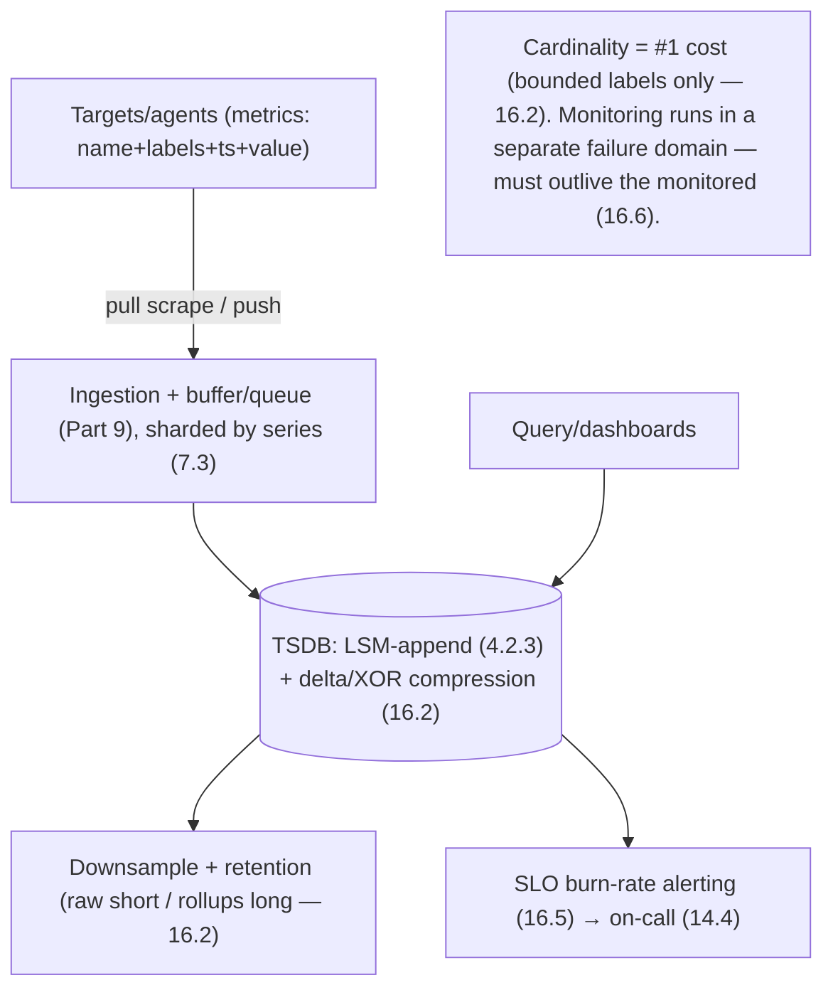

# Lesson 19.2.6 — Design a Metrics / Monitoring Platform

> Part 19 · Module 19.2 (Volume 2) · Difficulty: 🔴 · *Interview design*
>
> **Prerequisites:** [16.6 Designing a Monitoring Platform], [16.2 Metrics/TSDB/Cardinality], [Part 9 Messaging/Streaming], [4.2.3 LSM-Trees], [7.3 Sharding], [1.3.1 Framework].
> **Unlocks:** [19.2.9 Ad Click Aggregator], [Part 20 Capstone (observability)].

---

## 1. Learning Objectives

After this lesson you will be able to:

- Design a **metrics/monitoring platform** (Prometheus/Datadog-style) end-to-end (framework — 1.3.1), reusing **16.6** as the interview design.
- Design the **ingestion** path (push vs pull — 16.2) for a huge write firehose, buffered + sharded (Part 9/7.3).
- Design **time-series storage** (a TSDB — 16.2) optimized for append-heavy, time-ordered writes + range reads (LSM lineage — 4.2.3), with **downsampling + retention**.
- Explain why **cardinality is the #1 cost driver** and how to bound it (16.2).
- Design **query + SLO-based alerting** (16.5) and reason about **HA** ("the monitoring must outlive the monitored" — 16.6).

---

## 2. Problem statement

Design a **metrics/monitoring platform**: collect **time-series metrics** (CPU, latency, request counts, custom app metrics) from thousands of services/hosts, **store** them efficiently, let users **query + graph** them, and **alert** when things go wrong. This directly reuses **16.6**. The crux: a **massive, continuous write firehose** of numeric time-series, where **cardinality** (16.2) dominates cost and the platform itself must be **more reliable than what it watches**.

---

## 3. The design (framework — 1.3.1)

### 3.1 Requirements

`[BP]`
- **Functional:** ingest metrics (name + labels + timestamp + value — 16.2); store with retention; query (aggregate, range, rate); dashboards; **alerting** (threshold/SLO-burn — 16.5).
- **Non-functional:** **very high write throughput** (append firehose); **efficient storage** (compressed time-series); **fast range/aggregate reads**; **bounded cardinality** (16.2 — the cost driver); **HA** (must outlive the monitored system — 16.6).
- `[BP]` **Key signal:** write-heavy append-only time-series + cardinality cost + self-reliability. Drive to **buffered ingestion + TSDB + downsampling/retention + bounded labels + SLO alerting**.

### 3.2 Estimation (1.1.4)

`[BP]` Illustrative: millions of active time-series × a sample every ~10–60s → **millions of data points/sec** written continuously. Reads are far fewer (dashboards/alerts) but scan **ranges** of many series. → Optimize the **write path + compression + cardinality**; it's a write-dominated, append-only workload (16.2).

### 3.3 Ingestion — push vs pull (16.2)

`[BP]`
- **Pull (Prometheus-style):** the platform **scrapes** targets on an interval. Pros: the platform controls load, easy target health (a scrape failure = target down), simple service discovery. Cons: needs reachability to every target.
- **Push (StatsD/Datadog-agent-style):** agents **push** metrics to the platform (via a gateway/queue). Pros: works for short-lived jobs + across network boundaries. Cons: the platform can be overwhelmed → needs **buffering + backpressure** (9.9).
- `[BP]` Either way, **buffer ingestion through a queue/stream** (Part 9) to absorb spikes, then **shard by series** (7.3) across ingester/storage nodes. (16.6/16.2.)

### 3.4 Storage — the TSDB (16.2 / 4.2.3)

`[CS]` Time-series data has a special shape → a **purpose-built TSDB** `[BP]`:
- **Append-heavy, time-ordered, rarely-updated** writes + **range-scan** reads → an **LSM-tree-style** engine (4.2.3) is the natural fit (fast sequential appends).
- **Heavy compression:** consecutive samples of a series have small deltas → **delta-of-delta timestamp encoding + XOR value compression** (Gorilla-style) shrinks storage dramatically (16.2).
- **Downsampling + retention:** keep **raw** data short-term (high resolution) and **downsampled rollups** (e.g., 1-min → 1-hour averages) long-term; **expire** old data by retention policy (16.2). Old data at full resolution is rarely needed and too costly.
- **Shard by series (labels hash)** (7.3); index series by labels for query.
- `[BP]` **TSDB = LSM-append + aggressive time-series compression + downsampling/retention** (16.2).

### 3.5 Cardinality — the #1 cost driver (16.2)

`[CS]` The dominant design concern `[BP]`:
- A **time-series is identified by its name + the full set of label values** (`http_requests{method=GET,endpoint=/x,status=200,...}`). Each **unique combination** is a **separate series** to index + store. Adding a **high-cardinality label** (user ID, request ID, email) creates **millions of series** → **cardinality explosion** → memory/index/storage blows up (16.2).
- **Rule:** labels must be **bounded, low-cardinality** dimensions (method, region, status). **Never** put unbounded IDs in labels — those belong in **logs/traces** (16.1/16.4), not metrics.
- `[BP]` **Cardinality is *the* thing to mention** — it dominates a metrics system's cost and is the classic failure mode (16.2/16.6).

### 3.6 Query, alerting + HA (16.5 / 16.6)

`[BP]`
- **Query:** select series by labels, over a time range, with **aggregations** (sum/rate/percentile) — fan-out across shards + merge (scatter-gather — 18.7).
- **Alerting** (16.5): evaluate rules against metrics; prefer **SLO burn-rate, multi-window alerts** over static thresholds (14.1/16.5); route to on-call (14.4). Alerting must be reliable + low-false-positive.
- **HA — "the monitoring must outlive the monitored"** (16.6): the platform must **not fail with** the systems it watches (no shared fate) — run it **independently/redundantly**, in a **separate failure domain** (13.8). If your monitoring dies when your app dies, you're blind exactly when you need sight.
- **Bottleneck:** the **write path + cardinality** (§3.2/3.5) — dissolved by buffered sharded ingestion + compressed TSDB + bounded labels + downsampling.
- `[BP]` **The lesson (16.6):** metrics platform = **buffered/sharded ingestion (push or pull) + a compressed LSM-style TSDB + downsampling/retention + strictly bounded cardinality + SLO-based alerting + independent HA**. Extend the same shape to logs/traces (16.1).

---

## 4. Visual Intuition

---

## 5. Real-World Analogy

Think of a **hospital's patient-monitoring station** recording vital signs from thousands of beds continuously.

- **Ingestion firehose = every monitor reporting every few seconds:** a relentless stream of numbers. You can't stop to think about each; you buffer them and file them fast.
- **TSDB = specialized charts, not a filing cabinet of essays:** vitals are just **timestamped numbers per patient**, so you store them in tight, compressed strips (consecutive readings barely change → record only the tiny differences), and you keep **detailed recent readings** but only **hourly summaries** from last year (downsampling + retention). A general-purpose cabinet would be hopelessly wasteful.
- **Cardinality = how many distinct chart lines you keep:** tracking "heart rate by ward" is a handful of lines. Tracking "heart rate by *individual patient's name and case number*" is **millions of lines** — the chart room overflows. So you only chart along **broad, bounded categories**; the per-patient detail lives in each patient's **file** (logs/traces), not the vitals charts.
- **Alerting = the nurse call system:** not "beep on every tiny blip" (alarm fatigue), but "alert when a vital is trending toward danger fast" (burn-rate).
- **Outlive the monitored:** the monitoring station has its **own power supply** — if the ward loses power, the monitors must **keep working**, because that's exactly when you need them most.

---

## 6. Industry Example

- **Prometheus (pull) / Datadog (push)** `[CONV]`: the two ingestion models (§3.3, 16.2). *(Representative.)*
- **Gorilla-style compression (delta-of-delta + XOR)** `[CONV]`: dense time-series storage (§3.4, 16.2). *(Representative.)*
- **Downsampling + retention tiers** `[CONV]`: raw short-term, rollups long-term (§3.4, 16.2). *(Representative.)*
- **Cardinality as the dominant cost** `[CONV]`: bounded labels; unbounded IDs go to logs/traces (§3.5, 16.2). *(Representative.)*
- **SLO burn-rate alerting** `[CONV]`: multi-window burn-rate over static thresholds (§3.6, 16.5/14.1). *(Representative.)*

---

## 7. Implementation Details

- **Ingestion:** push or pull (16.2) buffered through a queue/stream (Part 9), sharded by series (7.3) (§3.3).
- **TSDB:** LSM-style append (4.2.3) + delta-of-delta/XOR compression (16.2); index series by labels (§3.4).
- **Downsampling + retention** tiers (16.2) (§3.4).
- **Bounded, low-cardinality labels only** (16.2) — the key constraint (§3.5).
- **Query** scatter-gather across shards + aggregate (18.7); **SLO burn-rate alerting** (16.5/14.1) (§3.6).
- **HA in a separate failure domain** — outlive the monitored (16.6/13.8) (§3.6).

---

## 8–14. (Condensed)

**Advantages:** absorbs the write firehose (buffered/sharded ingest + compressed TSDB); cheap storage (compression + downsampling); fast range/aggregate reads; reliable SLO alerting.
**Disadvantages/cautions:** cardinality explosion risk (must bound labels); downsampling loses old-data resolution (accepted); the platform is critical infra (must be independently HA); query fan-out cost on wide selects.
**When NOT to:** don't store high-cardinality/unbounded IDs as metrics (use logs/traces — 16.1); don't use a general-purpose DB for time-series at scale (use a TSDB).
**Common mistakes:** unbounded labels → cardinality explosion (16.2); using a relational DB for the firehose; no downsampling/retention (storage blowup); static-threshold alert spam (16.5); monitoring sharing fate with the monitored (16.6).
**Interview Qs:** 🟢 What's a time-series (name+labels+ts+value)? 🟡 Push vs pull ingestion? Why a TSDB not a SQL DB? 🔴 Why is cardinality the #1 cost, and how do you bound it? Downsampling/retention? ⚫ Full design: buffered sharded ingestion, compressed LSM TSDB, cardinality control, SLO alerting, independent HA; extend to logs/traces.
**Production pitfalls:** cardinality explosion (a bad label ships → OOM); ingestion lag under spikes (9.9); query fan-out overload; retention misconfig; monitoring outage during an incident (shared fate).
**Optimizations:** aggressive compression; downsample + tiered retention; cap label cardinality (reject/limit); pre-aggregate common queries (recording rules); shard by series; separate hot/cold storage.

---

## 15. Summary

A **metrics/monitoring platform** (Prometheus/Datadog-style) collects **time-series metrics** (name + labels + timestamp + value — 16.2) from thousands of services/hosts, stores them efficiently, and supports query + dashboards + **alerting** — directly reusing **16.6**. The crux is a **massive, continuous append-only write firehose** (millions of data points/sec) where **cardinality (16.2) dominates cost** and the platform must be **more reliable than what it watches**. **Ingestion** is **pull** (Prometheus scrapes targets — platform controls load, easy health detection) or **push** (agents send to a gateway — works for short-lived jobs/cross-network but can overwhelm → needs buffering/backpressure — 9.9); either way, **buffer through a queue/stream (Part 9)** to absorb spikes and **shard by series (7.3)**. **Storage** is a **purpose-built TSDB (16.2)**: because writes are append-heavy, time-ordered, and reads are range-scans, an **LSM-style engine (4.2.3)** fits, with **aggressive time-series compression** (delta-of-delta timestamps + XOR values, Gorilla-style) and **downsampling + retention tiers** (raw short-term, rollups long-term, expire old data). The **#1 design concern is cardinality**: a series is identified by its **name + full label-value combination**, so a **high-cardinality label** (user ID, request ID) creates **millions of series → index/memory/storage explosion**; the rule is **labels must be bounded, low-cardinality dimensions** (method/region/status), and **unbounded IDs belong in logs/traces (16.1/16.4), not metrics**. **Query** selects series by labels over a time range with aggregations (scatter-gather across shards — 18.7); **alerting** prefers **SLO burn-rate, multi-window** rules over static thresholds (16.5/14.1) routed to on-call (14.4). Crucially, the platform must **"outlive the monitored"** (16.6) — run **independently, in a separate failure domain (13.8)** with **no shared fate**, because monitoring that dies with your app blinds you exactly when you need it. The **bottleneck — the write path + cardinality — dissolves** via buffered/sharded ingestion + a compressed TSDB + bounded labels + downsampling. The same shape extends to **logs and traces** (16.1). In one line: **buffered/sharded ingestion + compressed LSM-style TSDB + downsampling/retention + strictly bounded cardinality + SLO alerting + independent HA**.

---

## 16. Revision Notes (flashcard-ready)

- **Q:** Workload shape? **A:** Write-heavy append-only time-series firehose; fewer range-scan reads.
- **Q:** Ingestion models? **A:** Pull (scrape — platform controls load, easy health) vs push (agents — short-lived jobs, needs buffering). Buffer via a queue either way.
- **Q:** Why a TSDB not SQL? **A:** Append-heavy time-ordered writes + range reads → LSM-style engine + time-series compression (delta-of-delta + XOR).
- **Q:** #1 cost driver? **A:** Cardinality — each unique name+label combo is a series; high-cardinality labels explode it.
- **Q:** Cardinality rule? **A:** Bounded low-cardinality labels only; unbounded IDs go to logs/traces, not metrics.
- **Q:** Managing old data? **A:** Downsampling (rollups) + retention tiers (raw short, rollups long, expire old).
- **Q:** Alerting? **A:** SLO burn-rate, multi-window (16.5/14.1), not static-threshold spam.
- **Q:** Key reliability principle? **A:** Monitoring must outlive the monitored — separate failure domain, no shared fate (16.6).
- **Q:** Query? **A:** Select by labels over a range, aggregate; scatter-gather across shards.

---

## 17. Further Reading + Knowledge-Graph Links

**Foundations:** [16.6 Designing a Monitoring Platform] · [16.2 Metrics/TSDB/Cardinality] · [4.2.3 LSM-Trees] · [Part 9 Messaging] · [16.5 SLO Alerting] · [14.1 Error Budgets].
**External:** Prometheus TSDB; Facebook Gorilla paper; Datadog architecture. *(Representative.)*

> **Knowledge-graph:** `16.6 monitoring` + `16.2 TSDB/cardinality` + `4.2.3 LSM` + `Part 9 ingest` → **`19.2.6 metrics platform`** (buffered ingest + compressed TSDB + cardinality control + SLO alerting + independent HA).
