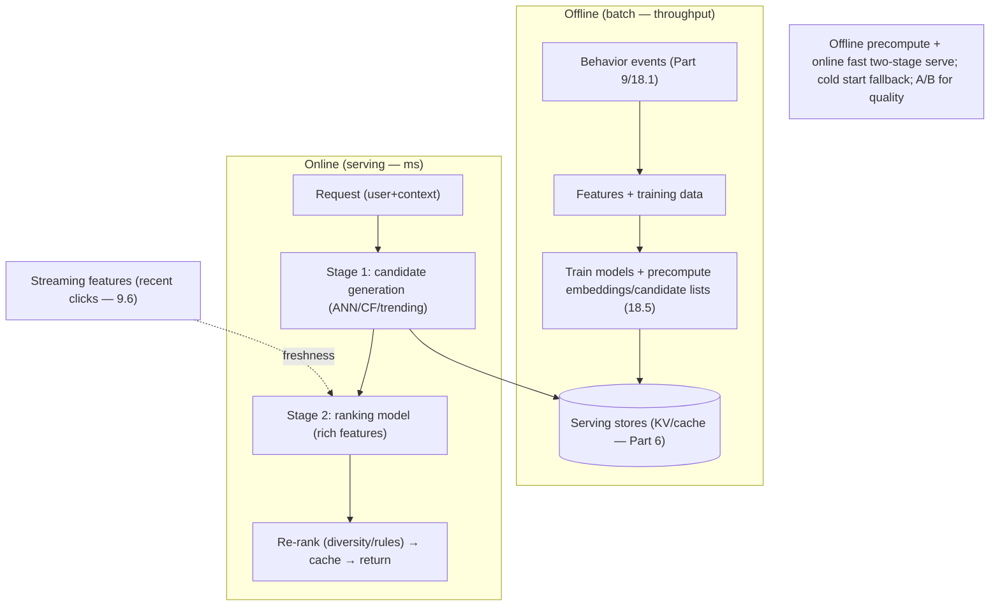

# Lesson 19.2.7 — Design a Recommendation System

> Part 19 · Module 19.2 (Volume 2) · Difficulty: 🔴 · *Interview design*
>
> **Prerequisites:** [18.5 Streaming & Recommendations (Netflix)], [19.2.2 News Feed Deep], [Part 9 Messaging/Streaming], [Part 6 Caching], [7.3 Sharding], [1.3.1 Framework].
> **Unlocks:** [19.2.9 Ad Aggregator], [Part 20 Capstone (AI/recs)].

---

## 1. Learning Objectives

After this lesson you will be able to:

- Design a **recommendation system** end-to-end (framework — 1.3.1), reusing **18.5** (Netflix online/offline split).
- Separate **offline** (batch model training + candidate precompute) from **online** (low-latency serving) — the central architectural split (18.5).
- Explain the **two-stage retrieval-then-ranking** pattern (cheap candidate generation → expensive precise ranking).
- Design **feature/data pipelines** (event logs → features — Part 9), **model serving**, and **caching** of recommendations (Part 6).
- Handle deep dives: **cold start**, **freshness vs cost**, **feedback loops**, and **A/B testing**.

---

## 2. Problem statement

Design a **recommendation system** (Netflix "you might like," YouTube up-next, product recommendations): given a user + context, return a **ranked list of items** they're likely to engage with. This reuses **18.5**. The crux is the **online/offline split** — heavy ML computation done **offline/precomputed**, with a **fast online serving path** — and the **two-stage** retrieval→ranking funnel. It's the ML-serving counterpart to the feed (19.2.2).

---

## 3. The design (framework — 1.3.1)

### 3.1 Requirements

`[BP]`
- **Functional:** produce a **ranked list of recommended items** per user/context; incorporate user history + item features + context (time, device); update as behavior changes; support experimentation (A/B — 14.7).
- **Non-functional:** **low-latency serving** (recs shown inline — must be fast); **scale** (many users × many items); **freshness** (reflect recent behavior — but tolerable lag); **quality** (relevance — the business metric).
- `[BP]` **Key signal:** heavy computation (ML) can't happen synchronously per request → **precompute offline + serve fast online** (18.5). And you can't score millions of items per request → **retrieve a small candidate set, then rank** it.

### 3.2 The online/offline split (the core — 18.5)

`[CS]` The central architecture `[BP]`:
- **Offline (batch — Part 9/hours-scale):** collect behavior **event logs** (views/clicks/watches), build **features**, **train models** periodically, and **precompute** artifacts (embeddings, item-similarity tables, per-user candidate lists). Heavy, throughput-oriented, not latency-sensitive. (18.5)
- **Online (serving — milliseconds):** on a request, use the **precomputed artifacts** + light real-time features to **retrieve + rank quickly**. No model training on the hot path.
- **Near-real-time (streaming — 9.6):** update some features from recent events (last few clicks) via a stream so recs reflect **fresh** behavior without waiting for the next batch.
- `[BP]` **Offline precompute + online fast serve + streaming freshness** = the recommendation shape (18.5). Same online/offline pattern as feed ranking (19.2.2).

### 3.3 Two-stage retrieval → ranking

`[CS]` You can't precisely score **millions of items** per request `[BP]`:
- **Stage 1 — Candidate generation (retrieval):** cheaply narrow millions of items to a few hundred candidates (e.g., **approximate nearest-neighbor** over embeddings, collaborative-filtering neighbors, trending, "similar to recently watched"). Fast, recall-oriented.
- **Stage 2 — Ranking:** apply a **richer, more expensive model** to precisely **score + order** the few-hundred candidates using many features. Precision-oriented, but only over a small set → affordable online.
- (Optional **re-ranking**: diversity, business rules, freshness, dedup.)
- `[BP]` **Two-stage funnel** = cheap retrieval + expensive ranking — the standard large-scale rec/search pattern (also feed — 19.2.2).

### 3.4 HLD

`[BP]`
- **Event ingestion:** behavior events → **stream/log** (Part 9/18.1) → feature store + training data (data lake).
- **Offline pipeline:** batch training (18.5) + precompute embeddings/candidate lists → push to **serving stores** (KV/cache — Part 6).
- **Online serving:** request → **candidate generation** (from precomputed/ANN — §3.3) → **ranking model** (served via a model server) → re-rank → return. **Cache** recommendations per user (Part 6) for repeat requests, with a freshness TTL.
- **Experimentation:** A/B framework to compare models/variants on real metrics (14.7).

### 3.5 Deep dives + bottlenecks

`[BP]`
- **Cold start:** new users/items have no history → fall back to **popularity/trending, content-based features, or context** until behavior accumulates. A must-mention.
- **Freshness vs cost** (18.5): full batch retrain is expensive + lagging; streaming features add freshness at extra complexity — tune per business value.
- **Feedback loops:** recs influence behavior which trains the next model → risk of **popularity bias / filter bubbles**; mitigate with exploration (show some diverse/novel items) — [EMERGING].
- **Serving latency:** keep the hot path to **retrieve-from-precomputed + rank-a-few** + caching (Part 6); heavy work stays offline.
- **A/B testing** (14.7): quality is measured by **engagement metrics**, validated via experiments — the real success criterion.
- **Bottleneck:** offline compute (throughput — scale the batch/stream cluster) + online ranking latency (bounded candidate set + caching). Serving scales horizontally (stateless — 7.2) over precomputed data.
- `[BP]` **The lesson (18.5):** recommendations = **offline precompute (batch train + candidate generation) + online two-stage retrieve→rank + streaming freshness + caching + A/B**, split online/offline. Candidate generation is separate from ranking — the same split as the feed (19.2.2).

---

## 4. Visual Intuition

---

## 5. Real-World Analogy

Think of a **great bookstore clerk who prepares recommendations before you even walk in**.

- **Offline precompute = overnight prep:** after closing, the clerk studies everyone's purchase history, groups similar readers, and **pre-writes shortlists** ("readers like you enjoyed these"). This heavy thinking happens **off the clock**, not while you're standing at the counter.
- **Online serving = the quick counter interaction:** when you arrive, the clerk doesn't re-analyze the whole store — they grab your **pre-made shortlist** and quickly tailor the top picks to your mood today. Fast, because the hard work was done in advance.
- **Two-stage funnel = shelf then hand-pick:** the clerk first pulls **a small stack** of plausible books from a huge store (retrieval), then **carefully orders that stack** by what fits you best (ranking) — they'd never rank all 100,000 books individually for you.
- **Cold start = a brand-new customer:** with no history, the clerk falls back to **bestsellers and your stated interests** until they learn your taste.
- **Feedback loop = only ever recommending what's already popular:** if the clerk only pushes bestsellers, niche gems never surface — so they deliberately **sprinkle in something novel** to keep learning your taste and avoid a bubble.

---

## 6. Industry Example

- **Netflix online/offline split** `[CONV]`: batch training/precompute + fast online serving + streaming freshness (§3.2, 18.5). *(Representative.)*
- **YouTube two-stage (candidate generation → ranking)** `[CONV]`: cheap retrieval then expensive ranking (§3.3). *(Representative.)*
- **Embedding + ANN retrieval** `[CONV]`: approximate nearest-neighbor over learned embeddings for candidate generation (§3.3). *(Representative.)*
- **A/B experimentation** `[CONV]`: measuring rec quality by engagement (§3.5, 14.7). *(Representative.)*
- **Cold-start fallback** `[CONV]`: popularity/content-based for new users/items (§3.5). *(Representative.)*

---

## 7. Implementation Details

- **Offline:** event stream (Part 9/18.1) → features → batch train + precompute embeddings/candidate lists → serving stores (Part 6) (§3.2/3.4).
- **Online two-stage:** candidate generation (ANN/CF/trending) → ranking model → re-rank → cache (Part 6) (§3.3/3.4).
- **Streaming features** for freshness (9.6) (§3.2).
- **Cold-start** fallbacks; **exploration** to counter feedback loops (§3.5).
- **A/B testing** for quality (14.7); stateless serving scaled horizontally (7.2).

---

## 8–14. (Condensed)

**Advantages:** heavy ML kept off the hot path (precompute); fast serving (two-stage + cache); scalable (offline throughput + stateless online); pluggable models via A/B.
**Disadvantages/cautions:** batch lag/freshness tradeoff; cold start; feedback-loop/filter-bubble risk; operational complexity (pipelines + model serving + experimentation).
**When NOT to:** don't score all items per request (retrieve then rank); don't train on the hot path; don't recommend without an evaluation/A/B loop.
**Common mistakes:** synchronous model training/scoring on request; single-stage scoring of millions of items; ignoring cold start; no experimentation (guessing quality); freshness-blind (only stale batch, no streaming); runaway feedback loops.
**Interview Qs:** 🟢 Why precompute offline? 🟡 Explain the two-stage retrieve→rank funnel. 🔴 How do you keep serving fast + fresh (offline+streaming+cache)? Cold start? ⚫ Full design: online/offline split, two-stage funnel, feature/training pipelines, serving, A/B, feedback loops.
**Production pitfalls:** stale recs (batch lag); cold-start blindness; feedback loops narrowing content; serving latency from oversized candidate sets; training/serving feature skew.
**Optimizations:** cache recs per user (TTL — Part 6); bound candidate set size; ANN indexes; streaming features for freshness; precomputed similarity tables; exploration for diversity.

---

## 15. Summary

A **recommendation system** (Netflix/YouTube/product recs) returns a **ranked list of items** a user is likely to engage with, and reuses **18.5**. The crux is the **online/offline split**: heavy ML **can't run synchronously per request**, so you **precompute offline** and **serve fast online**. **Offline (batch — Part 9)**: collect **behavior event logs** (views/clicks), build **features**, **train models** periodically, and **precompute** artifacts (embeddings, item-similarity tables, per-user candidate lists) — throughput-oriented, not latency-sensitive (18.5). **Online (milliseconds)**: use precomputed artifacts + light real-time features to retrieve+rank quickly — **no training on the hot path**. **Near-real-time streaming (9.6)** updates some features from recent events so recs reflect **fresh** behavior without waiting for the next batch. The second key pattern is the **two-stage funnel** (you can't precisely score millions of items per request): **Stage 1 candidate generation (retrieval)** cheaply narrows millions to a few hundred (approximate nearest-neighbor over embeddings, collaborative-filtering neighbors, trending) — recall-oriented; **Stage 2 ranking** applies a **richer, more expensive model** to precisely score/order only those few hundred — precision-oriented but affordable over a small set — followed by optional **re-ranking** (diversity/business rules). The **HLD**: event stream → feature store + training data; offline pipeline trains + precomputes → serving stores (Part 6); online serving does candidate-generation → ranking → re-rank → return, with **per-user rec caching** (Part 6, freshness TTL) and an **A/B framework** (14.7). **Deep dives:** **cold start** (fall back to popularity/content/context for new users/items), **freshness vs cost** (batch lag vs streaming complexity), **feedback loops** (recs shape behavior shapes the next model → popularity bias/filter bubbles → mitigate with **exploration** — `[EMERGING]`), **serving latency** (bounded candidate set + caching), and **A/B testing** (quality measured by engagement — the real success criterion). The **bottleneck** — offline compute throughput + online ranking latency — dissolves via scaling the batch/stream cluster + a bounded candidate set + caching + stateless horizontal serving (7.2). Candidate generation is kept **separate from ranking** — the same split as the feed (19.2.2). In one line: **offline precompute + online two-stage retrieve→rank + streaming freshness + caching + A/B, split online/offline**.

---

## 16. Revision Notes (flashcard-ready)

- **Q:** Central architectural split? **A:** Offline (batch train + precompute) vs online (fast serving); heavy ML never on the hot path (18.5).
- **Q:** Two-stage funnel? **A:** Stage 1 candidate generation (cheap retrieval, ANN/CF/trending → few hundred); Stage 2 ranking (expensive precise model over the small set).
- **Q:** Why two stages? **A:** Can't precisely score millions of items per request; retrieve cheaply, rank precisely on a small set.
- **Q:** Freshness? **A:** Streaming features (recent clicks — 9.6) on top of periodic batch; tune freshness vs cost.
- **Q:** Cold start? **A:** New users/items lack history → popularity/trending/content-based/context fallback.
- **Q:** Feedback loop risk? **A:** Recs shape behavior → next model → popularity bias/filter bubble; counter with exploration/diversity.
- **Q:** How is quality measured? **A:** A/B testing on engagement metrics (14.7).
- **Q:** Serving speed? **A:** Precomputed candidates + ranking a bounded set + per-user cache (Part 6); stateless horizontal scale (7.2).
- **Q:** Relation to feed (19.2.2)? **A:** Same candidate-generation-vs-ranking split; feed ranking is a recommendation problem.

---

## 17. Further Reading + Knowledge-Graph Links

**Foundations:** [18.5 Streaming & Recommendations] · [19.2.2 News Feed Deep] · [Part 9 Messaging] · [Part 6 Caching] · [14.7 Progressive Delivery/A-B] · [7.2 Stateless Scaling].
**External:** YouTube deep-neural-networks recommendation paper; Netflix tech blog; ANN literature. *(Representative.)*

> **Knowledge-graph:** `18.5 recs` + `Part 9 pipelines` + `two-stage funnel` + `Part 6 cache` → **`19.2.7 recommendations`** (offline precompute + online retrieve→rank + streaming freshness + A/B).
