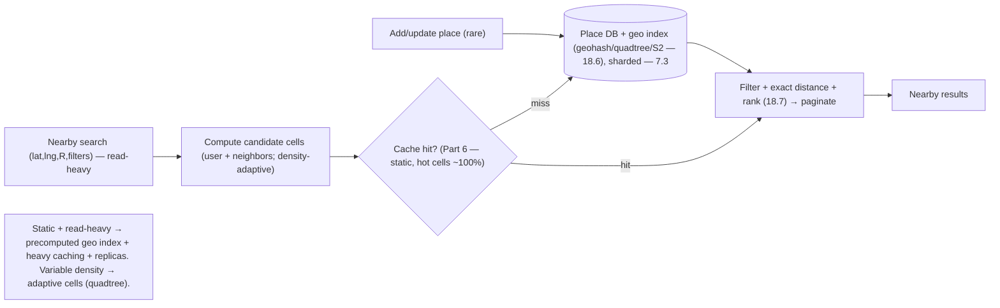

# Lesson 19.2.8 — Design Proximity / Nearby Services (Yelp)

> Part 19 · Module 19.2 (Volume 2) · Difficulty: 🔴 · *Interview design*
>
> **Prerequisites:** [18.6 Ride-Sharing & Geo (geospatial indexing)], [19.2.4 Ride-Sharing], [Part 6 Caching], [7.3 Sharding], [18.7 Search], [1.3.1 Framework].
> **Unlocks:** [Part 20 Capstone].

---

## 1. Learning Objectives

After this lesson you will be able to:

- Design a **proximity/nearby service** (Yelp, "restaurants near me") end-to-end (framework — 1.3.1), reusing the **geospatial indexing** from **18.6/19.2.4**.
- Contrast the two workloads: **ride-sharing** (high-write moving points — 19.2.4) vs **proximity search** (mostly-static places, **read-heavy** — this lesson).
- Design **geospatial indexing** for static POIs: **geohash**, **quadtree**, or **S2/H3** — and how each answers "find places within radius R."
- Design the **read-heavy** serving path: precomputed cells + heavy caching (Part 6) + read replicas (7.5).
- Handle deep dives: **variable density** (cities vs deserts), **radius/pagination**, and **combining geo + filters/ranking** (18.7).

---

## 2. Problem statement

Design a **proximity service**: given a user's location (and optional filters like "pizza, open now"), return **nearby places** ranked by distance/relevance. Think **Yelp, Google Places, "find nearby X."** It reuses the **geospatial indexing** of **18.6** but with a **very different workload**: the places are **mostly static** (unlike moving drivers), and it's **read-heavy** (many searches, few updates) — so the design leans on **precomputed geo indexes + caching**, not a write firehose.

---

## 3. The design (framework — 1.3.1)

### 3.1 Requirements

`[BP]`
- **Functional:** given (lat, lng) + radius (or "nearest N") + optional filters, return nearby places; add/update places (infrequent); rank by distance + relevance.
- **Non-functional:** **read-heavy** (search-dominated); **low latency**; **scale** (millions of places, huge query volume); freshness of place data is **relaxed** (a new restaurant appearing minutes later is fine — 10.5).
- `[BP]` **Key signal:** unlike ride-sharing (19.2.4), the data is **static + read-heavy** → **precompute the geospatial index + cache aggressively** (Part 6) + read replicas (7.5). The core problem is still **efficient "nearby" queries** (18.6).

### 3.2 Estimation (1.1.4)

`[BP]` Illustrative: writes (new/updated places) are **rare**; reads (nearby searches) are **massive**. → It's a **read-scaling + geo-index** problem, not a write-ingestion one (contrast 19.2.4). Cache + replicate reads.

### 3.3 Geospatial indexing for static POIs (the core — 18.6)

`[CS]` "Find places within radius R of (lat, lng)" — indexing options `[BP]`:
- **Geohash:** encode each place's location into a geohash string; nearby places share prefixes. Query = compute the user's cell (at a precision matching R) + **neighboring cells**, fetch places in them, filter by exact distance. Simple, works with any KV/DB with prefix range scans (18.6).
- **Quadtree:** recursively subdivide space into quadrants until each cell has ≤ K places; dense areas get **finer** cells, sparse areas **coarser** — naturally handles **variable density** (§3.5). Query descends the tree to the user's region.
- **S2 / H3:** hierarchical cell libraries (S2 cells / H3 hexagons) with efficient neighbor + coverage operations — production-grade (18.6).
- `[BP]` **Geospatial index turns "nearby" into a bounded cell lookup** — the same enabling trick as 18.6/19.2.4. For static POIs, the index is **precomputed + rarely updated** → highly cacheable.

### 3.4 HLD

`[BP]`
- **Write (rare):** add/update place → compute its geo-cell + store (place DB, sharded — 7.3) → update the geo index.
- **Read (hot):** search request → compute candidate cells (user cell + neighbors — §3.3) → fetch places in those cells (from **cache** — Part 6 — or read replicas — 7.5) → **filter** (category, open-now) + compute exact distances + **rank** → paginate → return.
- **Caching** (Part 6): popular areas' cell results are **highly cacheable** (static data + repeated queries) → near-100% hit for hot cells; CDN for static place metadata (18.4).
- **Filters/ranking:** combine geo candidates with attribute filters + a relevance score (rating, distance, popularity) — a **geo + search** blend (18.7).

### 3.5 Deep dives + bottlenecks

`[BP]`
- **Variable density** (the key geo challenge): a fixed cell size gives **too many** results in a dense city and **too few** in a rural area. **Quadtree** (adaptive cells) or **multi-precision geohash** (widen/narrow the cell to R + result count) handles it — the classic proximity nuance.
- **Radius vs nearest-N:** either fetch cells covering radius R, or expand outward from the user's cell until you have N results (ring expansion).
- **Read scaling** (§3.2): the whole game — **cache** (Part 6, dominant lever) + **read replicas** (7.5) + CDN (18.4). Static + read-heavy = ideal for caching.
- **Geo + filters/ranking** (18.7): "nearby AND pizza AND open now AND highly-rated" combines geo candidates with a filter/rank stage — can integrate a search engine (18.7) with geo capabilities.
- **Freshness:** relaxed — place updates propagate eventually (10.5); cache TTLs are generous.
- **Bottleneck:** essentially reads → dissolved by caching + replicas (contrast 19.2.4's write firehose). The interesting part is **density-adaptive indexing**.
- `[BP]` **The lesson:** proximity = **geospatial index (adaptive for density — quadtree/geohash/S2) + read-heavy serving (cache-first + replicas — Part 6/7.5) + geo-with-filters ranking (18.7)**. Same geo trick as 18.6 but **read-optimized** (static data), not write-optimized.

---

## 4. Visual Intuition

---

## 5. Real-World Analogy

Think of a **tourist information desk with a wall of neighborhood maps** for "what's near me?"

- **Geospatial index = the grid of neighborhood maps:** instead of scanning a citywide directory, the clerk grabs the **map tile for your block and the ones touching it** — a handful of places, not the whole city.
- **Variable density = different zoom levels:** downtown is packed, so its tile is **zoomed in** (a small area still has plenty); the countryside is empty, so its tile is **zoomed out** (a big area to find anything). A one-size grid would drown you downtown and starve you in the sticks — so the maps **adapt their scale to how crowded the area is** (quadtree).
- **Read-heavy + caching = laminated popular maps at the front desk:** the "downtown restaurants" tile gets asked for constantly and **rarely changes**, so the clerk keeps a **stack of copies right on the desk** (cache) instead of fetching from the archive each time.
- **Filters + ranking = "pizza, open now, well-reviewed":** after pulling the nearby tile, the clerk crosses off closed and non-pizza spots and hands you the best ones first.
- **Contrast with taxis (19.2.4):** the taxi board changes every few seconds (moving cars — write-heavy); the restaurant maps barely change (read-heavy) — same grid idea, opposite optimization.

---

## 6. Industry Example

- **Yelp/Google Places geo search** `[CONV]`: nearby POI queries over a geospatial index (§3.3). *(Representative.)*
- **Geohash / quadtree / S2 / H3 indexing** `[CONV]`: cell-based nearby lookups; adaptive cells for density (§3.3/3.5, 18.6). *(Representative.)*
- **Read-heavy caching + replicas** `[CONV]`: static POI data cached aggressively (§3.4, Part 6/7.5). *(Representative.)*
- **Geo + filters/ranking via search** `[CONV]`: combining geo candidates with attribute filters + relevance (§3.5, 18.7). *(Representative.)*

---

## 7. Implementation Details

- **Geospatial index** (geohash/quadtree/S2/H3), density-adaptive (quadtree/multi-precision) (§3.3/3.5, 18.6).
- **Read path:** candidate cells → **cache** (Part 6) / read replicas (7.5) → filter + exact distance + rank (18.7) → paginate (§3.4).
- **Write path** rare: store place + update geo index, sharded by region (7.3) (§3.4).
- **Aggressive caching** of hot cells + CDN for place metadata (18.4); generous TTLs (relaxed freshness — 10.5) (§3.4/3.5).
- **Ring expansion** for nearest-N; radius coverage for radius queries (§3.5).

---

## 8–14. (Condensed)

**Advantages:** bounded geo queries (cells); trivially read-scalable (static + cache + replicas); adaptive density handling (quadtree); geo+filter+rank flexibility.
**Disadvantages/cautions:** fixed cells struggle with density (use adaptive); geo+filter combination adds a ranking stage; cache invalidation on place updates (relaxed — generous TTL).
**When NOT to:** don't use a write-firehose design (that's 19.2.4 for moving points); don't scan all places (need a geo index); don't use fixed cell sizes for globally-variable density.
**Common mistakes:** brute-force distance over all places (no index); fixed cell size (density blindness); ignoring exact-distance filtering after cell fetch; under-caching a read-heavy static workload.
**Interview Qs:** 🟢 How do you find places within radius R efficiently? 🟡 Geohash vs quadtree — how does each handle density? 🔴 How do you scale reads + combine geo with filters/ranking? ⚫ Full design: geo index (adaptive), read-heavy serving (cache+replicas), geo+filter+rank, density; contrast with ride-sharing.
**Production pitfalls:** dense-city result explosions (adaptive cells); boundary effects (must query neighbor cells); stale place data (acceptable — TTL); cache misses in cold regions.
**Optimizations:** adaptive cell sizing (quadtree); multi-precision geohash; heavy caching of hot cells (Part 6); CDN metadata; precomputed popular-area results; read replicas (7.5).

---

## 15. Summary

A **proximity/nearby service** (Yelp, Google Places, "find nearby X") returns **nearby places** (with optional filters like "pizza, open now") ranked by distance/relevance. It reuses the **geospatial indexing** of **18.6/19.2.4** but with a **fundamentally different workload**: the places are **mostly static** (unlike moving drivers) and it's **read-heavy** (many searches, rare updates), so the design leans on a **precomputed geo index + aggressive caching (Part 6) + read replicas (7.5)** rather than a write firehose (the key contrast with ride-sharing — 19.2.4). The **core enabling trick** remains **geospatial indexing** to turn "find places within radius R" into a **bounded cell lookup**: **geohash** (prefix-shared cells, works over any prefix-range store), **quadtree** (recursively subdivide until ≤ K places per cell — dense areas get finer cells, sparse coarser — naturally handling **variable density**), or **S2/H3** (production hierarchical cell libraries). A query computes the **user's cell + neighbor cells**, fetches candidate places, then does **exact-distance filtering + attribute filters + relevance ranking** (a **geo+search** blend — 18.7) and paginates. The **HLD** is **read-optimized**: rare writes update the place DB + geo index (sharded — 7.3); the hot read path serves candidate cells from **cache** (static data + repeated hot-area queries → near-100% hit) or **read replicas**, with **CDN** for static place metadata (18.4) and **generous TTLs** (freshness is relaxed — a new place appearing minutes late is fine — 10.5). **Deep dives:** **variable density** (the key geo nuance — fixed cells over-fill cities and under-fill rural areas → use **quadtree/multi-precision geohash**), **radius vs nearest-N** (radius coverage vs ring-expansion), **read scaling** (cache-first + replicas — the whole game), **geo + filters/ranking** (integrate a search engine with geo — 18.7), and relaxed **freshness**. The **bottleneck is essentially reads**, dissolved by caching + replicas (contrast 19.2.4's write firehose); the interesting depth is **density-adaptive indexing**. In one line: **density-adaptive geospatial index + read-heavy cache-first serving + geo-with-filters ranking** — the same geo trick as 18.6, but read-optimized for static data.

---

## 16. Revision Notes (flashcard-ready)

- **Q:** Key contrast with ride-sharing (19.2.4)? **A:** Static places + read-heavy (cache/replicas) vs moving drivers + write-heavy (streaming ingest).
- **Q:** Core problem + solution? **A:** Efficient "nearby" queries → geospatial index (cell lookup: user cell + neighbors), not brute-force distance.
- **Q:** Geohash? **A:** Encode location to a prefix-shared string; query the user's cell + neighbors by prefix; filter exact distance.
- **Q:** Quadtree? **A:** Recursively subdivide until ≤ K per cell → adaptive: fine cells in dense areas, coarse in sparse — handles variable density.
- **Q:** Variable density problem? **A:** Fixed cells over-fill cities / under-fill rural; use adaptive (quadtree) or multi-precision geohash.
- **Q:** Scaling? **A:** Read-heavy → cache-first (Part 6, hot cells ~100%) + read replicas (7.5) + CDN metadata.
- **Q:** Nearest-N vs radius? **A:** Ring-expand outward until N results, or fetch cells covering radius R.
- **Q:** Geo + filters? **A:** Combine geo candidates with attribute filters + relevance ranking (18.7).
- **Q:** Freshness? **A:** Relaxed (10.5) — generous cache TTLs; place updates propagate eventually.

---

## 17. Further Reading + Knowledge-Graph Links

**Foundations:** [18.6 Geospatial Indexing] · [19.2.4 Ride-Sharing] · [Part 6 Caching] · [7.5 Read Scaling] · [18.7 Search] · [7.3 Sharding].
**External:** Geohash; quadtrees; Google S2; Uber H3; PostGIS/Elasticsearch geo queries. *(Representative.)*

> **Knowledge-graph:** `18.6 geo index` + `Part 6 cache` + `7.5 replicas` + `18.7 search` → **`19.2.8 proximity`** (density-adaptive geo index + read-heavy cache-first serving + geo-filter ranking).
