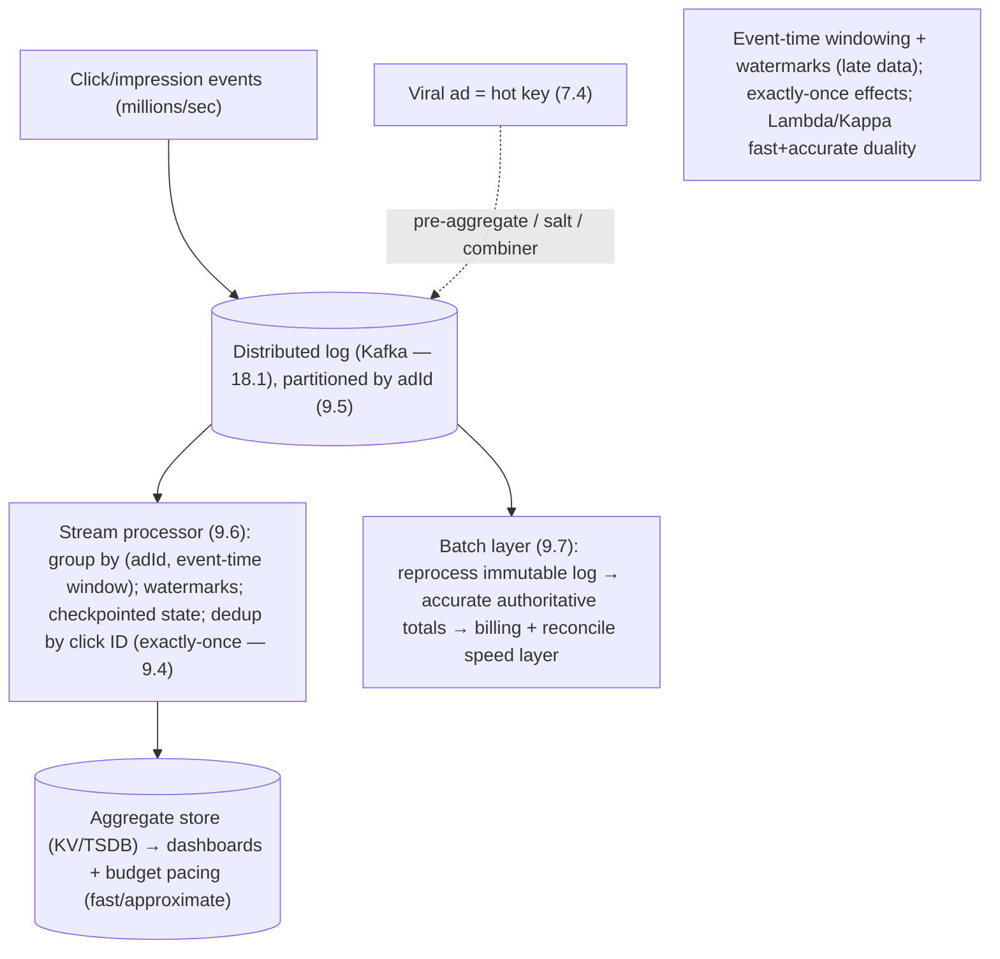

# Lesson 19.2.9 — Design an Ad Click Aggregator / Stream Analytics

> Part 19 · Module 19.2 (Volume 2) · Difficulty: 🔴⚫ · *Interview design*
>
> **Prerequisites:** [9.6 Stream Processing], [9.7 Batch/Stream Unification (Lambda/Kappa)], [9.4 Delivery Guarantees], [18.1 Distributed Log], [9.5 Idempotent Consumers], [1.3.1 Framework].
> **Unlocks:** [Part 20 Capstone (market-data streaming)].

---

## 1. Learning Objectives

After this lesson you will be able to:

- Design an **ad click aggregator / real-time stream analytics** system end-to-end (framework — 1.3.1), reusing **Part 9** (streaming).
- Design a **stream-processing pipeline**: ingest a huge event firehose → window + aggregate → serve near-real-time counts (9.6).
- Handle **event-time vs processing-time**, **windowing**, and **watermarks** for late/out-of-order events (9.6).
- Ensure **correctness** for money-adjacent counts: **exactly-once effects** via idempotent aggregation + dedup (9.4/9.5), plus **reconciliation** with a batch layer (9.7 Lambda/Kappa).
- Handle deep dives: **hot keys** (viral ads — 7.4), **late data**, and the **fast-approximate vs slow-accurate** duality.

---

## 2. Problem statement

Design an **ad click aggregator**: ingest a **massive stream of ad-click (and impression) events**, and produce **aggregated counts** (clicks per ad, per campaign, per time window) available in **near-real-time** for dashboards, billing, and budget-pacing. This is the canonical **real-time stream analytics** design (Part 9). The crux: a **huge write-only event firehose**, **windowed aggregation** with correct handling of **late/out-of-order** events, and **correctness** because **clicks map to money** (billing) — so it blends fast streaming with an accurate batch backstop (9.7).

---

## 3. The design (framework — 1.3.1)

### 3.1 Requirements

`[BP]`
- **Functional:** ingest click/impression events; aggregate counts by ad/campaign over time windows (per-minute/hour/day); serve near-real-time queries; support billing (accurate totals) + budget pacing (stop ads that hit budget).
- **Non-functional:** **very high write throughput** (event firehose); **low-latency** aggregate availability (seconds — for pacing/dashboards); **correctness** (clicks = money → counts must be accurate, deduplicated); **scalable**; fraud-resistant (dedup/filter).
- `[BP]` **Key signal:** massive append-only event stream + windowed aggregation + accuracy-matters. Drive to **log ingestion (18.1) + stream processing (9.6) + exactly-once effects (9.4) + a batch reconciliation layer (9.7)**.

### 3.2 Estimation (1.1.4)

`[BP]` Illustrative: clicks/impressions can be **millions/sec** globally → a firehose. Aggregated outputs are tiny by comparison. → Optimize **ingestion + streaming aggregation**; the raw event volume dominates.

### 3.3 Ingestion + stream processing (the core — 9.6 / 18.1)

`[CS]` `[BP]`:
- **Ingest** events into a **distributed log** (Kafka-style — 18.1/9.3), **partitioned by a key** (e.g., adId — 9.5) so the same ad's events land on the same partition (ordered, aggregatable). The log **buffers + durably retains** the firehose (replayable — 18.1).
- **Stream processor** (Flink/Spark-Streaming/Kafka-Streams-style — 9.6): consume the log, **group by (adId, window)**, and **incrementally aggregate** (counts). Maintain **windowed state** (per-key running counts) with **checkpointing** (9.6) for fault tolerance.
- **Serve:** write aggregated counts to a fast store (KV/TSDB — 16.2) for dashboards/pacing queries.
- `[BP]` **Log ingestion + partitioned streaming aggregation + windowed state** — the streaming-analytics backbone (9.6/18.1).

### 3.4 Windowing, event-time + watermarks (9.6)

`[CS]` The correctness subtlety `[BP]`:
- Aggregate by **event time** (when the click happened) **not processing time** (when it arrived) — events arrive **late + out of order** (mobile offline, network delays — 8.1.1). Using processing time miscounts.
- **Windows:** tumbling (fixed non-overlapping, e.g., per-minute) / sliding / session windows (9.6). Assign each event to its **event-time window**.
- **Watermarks** (9.6): a watermark estimates "event time has advanced to T; expect no more events older than T" → lets the processor **close a window + emit results** while **tolerating bounded lateness**. Very-late events go to a **late-data path** (correction/side output).
- `[BP]` **Event-time windowing + watermarks** handle late/out-of-order events — the core stream-correctness concept (9.6).

### 3.5 Correctness — exactly-once effects + batch backstop (9.4 / 9.7)

`[CS]` Because **clicks = money** `[BP]`:
- **Exactly-once effects** (9.4): a click must be counted **once** despite retries/reprocessing. Achieve via **idempotent aggregation** (dedup events by a unique click ID — 9.5) + the stream processor's **exactly-once state/checkpointing** (transactional writes — 9.4). At-least-once delivery + dedup = exactly-once effects (11.5).
- **Lambda/Kappa duality** (9.7): the **streaming (speed) layer** gives **fast, approximate** near-real-time counts; a **batch layer** reprocesses the same immutable event log **accurately** (handling all late data) to produce **authoritative** totals for **billing** — and **reconciles/corrects** the speed layer. (Kappa = do both via reprocessing the log — 9.7.) `[BP]` **Fast-approximate for pacing/dashboards, slow-accurate for billing** — a key duality.
- `[BP]` **Immutability of the event log (18.1) enables reprocessing** → correctness + reconciliation.

### 3.6 Deep dives + bottlenecks

`[BP]`
- **Late/out-of-order data** (§3.4): event-time + watermarks + a late-data correction path.
- **Exactly-once + dedup** (§3.5): idempotent counting by click ID; checkpointed transactional state (9.4/9.5).
- **Hot keys** (7.4): a **viral ad** = a hot partition → skew (7.4). Mitigate: **pre-aggregate at the edge/producer** (combine counts before the log), **salt** the hot key across sub-partitions then merge, or local partial-aggregation (a "combiner"). Classic streaming hotspot handling.
- **Fraud/invalid clicks:** filter bots/duplicates before/within aggregation (dedup + rules).
- **Fast vs accurate** (§3.5): speed layer (approximate, seconds) + batch layer (accurate, authoritative) — reconcile.
- **Bottleneck:** the ingestion + aggregation throughput → **partitioning (9.5) + horizontal stream workers + pre-aggregation for hot keys (7.4)**; the log absorbs bursts (backpressure — 9.9).
- `[BP]` **The lesson (Part 9):** ad click aggregator = **log ingestion (18.1) + partitioned windowed stream aggregation (9.6, event-time + watermarks) + exactly-once effects (9.4/9.5) + a batch reconciliation layer (9.7) + hot-key handling (7.4)**. Fast-approximate speed layer + slow-accurate batch layer.

---

## 4. Visual Intuition

---

## 5. Real-World Analogy

Think of **counting votes pouring in from thousands of polling stations in real-time, where the tally decides payouts**.

- **Event firehose + log = ballots arriving continuously:** you drop every ballot into a **durable, ordered intake** (the log) so nothing is lost and you can **recount later** if needed.
- **Windowed aggregation = tallies per hour, per candidate:** you keep **running counts** grouped by candidate and time window, updating as ballots stream in.
- **Event-time + watermarks = counting by when the vote was cast, not when it arrived:** a ballot mailed at 2pm but delivered at 5pm still counts in the **2pm** tally. You **wait a reasonable grace period** (watermark) before finalizing an hour's count, and handle stragglers with a correction.
- **Exactly-once = each ballot counted once:** every ballot has a **serial number**; if the same one shows up twice (a jam, a retry), you count it **once** — because the tally decides money.
- **Speed layer vs batch layer = the running estimate vs the official recount:** the live board shows a **fast approximate tally** (great for calling the race early / pacing spend), while a **careful full recount** of every archived ballot later produces the **official, authoritative** number for payouts — and corrects the live board.
- **Hot key = a landslide candidate:** if one candidate gets 90% of the ballots, one counter is swamped → you have **sub-counters tally partial sums** and combine them.

---

## 6. Industry Example

- **Kafka log ingestion + Flink/Spark streaming** `[CONV]`: durable partitioned event log + windowed stream aggregation (§3.3, 18.1/9.6). *(Representative.)*
- **Event-time windowing + watermarks** `[CONV]`: correct handling of late/out-of-order events (§3.4, 9.6). *(Representative.)*
- **Exactly-once stream processing** `[CONV]`: checkpointed transactional state + dedup for money-accurate counts (§3.5, 9.4). *(Representative.)*
- **Lambda/Kappa architecture** `[CONV]`: fast speed layer + accurate batch layer over the same immutable log (§3.5, 9.7/18.1). *(Representative.)*
- **Hot-key pre-aggregation** `[CONV]`: combiners/salting for viral ads (§3.6, 7.4). *(Representative.)*

---

## 7. Implementation Details

- **Ingest** into a distributed log (18.1), partition by adId (9.5) (§3.3).
- **Stream processor** (9.6): group by (adId, event-time window); watermarks; checkpointed windowed state (§3.3/3.4).
- **Exactly-once effects**: dedup by click ID (9.5) + transactional checkpointed state (9.4) (§3.5).
- **Batch layer** (9.7) reprocesses the immutable log for authoritative billing totals + reconciles the speed layer (§3.5).
- **Hot keys** (7.4): pre-aggregate/combine/salt viral ads (§3.6); fraud filtering; serve aggregates to KV/TSDB (16.2).

---

## 8–14. (Condensed)

**Advantages:** absorbs the firehose (durable log + partitioning); near-real-time aggregates; correct counts (event-time + exactly-once); authoritative billing via batch backstop; replayable.
**Disadvantages/cautions:** streaming correctness is subtle (watermarks/late data); exactly-once adds overhead; two layers (speed+batch) to operate; hot keys need special handling.
**When NOT to:** don't use processing-time if accuracy matters (use event-time); don't trust the speed layer alone for billing (reconcile with batch); don't ignore dedup (double-counted money).
**Common mistakes:** processing-time windows (miscount late events); no watermark/late-data handling; at-least-once without dedup (over-count → over-bill); ignoring hot keys (viral-ad skew); no batch reconciliation.
**Interview Qs:** 🟢 Why ingest into a log first? 🟡 Event-time vs processing-time + watermarks — why? 🔴 How do you guarantee exactly-once counts (money)? Speed vs batch layer? ⚫ Full design: log ingestion, partitioned windowed aggregation, event-time/watermarks, exactly-once effects, Lambda/Kappa reconciliation, hot keys.
**Production pitfalls:** hot-key skew (viral ads — 7.4); late-data undercounting; duplicate over-billing; stream-state loss without checkpointing; speed/batch divergence.
**Optimizations:** pre-aggregation/combiners for hot keys; partition by adId; checkpoint tuning; approximate structures (HyperLogLog for unique counts) in the speed layer; tiered aggregate storage (TSDB — 16.2).

---

## 15. Summary

An **ad click aggregator** ingests a **massive stream of click/impression events** and produces **aggregated counts** (per ad/campaign/window) in **near-real-time** for dashboards, **billing**, and budget pacing — the canonical **real-time stream analytics** design (Part 9). The crux: a **huge append-only event firehose** (millions/sec), **windowed aggregation** with correct handling of **late/out-of-order** events, and **correctness because clicks map to money**. The **core pipeline**: **ingest into a distributed log** (Kafka-style — 18.1/9.3) **partitioned by adId** (9.5, same ad → same partition, ordered/aggregatable) that durably **buffers + retains** the firehose (replayable); a **stream processor** (Flink/Spark/Kafka-Streams — 9.6) consumes it, **groups by (adId, window)**, and **incrementally aggregates** with **checkpointed windowed state** (fault tolerance); aggregates land in a fast store (KV/TSDB — 16.2) for queries. The **correctness subtleties**: aggregate by **event time** (when the click happened) **not processing time** (when it arrived — events arrive late/out-of-order — 8.1.1), assign events to **event-time windows** (tumbling/sliding/session), and use **watermarks** to decide when to **close a window + emit** while tolerating bounded lateness (very-late events go to a **correction path**). Because **clicks = money**, guarantee **exactly-once effects** (9.4): **idempotent aggregation** (dedup by a unique click ID — 9.5) + **transactional checkpointed state** (at-least-once delivery + dedup = exactly-once effects — 11.5). The **Lambda/Kappa duality** (9.7): a **streaming speed layer** gives **fast approximate** counts (pacing/dashboards), while a **batch layer reprocesses the immutable log accurately** (all late data included) to produce **authoritative billing totals** and **reconcile/correct** the speed layer — **fast-approximate for pacing, slow-accurate for billing** (the immutability of the log — 18.1 — is what makes reprocessing possible). **Deep dives:** late data (event-time + watermarks), exactly-once + dedup, **hot keys** (a viral ad = a hot partition/skew — 7.4 — mitigated by **pre-aggregation/combiners/salting**), fraud filtering, and the fast-vs-accurate duality. The **bottleneck — ingestion + aggregation throughput — dissolves** via partitioning + horizontal stream workers + hot-key pre-aggregation, with the log absorbing bursts (backpressure — 9.9). In one line: **log ingestion + partitioned event-time windowed aggregation (watermarks) + exactly-once effects + Lambda/Kappa batch reconciliation + hot-key handling**.

---

## 16. Revision Notes (flashcard-ready)

- **Q:** Why ingest into a log first? **A:** Durably buffer the firehose, order per-key (partition by adId), enable replay/reprocessing (18.1).
- **Q:** Event-time vs processing-time? **A:** Aggregate by when the click happened (event time) — events arrive late/out-of-order; processing-time miscounts.
- **Q:** Watermarks? **A:** Estimate event-time progress to close windows + emit results while tolerating bounded lateness; very-late → correction path.
- **Q:** Why exactly-once here? **A:** Clicks = money; must count each once — dedup by click ID + checkpointed transactional state (9.4/9.5).
- **Q:** Lambda/Kappa duality? **A:** Speed layer = fast approximate (pacing/dashboards); batch layer = accurate authoritative (billing) + reconciles speed. Kappa = reprocess the log.
- **Q:** What enables reprocessing? **A:** The immutable, retained event log (18.1).
- **Q:** Hot key (viral ad)? **A:** Hot partition/skew (7.4) → pre-aggregate/combine/salt across sub-partitions then merge.
- **Q:** Windows? **A:** Tumbling/sliding/session; assign events by event-time window (9.6).
- **Q:** Bottleneck? **A:** Ingestion + aggregation throughput → partitioning + horizontal workers + hot-key pre-aggregation; log absorbs bursts.

---

## 17. Further Reading + Knowledge-Graph Links

**Foundations:** [9.6 Stream Processing] · [9.7 Lambda/Kappa] · [9.4 Delivery Guarantees] · [9.5 Idempotent Consumers] · [18.1 Distributed Log] · [7.4 Hot Keys].
**External:** Google Dataflow/Beam model (event-time, watermarks); Flink exactly-once; Kappa architecture. *(Representative.)*

> **Knowledge-graph:** `18.1 log` + `9.6 stream` + `9.4 exactly-once` + `9.7 Lambda/Kappa` + `7.4 hot keys` → **`19.2.9 ad click aggregator`** (log ingest + event-time windowed aggregation + exactly-once + batch reconciliation).
