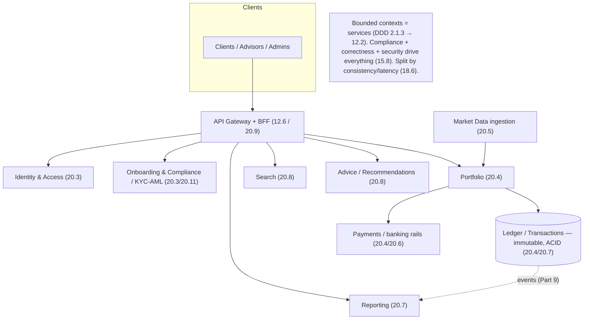

# Lesson 20.1 — Domain, Requirements, Compliance & Bounded Contexts

> Part 20 · Enterprise Capstone: Wealth Management Platform · Difficulty: ⚫ · *Capstone*
>
> **Prerequisites:** [1.1.2 FR vs NFR], [1.3.1 Framework], [2.1.3 Domain-Driven Design], [2.2.3 Microservices], [15.8 Compliance], [12.2 Service Decomposition].
> **Unlocks:** [20.2 Capacity & SLOs] and the rest of Part 20.

---

## 1. Learning Objectives

After this lesson you will be able to:

- Frame the **capstone system** — a **Wealth Management Platform** — and scope it with the **framework** (1.3.1).
- Separate **functional** from **non-functional** requirements (1.1.2) for a regulated financial platform.
- Map the **compliance landscape** (15.8 — KYC/AML, PCI, GDPR, SOX/audit, suitability) as **first-class design drivers**, not afterthoughts.
- Decompose the domain into **bounded contexts** (2.1.3 DDD) that become the **service boundaries** (12.2) for the rest of Part 20.
- Establish the **integration lesson** the whole capstone demonstrates: a large system is a **composition of subsystems**, each chosen from the course's building blocks.

---

## 2. Why a capstone — and why this domain

Parts 1–19 taught the building blocks and drilled 20 focused interview designs. The **capstone integrates all of it** into **one defended, end-to-end enterprise system** — the kind you'd actually architect and operate. We choose a **Wealth Management Platform** (manage customer investment portfolios: accounts, holdings, trades, market data, payments, reporting, advice/recommendations) because it forces **every hard theme at once**:

- **Financial correctness** (money — a ledger, idempotency, exactly-once effects — 18.3/11.5/19.2.3).
- **Heavy compliance** (regulated — KYC/AML, PCI, GDPR, SOX/audit — 15.8).
- **Real-time data** (market-data streaming — Part 9/19.2.9) + **strong-consistency transactions** (18.3) + **eventual-consistency reads** (10.5) — a **consistency/latency split** (18.6).
- **Search, recommendations, AI** (18.7/18.5/19.2.7), **caching/CDN** (Part 6/18.4), **microservices** (Part 12), **cloud-native reliability** (Part 13/11/14), **security + observability** (Parts 15/16).

`[BP]` It is deliberately a **superset** — Part 20 is a tour of the entire course applied to one coherent system.

---

## 3. The design (framework — 1.3.1)

### 3.1 Scope + actors

`[BP]` Actors: **clients** (view portfolio, transact, get advice), **financial advisors** (manage client portfolios), **admins/compliance officers** (oversight, audit), **external systems** (market-data feeds, payment/banking rails, custodians/brokers), and **the platform's own services**.

### 3.2 Functional requirements (1.1.2)

`[BP]` Core capabilities (each maps to later lessons):
- **Identity & onboarding:** register, **KYC/AML** verification, authenticate, authorize (→ 20.3).
- **Portfolio & holdings:** accounts, positions, balances, valuation (→ 20.4).
- **Transactions & trades:** buy/sell orders, transfers, payments; recorded in an **immutable ledger** (→ 20.4/20.7).
- **Market data:** ingest real-time prices, historical time-series, drive valuations (→ 20.5).
- **Money movement:** deposits/withdrawals/payments across banking rails (→ 20.4/20.6).
- **Search & discovery:** find instruments, transactions, documents (→ 20.8).
- **Recommendations/advice:** suggested allocations, insights (→ 20.8).
- **Reporting & statements:** performance, tax, regulatory reports (→ 20.7 audit trail).

### 3.3 Non-functional requirements (1.1.2) — the real drivers

`[BP]` For a regulated financial platform, NFRs dominate:
- **Correctness & consistency:** money must be **exactly right**; balances/ledger **strongly consistent + auditable** (18.3/20.4) — **CP where money is involved** (10.7).
- **Security:** authN/authZ, encryption in transit + at rest, secrets, zero-trust (Part 15) — a breach is existential.
- **Compliance:** KYC/AML, PCI-DSS, GDPR, SOX/audit, suitability rules (15.8 — §3.4) — legally mandatory.
- **Availability & reliability:** HA + DR + multi-region (11/13.8); market hours are unforgiving; RPO≈0 for the ledger.
- **Latency:** fast portfolio loads (read-optimized), near-real-time market data; but **correctness > latency** for money.
- **Auditability & traceability:** every state change **recorded, immutable, attributable** (15.8/20.7).
- **Scalability + cost:** many clients × instruments × price ticks; efficient (Part 17).
- `[BP]` **Priority order:** correctness & compliance & security **first**, then availability, then latency, then cost — the reverse of a typical consumer app. This ordering drives every later decision.

### 3.4 Compliance landscape (15.8) — design drivers, not afterthoughts

`[CS]` Compliance is a **first-class architectural input** (15.8) `[BP]`:
- **KYC/AML (Know Your Customer / Anti-Money-Laundering):** verify identity at onboarding; monitor transactions for suspicious patterns → an **identity/onboarding context** + transaction monitoring (20.3).
- **PCI-DSS:** if handling card/payment data → **tokenize, never store raw PANs**, minimize scope (15.8/19.2.3) → isolate payment handling (20.4/20.6).
- **GDPR / data privacy:** PII minimization, data-subject rights (erasure — hard with an immutable ledger → **crypto-shredding** — 15.8), residency → shapes data storage + multi-region (20.10).
- **SOX / financial audit:** **immutable, tamper-evident audit trail** of all financial changes → **event sourcing** (20.7) + append-only ledger (20.4).
- **Suitability / fiduciary rules:** advice must fit the client's risk profile → business rules in the advice context (20.8).
- `[BP]` **These constraints pre-decide** the ledger's immutability, the tokenization boundary, the audit-log architecture, encryption, and multi-region data residency. Design them **in**, not on.

### 3.5 Bounded contexts (DDD — 2.1.3) → service boundaries (12.2)

`[CS]` Decompose the domain into **bounded contexts** — each a cohesive model with a clear boundary, becoming a **service** (or service group) with **its own data** (database-per-service — 12.4) `[BP]`:
- **Identity & Access** (users, auth, roles — 20.3)
- **Onboarding & Compliance** (KYC/AML, suitability — 20.3/20.11)
- **Portfolio** (accounts, holdings, positions, valuation — 20.4)
- **Ledger / Transactions** (double-entry ledger, the financial source of truth — 20.4/20.7)
- **Payments** (money movement, banking rails — 20.4/20.6)
- **Market Data** (price ingestion, time-series — 20.5)
- **Search** (instruments, documents, transactions — 20.8)
- **Advice / Recommendations** (allocations, insights, AI — 20.8)
- **Reporting** (statements, tax, regulatory — 20.7)
- **Notifications** (alerts, confirmations — reuses 19.1.4)
- `[BP]` **Boundaries follow the domain + the invariants** (2.1.3/12.2): keep tightly-coupled, invariant-bound data together (the ledger's entries must be transactionally consistent — one context); separate concerns that change independently (market data vs advice). Same concept in two contexts → **model per context + shared ID + anti-corruption layer** (12.2).

### 3.6 The integration thesis

`[BP]` The capstone's core lesson: **a large system is a composition of subsystems, each solved with the right building block, split by consistency/latency profile** (18.6 meta-lesson), and **every decision follows from a requirement** (compliance/correctness/latency). Part 20's remaining lessons each take one context/concern and design it, citing the course. The art is in the **seams**: how contexts communicate (events/APIs — 12.3), share identity, and stay consistent (sagas — 20.6) without a distributed monolith.

---

## 4. Visual Intuition

---

## 5. Real-World Analogy

Think of **designing a modern regulated bank branch network**, not a lemonade stand.

- **Compliance-first = the vault and the rulebook come before the décor:** you don't design a bank by picking wallpaper (features) and later bolting on a vault (security/compliance). The **regulations, the auditable vault, the identity checks at the door** are the *starting constraints* — everything else fits around them.
- **Bounded contexts = departments with their own ledgers:** the tellers, the loan office, the compliance desk, the market-data terminal room, and the advisory office each have **their own records and expertise** and a **clear counter** where they hand off to each other. You don't run the whole bank out of one giant shared filing cabinet (a shared database) — that's chaos and coupling.
- **The ledger = the bank's sacred books:** balanced, written in ink, never erased, audited nightly — the one source of truth about money.
- **Integration = the inter-department memos and messengers:** departments coordinate through **defined messages** (events/APIs), not by rummaging in each other's drawers.
- **Priority order = safety before speed:** a bank that's fast but loses your money is finished; one that's careful and correct earns trust. Correctness and compliance outrank latency.

---

## 6. Industry Example

- **DDD bounded contexts → microservices** `[CONV]`: decomposing a financial domain into context-aligned services with their own data (§3.5, 2.1.3/12.2). *(Representative.)*
- **Compliance as a design driver** `[CONV]`: KYC/AML, PCI, GDPR, SOX shaping architecture in fintech (§3.4, 15.8). *(Representative.)*
- **Immutable ledger + event sourcing for audit** `[CONV]`: financial platforms recording tamper-evident history (§3.4, 18.3/20.7). *(Representative.)*
- **Consistency/latency split** `[CONV]`: strong for money, eventual for reads/market-data (§3.3/3.6, 18.6). *(Representative.)*

---

## 7. Implementation Details (capstone setup)

- **Framework** (1.3.1): scope → FR (§3.2) → NFR (§3.3, correctness/compliance/security-first) → contexts (§3.5) → per-context designs (rest of Part 20).
- **Bounded contexts** (2.1.3) become **services with database-per-service** (12.4); communicate via events (Part 9) + APIs (12.3); anti-corruption layers at seams (12.2).
- **Compliance baked in** (15.8): immutable ledger, tokenization boundary, audit log (event sourcing — 20.7), encryption, residency.
- **Consistency map:** ledger/transactions = CP/strong (18.3); portfolio reads/market-data/search = eventual/cached (10.5/Part 6); split explicitly (18.6).

---

## 8–14. (Condensed)

**Advantages of this framing:** requirements + compliance drive the architecture (no rework); clear context boundaries prevent a distributed monolith; correctness/audit designed-in; each concern reuses a proven building block.
**Disadvantages/cautions:** many contexts = distributed-system complexity (Part 12 costs); compliance adds constraints + cost; getting boundaries wrong is expensive to fix (2.3.2 the hard parts).
**When NOT to:** don't start with microservices if the domain is small — monolith-first (12.1); we use them here because the domain is genuinely large + multi-team + regulated.
**Common mistakes:** treating compliance/security as a later phase; one shared database across contexts (12.4 fatal); boundaries by technical layer not domain (12.2 anti-pattern); optimizing latency over correctness for money.
**Interview Qs:** 🟢 What are the key NFRs for a financial platform, and how do they differ from a consumer app? 🟡 How does compliance shape the architecture? 🔴 How do you decompose the domain into bounded contexts, and where are the consistency boundaries? ⚫ Defend the whole decomposition + the correctness/compliance-first priority order.
**Production pitfalls:** compliance gaps discovered late; context boundaries leaking (chatty cross-service calls); audit trail incomplete; PII in the wrong places (GDPR).
**Optimizations:** align contexts to teams (Conway's Law); keep invariant-bound data co-located (avoid cross-context transactions); event-driven seams to decouple (12.3).

---

## 15. Summary

The **capstone** integrates the entire course into **one defended, end-to-end enterprise system** — a **Wealth Management Platform** (portfolios, trades, market data, payments, advice, reporting) — chosen because it forces **every hard theme at once**: **financial correctness** (ledger/idempotency/exactly-once — 18.3/11.5/19.2.3), **heavy compliance** (15.8), **real-time streaming + strong-consistency transactions + eventual reads** (a **consistency/latency split** — 18.6), and search/recs/caching/microservices/reliability/security/observability. Applying the **framework** (1.3.1): the **functional requirements** span identity/onboarding, portfolio/holdings, transactions/trades, market data, money movement, search, recommendations, and reporting — each mapping to a later Part-20 lesson. But the **non-functional requirements dominate** and are prioritized **reverse of a consumer app**: **correctness & compliance & security first**, then availability, then latency, then cost. **Compliance is a first-class design driver** (15.8), not an afterthought: **KYC/AML** (identity + transaction monitoring), **PCI-DSS** (tokenize, never store raw card data, minimize scope), **GDPR** (PII minimization, erasure via crypto-shredding against an immutable ledger, residency), **SOX/audit** (immutable tamper-evident trail → event sourcing — 20.7), and **suitability/fiduciary** rules — these **pre-decide** the ledger's immutability, the tokenization boundary, the audit architecture, encryption, and multi-region data placement. The domain decomposes into **bounded contexts** (DDD — 2.1.3) that become **services with database-per-service** (12.2/12.4): Identity & Access, Onboarding & Compliance, Portfolio, Ledger/Transactions, Payments, Market Data, Search, Advice/Recommendations, Reporting, Notifications — with boundaries following the **domain + invariants** (keep transactionally-consistent data together, separate independently-changing concerns, model shared concepts per-context with a shared ID + anti-corruption layer). The **integration thesis** — the capstone's core lesson — is that **a large system is a composition of subsystems, each solved with the right building block, split by consistency/latency profile, where every decision follows from a requirement**; the remaining Part-20 lessons each design one context/concern citing the course, and the real art is in the **seams** (events/APIs, shared identity, sagas — 20.6) that avoid a distributed monolith.

---

## 16. Revision Notes (flashcard-ready)

- **Q:** Why a Wealth Management Platform for the capstone? **A:** It forces every hard theme: financial correctness, compliance, real-time data + strong transactions + eventual reads, search/recs/caching/microservices/reliability/security/observability.
- **Q:** NFR priority order (vs consumer app)? **A:** Correctness & compliance & security first, then availability, then latency, then cost — reverse of typical.
- **Q:** Is compliance an afterthought? **A:** No — it's a first-class design driver (KYC/AML, PCI, GDPR, SOX, suitability) that pre-decides ledger immutability, tokenization, audit, encryption, residency.
- **Q:** How to erase PII against an immutable ledger (GDPR)? **A:** Crypto-shredding (delete the key) — 15.8.
- **Q:** What becomes a service? **A:** Each bounded context (DDD — 2.1.3), with its own database (12.4).
- **Q:** How to set context boundaries? **A:** By domain + invariants — co-locate transactionally-consistent data, separate independently-changing concerns; shared concept → per-context model + shared ID + ACL.
- **Q:** Consistency split? **A:** Ledger/transactions = CP/strong (18.3); portfolio reads/market-data/search = eventual/cached (10.5/Part 6) — split explicitly (18.6).
- **Q:** The integration thesis? **A:** A big system = composition of subsystems, right building block each, split by consistency/latency, every decision from a requirement.

---

## 17. Further Reading + Knowledge-Graph Links

**Foundations:** [1.1.2 FR vs NFR] · [1.3.1 Framework] · [2.1.3 DDD] · [12.2 Decomposition] · [15.8 Compliance] · [18.6 Consistency/Latency Split] · [19.2.3 Payment System].
**External:** Evans *Domain-Driven Design*; fintech compliance (KYC/AML, PCI-DSS, GDPR, SOX). *(Representative.)*

> **Knowledge-graph:** `2.1.3 DDD` + `1.1.2 NFR` + `15.8 compliance` + `18.6 split` → **`20.1 capstone framing`** (Wealth Management Platform; compliance/correctness-first; bounded contexts → services) → seeds all of Part 20.
