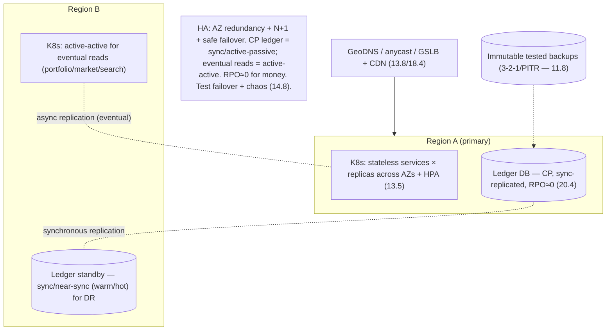

# Lesson 20.10 — Reliability: HA, DR, Multi-Region, Autoscaling on Kubernetes

> Part 20 · Enterprise Capstone · Difficulty: ⚫ · *Capstone*
>
> **Prerequisites:** [11.2 Redundancy/Failover], [11.8 Disaster Recovery], [13.8 Multi-AZ/Multi-Region], [13.5 Autoscaling], [13.3 Kubernetes], [20.2 Capacity/SLOs].
> **Unlocks:** [20.11 Security], [20.12 Observability].

---

## 1. Learning Objectives

After this lesson you will be able to:

- Design the platform's **reliability posture**: HA (no SPOF — 11.2), DR (RPO/RTO — 11.8), and multi-region (13.8) to meet the 20.2 SLOs.
- Deploy on **Kubernetes** (13.3) with **autoscaling** (13.5) for elastic tiers — while respecting the **non-elastic ledger DB** caveat.
- Choose a **multi-region strategy** (active-passive vs active-active vs global DB) per context, honoring the **CP ledger** (20.4) vs eventual read paths.
- Set **RPO ≈ 0 for the ledger** (money) and looser targets for derived data (20.2).
- **Test failover + DR** (11.8/14.8) — an untested DR plan is not a plan.

---

## 2. Motivation

A financial platform's downtime or data loss is catastrophic — **market hours are unforgiving** and **the ledger must never lose committed money** (RPO ≈ 0 — 20.2/20.4). Reliability isn't a feature you add; it's a **posture** across redundancy, failover, DR, and geography, calibrated to each context's SLO. This lesson assembles Parts 11 + 13 into the platform's HA/DR/multi-region design.

---

## 3. The design (framework — 1.3.1)

### 3.1 HA — no single point of failure (11.2)

`[BP]`
- **Redundancy everywhere** (11.2): every stateless service runs **multiple replicas** across **≥2 availability zones** (13.8); load-balanced (3.3.1); **N+1 headroom** (20.2) so losing an instance/AZ doesn't breach SLO.
- **Stateful (ledger/DB):** replicated with **automatic, fenced, quorum-gated, caught-up failover** (11.2 — no split-brain); synchronous replication for the ledger (RPO ≈ 0 — §3.4).
- **Multi-AZ is the HA baseline** (13.8 — synchronous, low-latency, cheap within a region); it survives a datacenter/AZ failure without data loss.
- `[BP]` **HA = redundancy across AZs + N+1 headroom + safe failover for stateful components** (11.2/13.8).

### 3.2 Kubernetes + autoscaling (13.3 / 13.5)

`[BP]`
- **Run services on Kubernetes** (13.3): declarative, self-healing (reschedule failed pods), rolling deploys, spread across AZs (anti-affinity).
- **Autoscaling** (13.5): **HPA** (replicas) for stateless tiers on the right metric (concurrency/queue-lag > raw CPU — 13.5), **Cluster-Autoscaler** for nodes; scale for **market-open peaks** (20.2).
- **The critical caveat** (13.5/20.2): **autoscaling doesn't scale the non-elastic ledger DB** — provision it for peak + pair with **load shedding** (11.4) as a backstop so a traffic surge can't overwhelm the money path. A recurring course lesson.
- **Stateful workloads:** prefer **managed databases** over self-hosted StatefulSets for the ledger (13.4) — operational reliability.
- `[BP]` **K8s + autoscale elastic tiers; provision + shed for the non-elastic ledger.**

### 3.3 Multi-region (13.8) — per-context strategy

`[CS]` Different contexts get different geo strategies (honoring their consistency model) `[BP]`:
- **Ledger / transactions (CP — 20.4):** the hard one. Options: a **globally-distributed SQL** DB with **synchronous consensus replication** (18.3 — Spanner/Cockroach — strong consistency across regions, pays latency — CP/PACELC), or **active-passive** (a primary region + a synchronously/near-sync replicated standby region for DR). `[BP]` For money, **consistency + zero data loss dominate** → distributed-SQL or active-passive with sync replication; **not** active-active multi-master on the ledger (conflicts on money are unacceptable).
- **Read paths / derived data (eventual — 20.4/20.5/20.8):** **active-active** across regions is fine (portfolio views, market data, search) — serve reads locally for low latency, replicate asynchronously (13.8/10.2).
- **Global traffic** (13.8): GeoDNS/anycast/GSLB + CDN (18.4) route users to the nearest healthy region.
- `[BP]` **Split geo strategy by consistency (18.6 again): CP ledger = sync/distributed-SQL or active-passive; eventual reads = active-active.** Global correlated-failure risk (global config/control plane) is the multi-region danger (13.8).

### 3.4 Disaster recovery — RPO/RTO (11.8)

`[CS]` `[BP]`:
- **RPO (how much data you can lose):** **≈ 0 for the ledger** (money — synchronous replication + durable, immutable log — 20.4/20.7); looser for derived data (rebuildable by replay — 20.7).
- **RTO (how fast you recover):** tight during market hours; drives the DR tier.
- **DR tiers** (11.8): backup-restore → pilot-light → warm-standby → active-active — pick per RPO/RTO + cost. For the ledger: **warm/hot standby in another region** with sync/near-sync replication (RPO≈0, low RTO).
- **Backups ≠ replicas** (11.8): keep **immutable, tested backups** (3-2-1, PITR) **in addition** to replicas — protects against corruption/deletion/ransomware, which replication faithfully copies. The immutable event log (20.7) aids recovery.
- `[BP]` **RPO≈0 + low RTO for the ledger via a warm/hot cross-region standby + immutable tested backups; looser for rebuildable derived data.**

### 3.5 Test it (11.8 / 14.8)

`[BP]`
- **An untested DR plan is not a plan** (11.8): regularly **exercise failover + restore** (game days — 14.8), and use **chaos engineering** (14.8) to validate resilience patterns (11.3) hold under real failures.
- Verify **backups restore** + reconciliation (19.2.3) confirms ledger integrity post-recovery.
- `[BP]` **Test failover, restore, and chaos regularly** — reliability is proven, not assumed.

### 3.6 Deep dives + bottlenecks

`[BP]`
- **CP vs eventual geo** (§3.3): the central multi-region judgment (18.6) — money is sync/CP, reads are active-active/eventual.
- **Non-elastic DB** (§3.2): autoscaling can't save the ledger DB → provision + shed (13.5/11.4).
- **Correlated failure** (13.8/11.1): global config/control-plane changes can take down all regions at once — stagger, canary, guard (14.7).
- **Failover safety** (11.2): fenced + quorum-gated + caught-up (no split-brain, no stale-primary serving money).
- **Cost** (17.6): multi-region + warm standby is expensive — justified for money; derived data can use cheaper tiers.
- `[BP]` **The lesson:** reliability = **HA (AZ redundancy + N+1 + safe failover — 11.2/13.8) + K8s autoscaling for elastic tiers (provision+shed the non-elastic ledger — 13.5/11.4) + per-context multi-region (CP ledger sync/active-passive, eventual reads active-active — 13.8/18.6) + DR (RPO≈0 for the ledger, immutable tested backups — 11.8) + tested failover/chaos (14.8)** — calibrated to each context's SLO (20.2).

---

## 4. Visual Intuition

---

## 5. Real-World Analogy

Think of a **bank designed to survive fires, floods, and regional disasters without losing a cent**.

- **HA = multiple tellers in multiple wings:** if one teller (instance) or even one wing (availability zone) is knocked out, others keep serving — and you keep **spare capacity** (N+1) so the loss doesn't create a queue.
- **Autoscaling = calling in extra tellers at lunchtime (market open)** — but the **vault** (ledger DB) isn't something you can duplicate on demand; you **size it for the rush ahead of time** and, if the crowd still surges, you **politely slow the line** (load shed) rather than let the vault be overrun.
- **Multi-region = a fully-equipped backup branch in another city:** for the **fast, read-only info** (balances display, prices), both branches serve customers locally. But the **official vault** can't have two independent copies both accepting deposits (they'd disagree about your money) — so either one authoritative vault with a **tightly-mirrored backup** (active-passive, synced), or a special **globally-synchronized vault** that agrees before committing.
- **DR + RPO≈0 = the vault's mirror never lags:** if the main branch is destroyed, the backup has **every committed transaction** (no money lost), and you can reopen fast (low RTO). And you keep **sealed, tested backups off-site** — because a mirror faithfully copies a mistake (a wrongful erasure), but a sealed backup doesn't.
- **Test it = fire drills:** a disaster plan you've never rehearsed will fail when it counts — so you **practice the evacuation and the vault-restore** regularly.

---

## 6. Industry Example

- **Multi-AZ HA + N+1 on Kubernetes** `[CONV]`: redundant stateless services across AZs, HPA autoscaling (§3.1/3.2, 13.3/13.5). *(Representative.)*
- **Globally-distributed SQL or active-passive for the ledger** `[CONV]`: strong consistency / zero-loss for money across regions (§3.3, 18.3/13.8). *(Representative.)*
- **Active-active for eventual read paths** `[CONV]`: local reads for portfolio/market/search (§3.3, 13.8). *(Representative.)*
- **RPO≈0 DR + immutable tested backups** `[CONV]`: warm/hot standby + 3-2-1/PITR (§3.4, 11.8). *(Representative.)*
- **Failover + chaos testing** `[CONV]`: game days validating DR + resilience (§3.5, 14.8). *(Representative.)*

---

## 7. Implementation Details

- **HA:** stateless replicas across ≥2 AZs + N+1 (20.2); safe (fenced/quorum-gated/caught-up) failover for stateful (11.2/13.8) (§3.1).
- **K8s** (13.3) + **HPA/Cluster-Autoscaler** (13.5) for elastic tiers; **provision + load-shed** the non-elastic ledger DB (11.4); managed DBs (13.4) (§3.2).
- **Multi-region per context** (13.8/18.6): CP ledger = distributed-SQL/sync or active-passive; eventual reads = active-active; GeoDNS/anycast + CDN (§3.3).
- **DR:** RPO≈0 ledger (sync replication + immutable log — 20.7) + warm/hot standby + immutable tested backups (3-2-1/PITR — 11.8); looser for derived data (§3.4).
- **Test** failover/restore/chaos regularly (11.8/14.8); reconcile ledger post-recovery (19.2.3) (§3.5).

---

## 8–14. (Condensed)

**Advantages:** survives instance/AZ/region failures; no money loss (RPO≈0); scales for peaks; SLO-calibrated per context; proven via testing.
**Disadvantages/cautions:** multi-region + warm standby is costly (justified for money); CP ledger geo pays latency (PACELC); autoscaling can't save the non-elastic DB; correlated global failures; DR complexity.
**When NOT to:** don't active-active multi-master the ledger (money conflicts); don't rely on replicas instead of backups; don't skip DR testing; don't autoscale-and-forget the ledger DB.
**Common mistakes:** SPOF in stateful components; unsafe failover (split-brain/stale-primary); no backups (only replicas — corruption propagates); untested DR; ignoring market-open peaks; global config change downing all regions.
**Interview Qs:** 🟢 What's the HA baseline (multi-AZ + N+1)? 🟡 Why can't autoscaling save the ledger DB? 🔴 Multi-region strategy for the CP ledger vs eventual reads? RPO/RTO targets? ⚫ Full reliability posture: HA, K8s autoscaling, per-context multi-region, DR (RPO≈0), and how you test it.
**Production pitfalls:** split-brain on failover; replication lag causing data loss on failover (semi-sync/sync for money); backup rot (untested); correlated global-config failure; DB saturation under peak (no shedding).
**Optimizations:** anti-affinity across AZs; managed DBs; sync replication for the ledger; active-active eventual reads for latency; automated failover with fencing; regular game days + chaos (14.8); immutable backups + PITR.

---

## 15. Summary

A financial platform's **downtime or data loss is catastrophic** (unforgiving market hours; the ledger must never lose committed money — RPO ≈ 0 — 20.2/20.4), so **reliability is a posture** across redundancy, failover, DR, and geography, **calibrated to each context's SLO**, assembling Parts 11 + 13. **HA** means **no SPOF** (11.2): every stateless service runs **multiple replicas across ≥2 availability zones** (the HA baseline — synchronous, cheap, survives an AZ failure — 13.8) with **N+1 headroom** (20.2), while stateful components (the ledger) use **automatic, fenced, quorum-gated, caught-up failover** (no split-brain — 11.2) with **synchronous replication** (RPO ≈ 0). Services run on **Kubernetes** (13.3 — self-healing, rolling deploys, AZ-spread) with **autoscaling** (13.5 — HPA on concurrency/queue-lag, Cluster-Autoscaler for nodes) sized for **market-open peaks** — but with the **recurring critical caveat**: **autoscaling doesn't scale the non-elastic ledger DB**, so **provision it for peak + pair with load shedding** (11.4) as a backstop, and prefer **managed databases** (13.4). **Multi-region** strategy is **split by consistency** (18.6 again): the **CP ledger** (money — 20.4) uses **globally-distributed SQL with synchronous consensus replication** (18.3 — strong across regions, pays latency — PACELC) **or active-passive** (primary + sync-replicated standby) — **never active-active multi-master** (money conflicts are unacceptable) — while **eventual read paths** (portfolio views, market data, search) can be **active-active** across regions (local reads, async replication — 13.8/10.2), with **GeoDNS/anycast/GSLB + CDN** (18.4) routing to the nearest healthy region. **DR** (11.8) sets **RPO ≈ 0 for the ledger** (synchronous replication + the durable immutable event log — 20.7) with a **warm/hot cross-region standby** (low RTO), plus **immutable, tested backups** (3-2-1/PITR) **in addition** to replicas (because replication faithfully copies corruption/deletion — backups ≠ replicas), while derived data gets **looser RPO** (rebuildable by replay — 20.7). Critically, **an untested DR plan is not a plan**: regularly **exercise failover + restore (game days) and chaos engineering** (14.8), verifying backups restore and **reconciliation** (19.2.3) confirms ledger integrity. **Deep dives:** the CP-vs-eventual geo judgment (18.6), the non-elastic DB caveat, **correlated global failure** (global config/control-plane changes downing all regions — stagger/canary — 14.7), failover safety (fenced/quorum-gated), and cost (multi-region warm standby is expensive but justified for money). In one line: **HA (AZ redundancy + N+1 + safe failover) + K8s autoscaling for elastic tiers (provision+shed the non-elastic ledger) + per-context multi-region (CP ledger sync/active-passive, eventual reads active-active) + DR (RPO≈0 + immutable tested backups) + tested failover/chaos**.

---

## 16. Revision Notes (flashcard-ready)

- **Q:** HA baseline? **A:** Multiple replicas across ≥2 AZs + N+1 headroom + load balancing; multi-AZ survives an AZ failure (13.8).
- **Q:** Why can't autoscaling save the ledger DB? **A:** It's non-elastic — can't scale instantly; provision for peak + load-shed as a backstop (13.5/11.4).
- **Q:** Multi-region for the CP ledger? **A:** Distributed-SQL (sync consensus) or active-passive (sync-replicated standby) — never active-active multi-master (money conflicts).
- **Q:** Multi-region for eventual reads? **A:** Active-active — local reads, async replication (portfolio/market/search).
- **Q:** RPO/RTO for money? **A:** RPO ≈ 0 (sync replication + immutable log), low RTO (warm/hot standby).
- **Q:** Backups vs replicas? **A:** Replicas copy corruption/deletion; keep immutable, tested backups (3-2-1/PITR) too (11.8).
- **Q:** Failover safety? **A:** Fenced + quorum-gated + caught-up — no split-brain, no stale-primary serving money (11.2).
- **Q:** Multi-region danger? **A:** Correlated failure — a global config/control-plane change downs all regions; stagger + canary (14.7).
- **Q:** Reliability proof? **A:** Test failover + restore (game days) + chaos (14.8); reconcile ledger post-recovery.

---

## 17. Further Reading + Knowledge-Graph Links

**Foundations:** [11.2 Redundancy/Failover] · [11.8 Disaster Recovery] · [13.8 Multi-Region] · [13.5 Autoscaling] · [13.3 Kubernetes] · [14.8 Chaos] · [20.2 Capacity/SLOs] · [20.4 Ledger].
**External:** Google SRE (reliability); cloud multi-region/DR guides. *(Representative.)*

> **Knowledge-graph:** `11.2 HA` + `11.8 DR` + `13.8 multi-region` + `13.5 autoscaling` → **`20.10 reliability`** (AZ redundancy + K8s autoscale + per-context geo + RPO≈0 DR + tested failover) → meets 20.2 SLOs.
