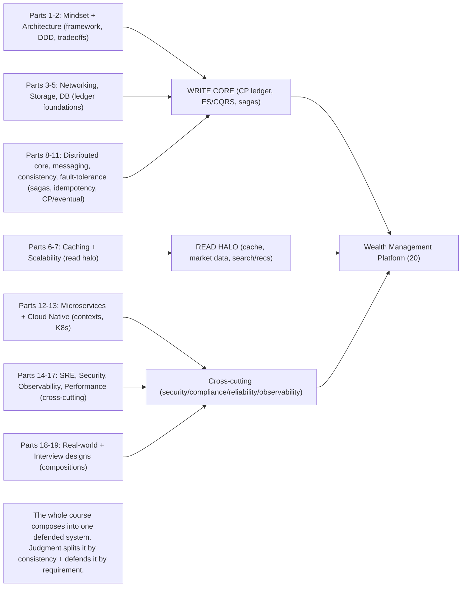

# Lesson 20.13 — Full Architecture Review: Every Decision Defended

> Part 20 · Enterprise Capstone · Difficulty: ⚫ · *Capstone — the finale*
>
> **Prerequisites:** all of 20.1–20.12 (and, through them, all of Parts 1–19).
> **Unlocks:** you. This is the capstone of the capstone.

---

## 1. Learning Objectives

After this lesson you will be able to:

- **Assemble** the entire Wealth Management Platform (20.1–20.12) into one coherent, defended architecture.
- **Defend every major decision** by tracing it back to a **requirement** (1.3.1) and **weighing the alternatives** (1.1.5 tradeoffs / 2.3.1).
- Articulate the **cross-cutting through-lines** that make the design coherent (consistency split, correctness patterns, defense-in-depth).
- Run an **architecture review** the way a Staff/Principal engineer does — the meta-skill the whole course built toward.
- See the **knowledge graph** of the platform: how every part connects.

---

## 2. The system in one paragraph

The **Wealth Management Platform** is a **microservices system organized by bounded context** (20.1) where **correctness, compliance, and security come first** (the reverse of a consumer app). Its **financial heart is an immutable, double-entry, ACID, CP ledger** (20.4) implemented via **event sourcing** with **CQRS read models** (20.7); money-moving operations are **idempotent** (exactly-once effects) and cross-context flows run as **orchestrated sagas with the transactional outbox** (20.6). Around this core sit an **eventual-consistency, high-throughput** halo: **market-data streaming** (20.5), **search + recommendations + AI** (20.8), and **cached read models** (20.9) — all **derived** and **decoupled from the CP ledger**. It's fronted by an **API gateway + BFF** with a **CDN/WAF edge** (20.9), secured by **zero-trust + defense-in-depth** with heavy **compliance controls** (20.11/20.3), made reliable by **multi-AZ HA + per-context multi-region + tested DR (RPO≈0 for money)** on **Kubernetes with autoscaling** (20.10), and operated via **correlated observability + SLO alerting + a production-readiness review** (20.12). Every choice follows from a requirement.

---

## 3. The assembled architecture

### 3.1 The layered picture

```mermaid
flowchart TB
    subgraph Edge
      CDN["CDN/WAF/DDoS (18.4/20.9) → GeoDNS/LB (13.8/3.3.1)"]
      GW["API Gateway + BFF (12.6/20.9): authN (20.3) + rate limit (20.11)"]
    end
    subgraph WriteCore["Write core — CP, strong, correctness-first"]
      TXN["Transaction/trade service: idempotent (11.5) + saga orchestrator (20.6)"]
      LEDGER[("Event-sourced double-entry ledger — immutable, ACID, CP (20.4/20.7)")]
    end
    subgraph ReadHalo["Read halo — eventual, high-throughput, derived"]
      PORT["Portfolio read model (CQRS — 20.7)"]
      MD["Market data streaming + TSDB (20.5)"]
      SRCH["Search + Recs + AI (20.8)"]
      CACHE[("Cache / read models (20.9)")]
    end
    Edge --> WriteCore
    Edge --> ReadHalo
    LEDGER -. events / CDC (9.8) .-> ReadHalo
    IAM["Identity + KYC/AML (20.3)"] --> Edge
    CROSS["Cross-cutting: zero-trust security + compliance + resilience + locks (20.11) · observability + PRR (20.12) · HA/DR/multi-region (20.10)"]
    note["Write core CP + read halo eventual, linked by ledger events. Every decision ← a requirement."]
```

### 3.2 The defense — decision → requirement → alternative rejected

`[BP]` A Staff-level review defends each decision by requirement + weighed alternative (1.1.5/2.3.1):

| Decision | Driven by requirement | Alternative rejected (why) |
|---|---|---|
| **Microservices by bounded context** (20.1) | Large, multi-team, regulated domain; independent scaling/deploy | Monolith — would work early (12.1) but doesn't fit org/scale/compliance isolation here |
| **Immutable double-entry ACID CP ledger** (20.4) | Financial correctness + audit (SOX) — money can't be lost/wrong | Mutable balances / eventual consistency — no audit, corrupts money |
| **Event sourcing + CQRS** (20.7) | Tamper-evident audit + many read shapes from one truth | Plain CRUD — loses history/audit, couples read+write |
| **Idempotency + saga + outbox** (20.6) | Exactly-once effects across services; no distributed ACID | 2PC — blocking/fragile, doesn't span external rails (11.6) |
| **Consistency split: CP write / eventual read** (18.6) | Money needs strong; dashboards tolerate lag; scale | All-strong (kills scale) or all-eventual (corrupts money) |
| **Streaming market data, decoupled** (20.5) | High-write firehose; valuations are derived reads | Coupling market data to the ledger (slows the money path) |
| **Cache derived views, never the auth truth** (20.9) | Read-heavy dashboards + money correctness | Caching authoritative balances for authorization (correctness bug) |
| **Zero-trust + defense-in-depth** (20.11) | Existential security; assume breach | Perimeter-only trust (lateral movement risk — 15.5) |
| **Per-context multi-region (CP sync / eventual active-active)** (20.10) | RPO≈0 for money + low-latency global reads | Active-active multi-master ledger (money conflicts); single region (no DR) |
| **Resilience on every dependency** (20.11) | Prevent cascades around external rails | Naive calls — one slow dependency topples the platform (11.3) |
| **Distributed locks only where needed** (20.11) | Correct coordination for singleton jobs | Locks everywhere (prefer idempotency/partitioning — 19.2.5) |
| **Per-context SLOs + PRR** (20.2/20.12) | Correctness-first calibration + safe launch | One global SLO / launch-without-review |

`[BP]` **This table *is* the interview.** Every box on the diagram maps to a requirement and a rejected alternative. If you can't name the requirement, cut the box (20.1).

### 3.3 The through-lines (what makes it coherent)

`[CS]` The recurring principles that unify the design `[BP]`:
- **Every decision follows from a requirement** (1.3.1) — the master rule.
- **Split by consistency/latency profile** (18.6): a **CP write core** + an **eventual, derived read halo**, linked by **ledger events** (9.8/20.7). This single idea organizes the whole system.
- **Correctness patterns** (money): idempotency/exactly-once effects (11.5), immutable ledger + event sourcing (20.4/20.7), sagas + outbox (20.6), reconciliation (19.2.3) — "make it impossible to lose or double-count money."
- **Derived-data patterns** (reads): CQRS read models, materialized views, caches, search indexes — all **rebuildable from the log** (20.7), all eventually consistent.
- **Defense-in-depth** (security/reliability): layered controls (zero-trust, encryption, rate limiting, resilience, DR) — **no single control is trusted alone**; **fail-closed for money/security, fail-open for reliability** (20.11).
- **Operability is designed-in** (20.12): SLOs, observability, PRR — the system is built to be **run**, not just built.
- **Compositions of subsystems** (18 meta-lesson): the platform reuses the whole course — feed/notification (19.1.4/5), search (18.7), recs (19.2.7), geo isn't needed here, streaming (19.2.9/20.5), ledger (18.3/19.2.3), locks (19.2.5), monitoring (19.2.6).

### 3.4 How to run the review (the meta-skill — 1.3.1/1.3.2)

`[BP]` A Staff/Principal architecture review:
1. **Restate requirements + priorities** (correctness/compliance/security first — 20.1/20.2). Everything is judged against these.
2. **Walk the request paths:** a **read** (dashboard load — cache → read model) and a **write** (trade — idempotent saga → ledger → events → derived updates). Show data flow + consistency at each hop.
3. **Defend each decision** (§3.2): requirement + alternative weighed (1.1.5). Acknowledge tradeoffs honestly (2.3.1) — no design is free.
4. **Probe the risks:** SPOFs, hot keys (7.4), the non-elastic ledger DB (13.5), correlated failures (13.8), compliance gaps, cascade risks (11.3). Show mitigations.
5. **State what you'd monitor + how you'd evolve** (fitness functions — 2.3.3): the design is **evolutionary**, not final.
- `[BP]` **The review is the demonstration of judgment** — the actual skill the entire course was building. Not "I know patterns," but "I can choose, defend, and weigh them under real constraints."

### 3.5 Coda — what you've built

`[BP]` You started (Part 1) with **"what is system design"** and **tradeoffs as the core skill**. You end here **defending a complete regulated financial platform** end-to-end. The platform (Parts 1–19) gave you the **blocks**; the capstone (Part 20) showed they **compose** into something real — and that the hard part was never any single block, but the **judgment** to choose among them, **split by consistency**, **defend by requirement**, and **build for operation**. `[BP]` **That judgment is what makes a Staff/Principal engineer** — and it's now yours to practice.

---

## 4. Visual Intuition — the knowledge graph



---

## 5. Real-World Analogy

Think of the **final defense of an architect's blueprint before a board of veteran builders**.

- **You don't present wallpaper; you present decisions:** for every wall, beam, and pipe, the board asks **"why here, why this way, what else did you consider?"** A good architect answers each with a **requirement** ("the vault wall is reinforced because it must survive a break-in") and an **honest tradeoff** ("we chose the pricier fireproofing because the alternative risked the archives").
- **Coherence over cleverness:** the board isn't impressed by exotic materials; they're impressed that **every piece fits a plan** — the fast public lobby and the guarded vault are clearly separated, and the whole building **can actually be run and maintained**, not just admired.
- **Honesty about tradeoffs:** the best architects **name the weaknesses** ("this costs more; this region-failover adds latency") rather than pretending the design is free — because the board knows no building is.
- **The blueprint is alive:** they don't claim it's final; they show **where it can grow** and **what they'll watch** as it's used. That humility + judgment is what earns the board's trust — and it's the whole point of the training.

---

## 6. Industry Example

- **Architecture Decision Records + reviews** `[CONV]`: documenting decisions with context + alternatives (§3.2, 1.3.3). *(Representative.)*
- **Consistency-split platforms** `[CONV]`: CP financial core + eventual derived read/analytics halo (§3.3, 18.6). *(Representative.)*
- **Event-sourced ledgers with CQRS** `[CONV]`: fintech cores with audit + derived views (§3.1, 20.4/20.7). *(Representative.)*
- **Production-readiness + evolutionary architecture** `[CONV]`: run-ready, fitness-function-guarded systems (§3.4, 20.12/2.3.3). *(Representative.)*

---

## 7. Implementation Details (the review artifacts)

- **A defended diagram** (§3.1) + a **decision→requirement→alternative table** (§3.2) — the core deliverables.
- **Two traced request paths** (a read + a trade write) showing consistency at each hop (§3.4).
- **A risk register** (SPOFs, hot keys, non-elastic DB, correlated failure, compliance, cascades) with mitigations (§3.4).
- **ADRs** (1.3.3) for the major decisions; **fitness functions** (2.3.3) for evolution.
- **The PRR** (20.12) as the launch gate.

---

## 8–14. (Condensed)

**Advantages of this discipline:** coherent, defensible, operable design; honest tradeoffs; requirement-traceable; evolvable.
**Disadvantages/cautions:** no design is optimal on all axes (correctness-first costs latency/money — accepted); complexity is real (microservices tax — 12.1) — justified by scale/regulation, not fashion.
**When NOT to:** don't over-engineer a small system into this (monolith-first — 12.1); this scale of design is for genuinely large, regulated, multi-team platforms.
**Common mistakes:** components without a requirement (cut them); pretending tradeoffs don't exist; all-strong or all-eventual (get the split right — 18.6); building without designing for operation (20.12); treating the architecture as final (it's evolutionary — 2.3.3).
**Interview Qs:** 🟢 Walk the read path and the write path. 🟡 Why CP ledger + eventual read halo? Defend one decision + its alternative. 🔴 Where are the SPOFs/hot keys/cascade risks and their mitigations? ⚫ Present + defend the entire platform end-to-end: every decision to a requirement, every alternative weighed, risks + evolution named.
**Production pitfalls (system-level):** consistency-boundary leaks (money off a cache); saga/compensation gaps; correlated multi-region failure; ledger DB saturation; compliance/audit holes; monitoring blind spots.
**Optimizations (design-level):** get the consistency split right (18.6); keep invariant-bound data co-located (12.4); reuse proven building blocks (Parts 18–19); design-in operability (20.12); document decisions (ADRs) + guard with fitness functions (2.3.3).

---

## 15. Summary

This finale **assembles the entire Wealth Management Platform (20.1–20.12) into one coherent, defended architecture** and demonstrates the **meta-skill** the whole course built toward: **defending every decision by tracing it to a requirement and weighing the alternatives** (1.3.1/1.1.5/2.3.1). The system is a **microservices platform organized by bounded context** (20.1) where **correctness, compliance, and security come first** (reverse of a consumer app). Its structure is **a CP write core + an eventual, derived read halo, linked by ledger events** — the single organizing idea (18.6): the **write core** is an **immutable, double-entry, ACID, CP ledger** (20.4) built with **event sourcing + CQRS** (20.7), with **idempotent** money operations (exactly-once effects — 11.5) and cross-context flows as **orchestrated sagas + transactional outbox** (20.6, not 2PC); the **read halo** — **market-data streaming** (20.5), **search/recs/AI** (20.8), **cached read models** (20.9) — is **derived, eventually consistent, and decoupled from the ledger**. It's fronted by an **API gateway + BFF + CDN/WAF edge** (20.9), secured by **zero-trust + defense-in-depth + compliance controls** (20.11/20.3), made reliable by **multi-AZ HA + per-context multi-region + tested DR (RPO≈0 for money) on Kubernetes with autoscaling** (20.10), and operated via **correlated observability + SLO alerting + a production-readiness review** (20.12). The heart of a Staff-level review is the **decision → requirement → alternative-rejected** discipline (§3.2): microservices-by-context (large regulated multi-team domain, not a monolith), the immutable ACID CP ledger (correctness/audit, not mutable/eventual balances), event sourcing + CQRS (audit + many read shapes, not plain CRUD), idempotency + saga + outbox (exactly-once across services, not blocking 2PC), the consistency split (not all-strong nor all-eventual), decoupled streaming market data, cache-derived-views-never-the-auth-truth, zero-trust, per-context multi-region (sync/active-passive for money, active-active for reads — never multi-master ledger), resilience on every dependency, locks only where needed, and per-context SLOs + PRR — **each box mapping to a requirement and a weighed alternative** (if you can't name the requirement, cut the box — 20.1). The **through-lines** that make it coherent: every decision follows from a requirement; split by consistency/latency (18.6); correctness patterns for money (idempotency/immutable ledger/sagas/reconciliation); derived-data patterns for reads (CQRS/caches/indexes, rebuildable from the log); defense-in-depth (fail-closed for money/security, fail-open for reliability); operability designed-in; and the whole thing as a **composition of the course's subsystems** (18/19). Running the review is the demonstration of **judgment** — restate requirements, walk the read + write paths showing consistency at each hop, defend each decision with its alternative and honest tradeoffs, probe the risks (SPOFs, hot keys, the non-elastic ledger DB, correlated failure, compliance, cascades) with mitigations, and state what you'd monitor + how it evolves (fitness functions — 2.3.3). **That judgment — choosing, defending, and weighing patterns under real constraints — is what makes a Staff/Principal engineer, and it is the true output of this platform.**

---

## 16. Revision Notes (flashcard-ready)

- **Q:** The platform in one structural idea? **A:** A CP write core (immutable ACID ledger, ES/CQRS, sagas) + an eventual derived read halo (cache/market-data/search-recs), linked by ledger events (18.6).
- **Q:** How do you defend a decision in a review? **A:** Trace it to a requirement + name the alternative you rejected and why (1.1.5/2.3.1). If no requirement → cut it.
- **Q:** Why microservices-by-context here? **A:** Large, regulated, multi-team domain needing independent scaling/deploy + compliance isolation — not a monolith.
- **Q:** Why an immutable ACID CP ledger? **A:** Financial correctness + audit (SOX); mutable/eventual balances lose history and corrupt money.
- **Q:** Why sagas not 2PC? **A:** Exactly-once effects across services + external rails without blocking/fragile 2PC (20.6/11.6).
- **Q:** The master through-line? **A:** Every decision follows from a requirement; split by consistency/latency; defense-in-depth; operability designed-in.
- **Q:** Fail-open vs fail-closed rule? **A:** Money/security checks fail-closed; reliability controls (rate limiter) fail-open (20.11).
- **Q:** How to run the review? **A:** Restate requirements → walk read + write paths → defend decisions + alternatives → probe risks + mitigations → monitoring + evolution.
- **Q:** The real skill the course built? **A:** Judgment — choosing, defending, and weighing patterns under real constraints (Staff/Principal level).

---

## 17. Further Reading + Knowledge-Graph Links

**Foundations:** all of 20.1–20.12; and [1.3.1 Framework] · [1.1.5 Tradeoffs] · [1.3.3 ADRs] · [2.3.1 Style Selection] · [2.3.3 Evolutionary Architecture] · [18.6 Consistency Split].
**External:** *Fundamentals of Software Architecture* (tradeoff analysis); *Designing Data-Intensive Applications*; Google SRE. *(Representative.)*

> **Knowledge-graph:** `all Parts 1-19` → **`Part 20 capstone`** → **`20.13 full review`** (assemble + defend every decision by requirement, weigh alternatives, split by consistency, design for operation) → **the judgment that is the course's true output. Platform complete.**
