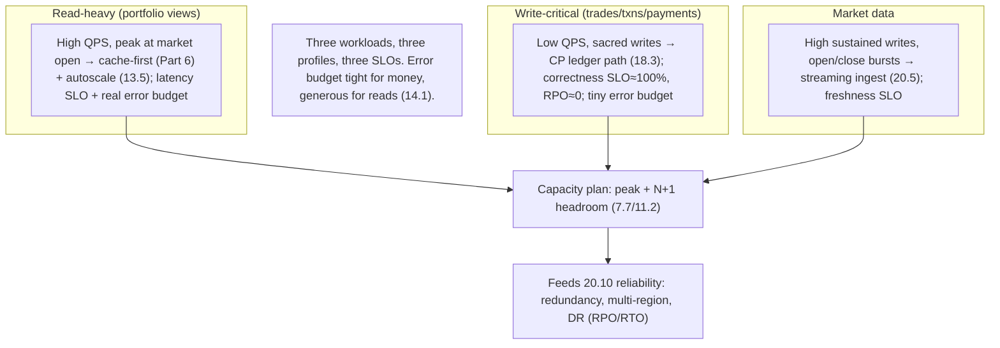

# Lesson 20.2 — Capacity Estimation & SLOs

> Part 20 · Enterprise Capstone · Difficulty: ⚫ · *Capstone*
>
> **Prerequisites:** [1.1.4 Capacity Estimation], [14.1 SLI/SLO/Error Budget], [7.7 Capacity Planning], [17.2 Tail Latency], [20.1 Domain & Contexts].
> **Unlocks:** [20.3 Identity], [20.10 Reliability].

---

## 1. Learning Objectives

After this lesson you will be able to:

- Produce **capacity estimates** (1.1.4) for the Wealth Management Platform's workloads and identify the **binding constraints** (7.6).
- Define **per-context SLIs/SLOs** (14.1) that reflect the **correctness/compliance-first** priority (20.1) — not a single global number.
- Distinguish the **read-heavy** (portfolio views), **write-critical** (ledger/trades), and **firehose** (market data) workloads and size each differently.
- Set **error budgets** (14.1) and reason about where **100% is the wrong target** vs where near-perfection is mandatory (money).
- Translate estimates + SLOs into **headroom, redundancy, and scaling** inputs for later lessons (20.10).

---

## 2. Motivation

Before designing components, you **size the problem** (1.1.4) and **define what "good" means** (14.1). For a regulated financial platform these two steps are unusually consequential: **market-hours peaks** are unforgiving, the **ledger tolerates almost no error**, and **SLAs are contractual**. Getting the estimates + SLOs right tells you which subsystems need the most engineering (the ledger, market-data ingestion) and which can be simpler.

---

## 3. The design (framework — 1.3.1)

### 3.1 Workload characterization (the three shapes)

`[BP]` The platform has **three distinct workload shapes** — size each separately (they don't share a profile):
- **Read-heavy — portfolio/dashboard views:** clients + advisors loading portfolios, positions, charts. **Reads ≫ writes** (say ~100:1). Latency-sensitive, cacheable (Part 6). → the bulk of request volume.
- **Write-critical — transactions/trades/payments:** far lower volume but **each write is sacred** (money — 18.3/20.4). Correctness + durability > throughput.
- **Firehose — market data:** continuous price ticks for many instruments → a **high-write streaming** ingest (Part 9/20.5), independent of user activity, spiking at market open/close.
- `[BP]` **Three shapes → three designs:** cache-first reads, CP write path, streaming ingestion. Estimating them together would hide the real constraints.

### 3.2 Capacity estimation (1.1.4) — illustrative

`[BP]` Work back-of-envelope (label all numbers **illustrative** — never invent benchmarks):
- **Users:** e.g., a few million clients + tens of thousands of advisors; a fraction active concurrently, peaking at **market open**.
- **Portfolio reads:** active users × refreshes/session → the dominant QPS; multiply by a **peak factor** (market hours). → size the read tier + cache.
- **Writes (trades/txns):** orders/day × peak factor → modest QPS but each needs the CP ledger path. → size for **correctness + durability**, not raw QPS.
- **Market data:** instruments × ticks/sec → potentially **very high sustained write rate**, bursting at open/close. → the firehose to optimize (20.5).
- **Storage:** ledger grows **append-only forever** (immutable + audit — 20.7) → plan long-term growth + tiering; market-data time-series → TSDB + downsampling (16.2/20.5); documents/statements → object storage (4.3.2/20.9).
- `[BP]` **Method** (1.1.4): estimate per workload, apply peak factors, identify the **one binding constraint** per path (7.6) — usually the **ledger's write consistency** and the **market-data ingestion rate**, not the read tier (cache dissolves it).

### 3.3 SLIs & SLOs (14.1) — per-context, not global

`[CS]` Define **user-centric SLIs** and **SLOs per context**, reflecting the 20.1 priority order `[BP]`:
- **Ledger / transactions:** **correctness SLI ≈ 100%** target (a wrong balance is unacceptable — near-zero error budget for correctness); availability high (e.g., very high during market hours); durability RPO ≈ 0 (18.3/11.8). `[BP]` This is where **"100% is the wrong target" does NOT fully apply to correctness** — you spend heavily here.
- **Portfolio reads:** **latency SLI** (e.g., p99 page-load target) + availability SLO; an occasional slow/failed read is tolerable → a **real error budget** exists (spend it on velocity — 14.1).
- **Market data:** **freshness/lag SLI** (ticks visible within X) + ingestion availability; brief lag tolerable, sustained lag not.
- **Payments:** correctness-critical (like the ledger) + availability tied to banking-rail hours.
- `[BP]` **Different contexts get different SLOs** — the correctness-critical paths get near-perfection (and the cost that implies — 14.1); the read paths get budgets you can spend on shipping. **A single global SLO would be wrong.**

### 3.4 Error budgets (14.1)

`[BP]`
- **Error budget = 1 − SLO** — a **resource** governing the reliability-vs-velocity tradeoff (14.1). Read/advice paths have meaningful budgets → move fast, use progressive delivery (14.7/20.10). Money paths have tiny budgets → change cautiously, heavier testing/verification.
- **Burn-rate alerting** (14.1/16.5): alert on **fast budget burn**, not every blip — routed to on-call (14.4/20.12).
- `[BP]` The error budget **operationalizes** the correctness-first priority: it's tight where money lives, generous where it doesn't.

### 3.5 From estimates + SLOs to capacity (7.7)

`[BP]`
- **Plan to peak + headroom** (7.7): size for **market-open peaks** plus **N+1 redundancy** headroom (11.2) — you can't be at the knee of the latency curve during peaks (7.7/17.3 Little's Law).
- **Autoscaling for elastic tiers** (stateless reads — 13.5/7.2) **but** the **non-elastic ledger DB** can't autoscale instantly → provision for peak + shed load as a backstop (13.5/11.4). A recurring course warning.
- **Feeds 20.10** (reliability): these numbers set redundancy, multi-region, and DR (RPO/RTO) targets.
- `[BP]` **The lesson:** size the **three workloads separately**, set **per-context SLOs** honoring correctness-first, derive **error budgets** (tight for money, generous for reads), and plan **peak + headroom** with autoscaling for elastic tiers and provisioning + shedding for the non-elastic ledger.

---

## 4. Visual Intuition

---

## 5. Real-World Analogy

Think of **staffing and setting service standards for three very different counters in the same bank**.

- **The information desk (reads)** gets **swamped at lunchtime** (market open). You staff it heavily for the peak, and it's fine if someone occasionally waits a bit or has to ask again — no money is at stake, so you allow a **margin for error** and optimize for throughput.
- **The vault teller (writes/ledger)** handles **fewer customers but every transaction must be exact**. You don't measure it by speed; you measure it by **never making a mistake** and **never losing a record**. Its "error budget" is essentially zero, and you invest accordingly.
- **The market-data ticker room (firehose)** runs **constantly regardless of customers**, blasting hardest at the opening and closing bells. You size it for that relentless stream and judge it by **how fresh the numbers are**.
- **One standard for all three would be absurd:** holding the info desk to vault-teller perfection wastes money; holding the vault to info-desk looseness loses money. **Each counter gets its own standard** — that's what per-context SLOs are.

---

## 6. Industry Example

- **Per-service SLOs** `[CONV]`: distinct latency/availability/correctness targets per subsystem (§3.3, 14.1). *(Representative.)*
- **Error budgets governing velocity** `[CONV]`: tight for financial correctness, generous for read paths (§3.4, 14.1). *(Representative.)*
- **Peak-plus-headroom capacity** `[CONV]`: sizing for market-open peaks + N+1 (§3.5, 7.7/11.2). *(Representative.)*
- **Autoscale elastic tiers, provision the non-elastic DB** `[CONV]`: the recurring autoscaling caveat (§3.5, 13.5/11.4). *(Representative.)*

---

## 7. Implementation Details

- **Characterize three workloads** separately (reads / write-critical / market-data firehose) (§3.1).
- **Estimate per workload** with peak factors; find the binding constraint per path (1.1.4/7.6) (§3.2).
- **Per-context SLIs/SLOs** (14.1): correctness≈100% + RPO≈0 for ledger/payments; latency + availability + real budget for reads; freshness for market data (§3.3).
- **Error budgets** (14.1) + burn-rate alerting (16.5); tight for money, generous elsewhere (§3.4).
- **Capacity plan** to peak + N+1 (7.7/11.2); autoscale elastic tiers (13.5), provision + shed for the ledger DB (11.4) (§3.5) → feeds 20.10.

---

## 8–14. (Condensed)

**Advantages:** right-sized per workload; SLOs honor correctness-first; error budgets operationalize the reliability-vs-velocity tradeoff; feeds concrete redundancy/DR targets.
**Disadvantages/cautions:** estimates are illustrative (validate with load testing — 7.7); over-provisioning the ledger for safety costs money (accepted for correctness); many SLOs to track (observability — 20.12).
**When NOT to:** don't set one global SLO; don't size all workloads together; don't autoscale-and-forget the non-elastic ledger.
**Common mistakes:** ignoring market-open peaks; a single availability number for money + reads alike; no headroom (running at the knee); treating market-data lag as harmless when sustained.
**Interview Qs:** 🟢 What are the platform's workload shapes? 🟡 Why per-context SLOs, not one global? 🔴 Where does "100% is the wrong target" apply and where does it not? ⚫ Derive capacity + SLOs + error budgets across the three workloads and justify the priority order.
**Production pitfalls:** peak underestimation (market open); ledger DB saturation (non-elastic); SLO/alert misconfig (burn-rate); budget exhaustion halting releases.
**Optimizations:** cache-first reads (Part 6) to shrink the read tier; tiered/downsampled market-data storage (16.2); provision ledger for peak + shed; recording-rules for SLO metrics (16.2).

---

## 15. Summary

Before designing components, the capstone **sizes the problem** (1.1.4) and **defines "good"** (14.1) — both unusually consequential for a regulated financial platform (unforgiving market-hours peaks, near-zero ledger error tolerance, contractual SLAs). The platform has **three distinct workload shapes that must be sized separately**: **read-heavy** portfolio/dashboard views (reads ≫ writes, latency-sensitive, cacheable — the bulk of QPS, peaking at market open), **write-critical** transactions/trades/payments (low volume but each write is sacred — correctness/durability over throughput, the CP ledger path — 18.3), and a **market-data firehose** (continuous price ticks, high sustained writes bursting at open/close, independent of user activity — a streaming ingest — 20.5). **Capacity estimation** (illustrative numbers only — never invent benchmarks) works each path with peak factors and finds the **one binding constraint** per path (7.6) — typically the **ledger's write consistency** and the **market-data ingestion rate**, not the read tier (cache dissolves it) — plus storage planning (append-only ledger forever + tiering — 20.7, time-series TSDB + downsampling — 16.2, documents in object storage — 20.9). **SLIs/SLOs are defined per context, not globally** (14.1), reflecting the 20.1 correctness-first priority: the **ledger/payments** get a **correctness SLI ≈ 100%** target, RPO ≈ 0, and high availability (near-perfection you **pay heavily** for — the one place "100% is the wrong target" bends toward near-100% for *correctness*); **portfolio reads** get **latency + availability SLOs with a real error budget** (spend it on velocity); **market data** gets a **freshness/lag SLI**. **Error budgets** (1 − SLO) **operationalize** the tradeoff — tiny where money lives (change cautiously, verify heavily), generous where it doesn't (move fast, progressive delivery) — with **burn-rate alerting** (16.5). Finally, translate estimates + SLOs into **capacity**: plan to **peak + N+1 headroom** (7.7/11.2, don't run at the latency knee — 17.3), **autoscale the elastic stateless tiers** (13.5/7.2) but **provision the non-elastic ledger DB for peak + load-shed as a backstop** (13.5/11.4 — the recurring course caveat) — all feeding the redundancy, multi-region, and DR (RPO/RTO) targets of **20.10**.

---

## 16. Revision Notes (flashcard-ready)

- **Q:** Three workload shapes? **A:** Read-heavy portfolio views; write-critical trades/txns/payments; market-data firehose — size each separately.
- **Q:** Binding constraints? **A:** Ledger write consistency + market-data ingestion rate; NOT the read tier (cache dissolves it).
- **Q:** One global SLO? **A:** No — per-context SLOs; correctness-first priority means money paths ≠ read paths.
- **Q:** Ledger/payment SLOs? **A:** Correctness ≈ 100%, RPO ≈ 0, high availability — tiny error budget, pay heavily.
- **Q:** Read-path SLOs? **A:** Latency (p99) + availability with a real error budget → spend on velocity.
- **Q:** Market-data SLO? **A:** Freshness/lag (ticks visible within X) + ingestion availability.
- **Q:** Error budget role? **A:** 1 − SLO; operationalizes reliability-vs-velocity — tight for money, generous for reads; burn-rate alerting.
- **Q:** Capacity plan? **A:** Peak (market open) + N+1 headroom; autoscale elastic tiers, provision + shed the non-elastic ledger DB.
- **Q:** Where does "100% is wrong" bend? **A:** For correctness of money — you target near-100% and pay for it.

---

## 17. Further Reading + Knowledge-Graph Links

**Foundations:** [1.1.4 Capacity Estimation] · [14.1 SLI/SLO/Error Budget] · [7.7 Capacity Planning] · [17.2 Tail Latency] · [11.2 Redundancy] · [13.5 Autoscaling].
**External:** Google SRE Book (SLOs, error budgets); capacity-planning practice. *(Representative.)*

> **Knowledge-graph:** `1.1.4 estimation` + `14.1 SLO/budget` + `7.7 capacity` → **`20.2 capacity & SLOs`** (three workloads, per-context SLOs, correctness-first budgets, peak+headroom) → feeds 20.10 reliability.
