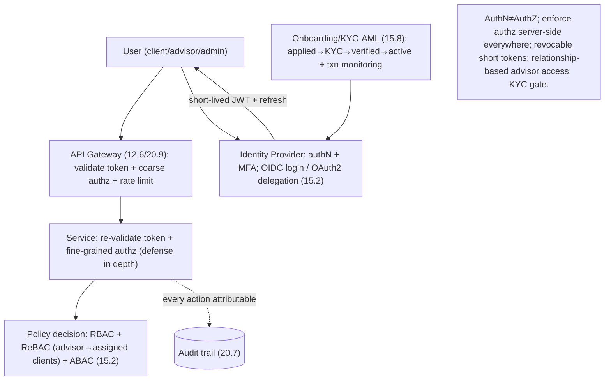

# Lesson 20.3 — Authentication, Authorization & Identity

> Part 20 · Enterprise Capstone · Difficulty: ⚫ · *Capstone*
>
> **Prerequisites:** [15.2 AuthN/AuthZ], [15.3 Cryptography], [15.4 Secrets], [15.8 Compliance (KYC/AML)], [12.6 API Gateway], [20.1 Contexts].
> **Unlocks:** [20.11 Security & Compliance], [20.9 Gateway].

---

## 1. Learning Objectives

After this lesson you will be able to:

- Design the **Identity & Access** and **Onboarding/Compliance** contexts (20.1) for the Wealth Management Platform.
- Distinguish **authentication** (who you are) from **authorization** (what you may do) and enforce authz **server-side** (15.2 — broken access control is the #1 risk).
- Choose a **session model** (stateful sessions vs JWT + short-lived tokens + refresh) with **revocation** in mind (15.2).
- Design **MFA**, **OAuth2/OIDC** for delegation/SSO, and **KYC/AML onboarding** (15.8) as part of identity.
- Model **RBAC/ABAC/ReBAC** for a multi-role platform (clients, advisors managing *specific* clients, admins) and enforce it at the **gateway + per-service** (defense in depth).

---

## 2. Motivation

For a regulated financial platform, **identity is the front door and the audit anchor**. A breach or a broken access control (15.2 — OWASP #1) is existential: leaked portfolios, unauthorized trades, compliance failure. Identity also carries **KYC/AML** (15.8) — you must **know your customer** before they transact. And every action must be **attributable** (who did what — audit — 20.7). So identity is both a **security** and a **compliance** cornerstone.

---

## 3. The design (framework — 1.3.1)

### 3.1 AuthN vs AuthZ (15.2)

`[CS]` `[BP]`:
- **Authentication (who you are):** verify identity — credentials + **MFA** (mandatory for financial access — 15.2). Support **OIDC** for login (and enterprise **SSO** for advisors).
- **Authorization (what you may do):** enforced **server-side on every request** — never trust the client (15.2 — broken access control is #1). The gateway does coarse checks; **each service re-checks** its own authorization (defense in depth — 15.5).
- `[BP]` **Separate the two; enforce authz server-side, everywhere.**

### 3.2 Session model — tokens + revocation (15.2)

`[BP]` The classic tradeoff (15.2):
- **Stateful sessions:** server stores session state; **easy revocation** (delete it) but needs a shared session store (7.2) — a lookup per request.
- **JWT (stateless):** self-contained signed token; **no per-request lookup** (scales — 7.2) but **hard to revoke** before expiry.
- `[BP]` **Recommended for this platform:** **short-lived access tokens (JWT) + refresh tokens**, with a **revocation/deny-list** for the short window and **refresh-token revocation** for logout/compromise. Short lifetimes bound the blast radius of a stolen token; refresh enables revocation. For highly sensitive actions (trades, money movement), **re-authenticate / step-up MFA** (15.2). This balances scale (stateless verification) with the **revocation** that a financial platform demands.

### 3.3 OAuth2 / OIDC (15.2)

`[BP]`
- **OIDC** (built on OAuth2) for **authentication/login** (15.2 — OIDC = authentication, OAuth2 = delegated *authorization*, a common confusion).
- **OAuth2** for **delegated authorization** — e.g., a third-party app or an aggregator accessing a client's data **with consent + scopes**, without sharing credentials. Scopes limit access (least privilege — 15.1).
- `[BP]` Use a dedicated **identity provider** (managed or in-house) issuing tokens; services validate signatures + scopes/claims.

### 3.4 Authorization model — RBAC / ABAC / ReBAC (15.2)

`[CS]` The platform has **relationship-driven** access `[BP]`:
- **RBAC (roles):** client, advisor, admin, compliance-officer — coarse capabilities.
- **ABAC (attributes):** context-sensitive rules (e.g., "advisors can trade only during market hours," "amounts above X need approval").
- **ReBAC (relationships):** the key one — an **advisor may access only *their assigned* clients' portfolios**, not all clients. This is a **relationship** (advisor→client), not a role. Model it explicitly (a policy/authorization service — like a Zanzibar-style relationship store — 15.2).
- `[BP]` **Combine:** RBAC for coarse roles + **ReBAC for the advisor-client relationship** (the critical fine-grained control) + ABAC for contextual rules. Enforce via a **central policy decision** consulted by services (or a policy sidecar — 12.7).

### 3.5 Onboarding & KYC/AML (15.8)

`[BP]`
- **KYC (Know Your Customer):** verify identity documents at onboarding before the account can transact — a **compliance gate** (15.8). Often integrates third-party verification providers.
- **AML (Anti-Money-Laundering):** ongoing **transaction monitoring** for suspicious patterns → flag/report (feeds the compliance context — 20.11). This is a **stream/rules** problem over transaction events (Part 9).
- `[BP]` **Onboarding is a compliance workflow**, not just a signup form — model it as its own context (20.1) with a state machine (applied→KYC-pending→verified→active) and an audit trail (20.7).

### 3.6 Cross-cutting + enforcement

`[BP]`
- **Enforcement points:** **API gateway** (12.6/20.9) for authN + coarse authz + rate limiting (15.7/20.11); **each service** re-validates tokens + fine-grained authz (defense in depth — 15.5).
- **Secrets/keys** (15.4): signing keys in a **KMS/secrets manager**, rotated; **mTLS** between services (zero-trust — 15.5/12.7).
- **Everything attributable** (20.7): identity stamps every action → the audit trail (15.8).
- `[BP]` **The lesson:** identity = **MFA authN + OIDC/OAuth2 + short-lived JWT + refresh with revocation + RBAC/ReBAC/ABAC (advisor-client relationship is the crux) + KYC/AML onboarding**, enforced **at the gateway + per-service** (defense in depth), with everything **attributable** for audit. Security + compliance cornerstone.

---

## 4. Visual Intuition

---

## 5. Real-World Analogy

Think of a **private bank with a strict front desk, ID checks, and relationship managers**.

- **Authentication = the ID check + a second factor:** you show your ID **and** a token/passcode (MFA) — one proof isn't enough for money.
- **KYC onboarding = opening the account:** before you can transact, the bank **verifies your documents** and runs background checks — you can't move money on day zero. It's a **gate**, not a form.
- **Authorization = what your badge lets you do — checked at every door, not just the entrance:** getting in the building doesn't mean you can walk into the vault. Each room **re-checks** your badge (defense in depth).
- **Relationship-based access (ReBAC) = your relationship manager sees *your* file, not everyone's:** an advisor can open the portfolios of **their assigned clients** only — that's a **relationship**, not a rank. A senior title (role) doesn't grant access to strangers' accounts.
- **Short-lived tokens + revocation = a day pass you can cancel:** visitors get **passes that expire quickly**, and if one is lost, the desk **cancels it** — rather than issuing permanent keys nobody can recall.
- **Attributable = the visitor log:** every door you open is recorded against your name — the audit trail.

---

## 6. Industry Example

- **MFA + OIDC/OAuth2** `[CONV]`: standard for financial-grade login + delegated access (§3.1/3.3, 15.2). *(Representative.)*
- **Short-lived JWT + refresh + revocation** `[CONV]`: balancing stateless scale with revocability (§3.2, 15.2). *(Representative.)*
- **ReBAC (Zanzibar-style) for relationship access** `[CONV]`: advisor→assigned-client authorization (§3.4, 15.2). *(Representative.)*
- **KYC/AML onboarding + transaction monitoring** `[CONV]`: compliance-gated account activation (§3.5, 15.8). *(Representative.)*
- **Gateway + per-service enforcement + mTLS** `[CONV]`: defense-in-depth zero-trust (§3.6, 15.5/12.7). *(Representative.)*

---

## 7. Implementation Details

- **AuthN:** MFA + OIDC login / OAuth2 delegation via an identity provider; step-up auth for sensitive actions (§3.1/3.3).
- **Tokens:** short-lived JWT + refresh + revocation/deny-list (15.2) (§3.2).
- **AuthZ:** RBAC + **ReBAC** (advisor-client relationship) + ABAC via a central policy decision; enforce at gateway + per-service (defense in depth — 15.5) (§3.4/3.6).
- **Onboarding:** KYC gate + AML transaction monitoring (stream/rules — Part 9) as its own context (15.8) (§3.5).
- **Secrets/keys** in KMS, rotated (15.4); **mTLS** between services (12.7); every action **attributable** → audit (20.7) (§3.6).

---

## 8–14. (Condensed)

**Advantages:** strong financial-grade authN (MFA); scalable stateless verification with revocation; precise relationship-based access (ReBAC); compliance-gated onboarding; defense-in-depth + full attribution.
**Disadvantages/cautions:** JWT revocation complexity (deny-list/short TTL); ReBAC needs a relationship store + care; KYC integration + latency; policy engine as a dependency.
**When NOT to:** don't use long-lived non-revocable tokens for money; don't rely on gateway-only authz (re-check per service); don't skip KYC before enabling transactions.
**Common mistakes:** client-side authz enforcement (15.2 #1 risk); role-only access (advisor sees all clients — missing ReBAC); no MFA; storing/logging tokens or secrets (15.4); no step-up for sensitive actions.
**Interview Qs:** 🟢 AuthN vs AuthZ? Why MFA? 🟡 JWT vs sessions — how do you handle revocation? 🔴 How do advisors get access to only their clients (ReBAC)? Where do you enforce authz? ⚫ Full identity design: authN/MFA/OIDC/OAuth2, token model, RBAC/ReBAC/ABAC, KYC/AML, defense-in-depth, attribution.
**Production pitfalls:** broken access control (over-broad roles); token leakage/replay; missing revocation on compromise; KYC bypass; inconsistent authz across services.
**Optimizations:** short tokens + fast refresh; cache policy decisions carefully; central policy service/sidecar (12.7); gateway coarse + service fine authz; managed IdP.

---

## 15. Summary

For the Wealth Management Platform, **identity is the front door and the audit anchor** — a **security + compliance cornerstone** where broken access control (OWASP #1 — 15.2) is existential. The design separates **authentication** (who you are — verified with **MFA**, mandatory for financial access; **OIDC** for login, enterprise **SSO** for advisors) from **authorization** (what you may do — enforced **server-side on every request**, never trusting the client, with the **gateway doing coarse checks and each service re-checking** its own authz — defense in depth — 15.5). The **session model** balances the classic tradeoff (15.2): **short-lived access JWTs + refresh tokens**, with a **revocation/deny-list** for the short window and refresh-token revocation for logout/compromise — getting stateless-verification scale (7.2) **plus** the revocation a financial platform demands — and **step-up re-authentication/MFA** for sensitive actions (trades, money movement). **OIDC/OAuth2** provide login and **delegated, scoped, consented** third-party access (OIDC = authentication, OAuth2 = delegated authorization — a common confusion). The **authorization model combines** **RBAC** (client/advisor/admin/compliance roles), **ABAC** (contextual rules like market-hours or approval thresholds), and — the crux — **ReBAC** (an advisor may access only **their assigned** clients' portfolios; that's a **relationship**, not a role — a Zanzibar-style relationship store — 15.2), consulted via a **central policy decision** (or a policy sidecar — 12.7). **Onboarding is a compliance workflow, not a signup form**: a **KYC gate** verifies identity before the account can transact, and **AML transaction monitoring** (a stream/rules problem over transaction events — Part 9) flags suspicious activity (15.8) — modeled as its own context with a state machine and audit trail. Cross-cutting: enforce at the **gateway + per-service**, keep **signing keys in a KMS** (rotated — 15.4), use **mTLS** between services (zero-trust — 12.7), and make **every action attributable** (identity stamps everything → the audit trail — 20.7). In one line: **MFA authN + OIDC/OAuth2 + short-lived JWT + refresh-with-revocation + RBAC/ReBAC/ABAC (advisor-client relationship is the crux) + KYC/AML onboarding, enforced gateway + per-service, everything attributable**.

---

## 16. Revision Notes (flashcard-ready)

- **Q:** AuthN vs AuthZ? **A:** AuthN = who you are (MFA/OIDC); AuthZ = what you may do (enforced server-side, everywhere). Broken access control is OWASP #1.
- **Q:** Session model here? **A:** Short-lived JWT + refresh + revocation/deny-list; step-up MFA for sensitive actions — scale + revocability.
- **Q:** Why not long-lived JWT? **A:** Hard to revoke; a stolen token stays valid — bad for money. Short TTL bounds blast radius.
- **Q:** OIDC vs OAuth2? **A:** OIDC = authentication (login); OAuth2 = delegated authorization (scoped consented access).
- **Q:** How do advisors access only their clients? **A:** ReBAC — model the advisor→assigned-client relationship (not a role); Zanzibar-style store.
- **Q:** Authz model combo? **A:** RBAC (roles) + ReBAC (relationships — the crux) + ABAC (contextual rules).
- **Q:** KYC/AML in identity? **A:** KYC = verify identity before transacting (gate); AML = ongoing transaction monitoring (stream/rules) → compliance context.
- **Q:** Enforcement? **A:** Gateway (coarse) + per-service (fine) — defense in depth; mTLS between services.
- **Q:** Attribution? **A:** Identity stamps every action → the immutable audit trail (20.7).

---

## 17. Further Reading + Knowledge-Graph Links

**Foundations:** [15.2 AuthN/AuthZ] · [15.3 Cryptography] · [15.4 Secrets] · [15.8 KYC/AML/Compliance] · [12.6 API Gateway] · [12.7 Service Mesh/mTLS].
**External:** OAuth2/OIDC specs; Google Zanzibar (ReBAC); KYC/AML regulation. *(Representative.)*

> **Knowledge-graph:** `15.2 authN/authZ` + `15.8 KYC/AML` + `12.6 gateway` → **`20.3 identity`** (MFA + OIDC/OAuth2 + short JWT + RBAC/ReBAC/ABAC + KYC, defense-in-depth, attributable) → feeds 20.11 security.
