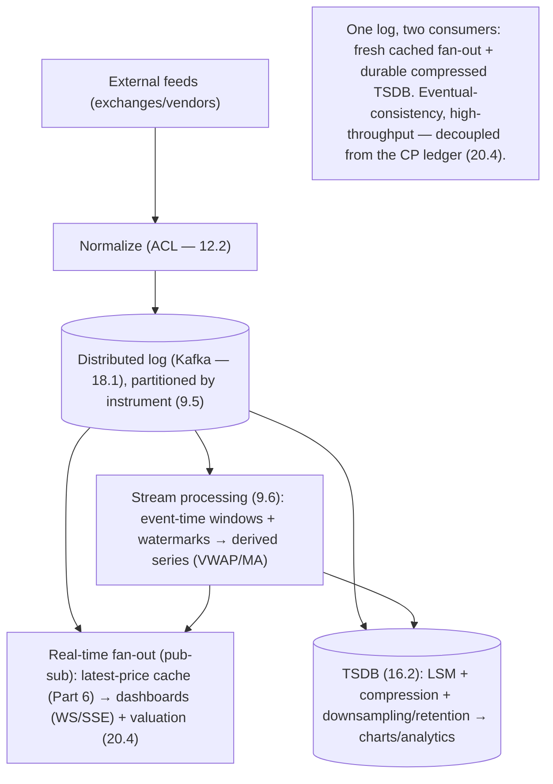

# Lesson 20.5 — Market Data Ingestion (Streaming, Kafka, Time-Series)

> Part 20 · Enterprise Capstone · Difficulty: ⚫ · *Capstone*
>
> **Prerequisites:** [18.1 Distributed Log], [9.6 Stream Processing], [16.2 TSDB/Cardinality], [19.2.9 Ad Click Aggregator], [10.5 Consistency Spectrum], [20.4 Portfolio/Ledger].
> **Unlocks:** [20.8 Search/Recs], [20.9 Caching].

---

## 1. Learning Objectives

After this lesson you will be able to:

- Design the **Market Data** context (20.1): ingest a **high-write price firehose**, store time-series, and drive portfolio valuations + analytics.
- Reuse the **distributed log** (18.1) + **stream processing** (9.6) + **TSDB** (16.2) building blocks (same shape as 19.2.9).
- Distinguish **real-time price distribution** (fan-out to live dashboards) from **historical time-series storage** (charts, analytics).
- Handle deep dives: **fan-out to many consumers**, **event-time correctness**, **downsampling/retention**, and how market data feeds the **eventual-consistency** side of the platform.
- Connect market data to **valuation** (20.4 portfolio read model) without coupling it to the CP ledger.

---

## 2. Motivation

Market data is the platform's **firehose** (20.2): continuous price ticks for many instruments, independent of user activity, bursting at market open/close. It **drives valuations** (a portfolio's worth depends on live prices — 20.4), **charts**, and **analytics/recommendations** (20.8). It's a classic **streaming + time-series** problem — and crucially it lives on the **eventual-consistency, high-throughput** side of the platform (10.5), decoupled from the **CP ledger** (20.4). The design directly reuses **19.2.9** (stream analytics) and **16.2** (TSDB).

---

## 3. The design (framework — 1.3.1)

### 3.1 Requirements

`[BP]`
- **Functional:** ingest real-time prices from **external feeds** (exchanges/vendors); distribute **live prices** to dashboards + valuation; store **historical time-series** for charts/analytics; compute derived data (moving averages, indicators).
- **Non-functional:** **very high write throughput** (firehose, open/close bursts — 20.2); **low-latency distribution** (live prices should be fresh — seconds); **freshness SLI** (20.2); **eventual consistency is fine** (a price a moment stale is acceptable — 10.5) — **not** on the CP path; scalable + cost-efficient storage.
- `[BP]` **Key signal:** high-write stream + fan-out + time-series storage → **log + stream processing + TSDB** (18.1/9.6/16.2). Same as 19.2.9.

### 3.2 Ingestion — the distributed log (18.1)

`[BP]`
- Ingest external feeds into a **distributed log** (Kafka-style — 18.1/9.3), **partitioned by instrument** (symbol) so each instrument's ticks are ordered on one partition (9.5) and consumers can parallelize across partitions.
- The log **buffers + durably retains** the firehose (absorbs bursts, decouples producers from consumers, enables **replay** — 18.1). Backpressure + bounded buffers protect downstream (9.9).
- **Normalize** heterogeneous vendor feeds into a canonical format at ingestion (an anti-corruption layer — 12.2) before publishing to the log.
- `[BP]` **Log-centered ingestion** = the hub decoupling many producers from many consumers (18.1 — O(N²)→O(N)).

### 3.3 Distribution vs storage (two consumers of the log)

`[CS]` The log fans out to **two very different consumers** `[BP]`:
- **Real-time distribution (hot path):** a **stream processor / pub-sub fan-out** pushes fresh prices to **live dashboards** (WebSockets/SSE — 3.2.5) and to the **portfolio valuation** read model (20.4). This is **latency-sensitive fan-out to many subscribers** (like 18.8/19.2.9) — cache the **latest price per instrument** (Part 6) for instant reads.
- **Historical storage (warm/cold path):** a consumer writes ticks to a **time-series database** (16.2 — LSM-append + delta/XOR compression), with **downsampling + retention** (raw short-term, rollups long-term — 16.2) for charts + analytics. **Cardinality** is bounded (instrument × field — not user-level — 16.2).
- `[BP]` **One log, two derived consumers: real-time fan-out (fresh, cached) + TSDB (compressed, downsampled).** Separate the fast-serve from the durable-store.

### 3.4 Stream processing (9.6)

`[BP]`
- Compute **derived series** (VWAP, moving averages, indicators) via **windowed stream processing** (9.6 — event-time windows + watermarks for late/out-of-order ticks — 8.1.2). Same event-time discipline as 19.2.9.
- Feed **valuations**: on new prices, recompute affected portfolio values in the read model (20.4) — eventually consistent, event-driven (9.8).
- `[BP]` Stream processing turns raw ticks into the derived data valuations/analytics/recs need.

### 3.5 Deep dives + bottlenecks

`[BP]`
- **Fan-out to many consumers:** live prices → huge subscriber fan-out (dashboards) → **pub-sub + edge fan-out + latest-price cache** (Part 6/18.4), decoupled from ingestion. Don't let slow consumers back up the log (bounded/lagging — 9.9).
- **Event-time correctness** (9.6): ticks arrive out of order/late (network) → event-time windows + watermarks for correct derived series (like 19.2.9).
- **Storage cost** (16.2): compression + downsampling + retention tiers; hot recent data in fast storage, cold history cheap. Bounded cardinality.
- **Freshness vs cost:** real-time path optimized for latency; historical path for storage efficiency — two profiles.
- **Decoupling from the ledger** (20.4): market data is **eventual-consistency, high-throughput** — it must **not** couple to or slow the CP ledger. Valuations are **derived reads**, not authoritative money movements.
- **Bottleneck:** the ingestion + fan-out throughput → log partitioning (by instrument) + horizontal stream workers + caching the latest price; the log absorbs bursts.
- `[BP]` **The lesson:** market data = **normalize → distributed log (partitioned by instrument — 18.1) → two consumers: real-time pub-sub fan-out + latest-price cache (fresh dashboards/valuations) and a compressed downsampled TSDB (history/analytics — 16.2) → windowed stream processing for derived series (9.6)** — all on the **eventual-consistency, high-throughput** side, decoupled from the CP ledger. Same building blocks as 19.2.9.

---

## 4. Visual Intuition

---

## 5. Real-World Analogy

Think of a **trading-floor ticker feeding both the wall boards and the archive room**.

- **The feed = a firehose of quotes** streaming in nonstop, loudest at the opening and closing bells. You pipe it first into a **durable intake belt** (the log) so nothing is lost and you can rewind it.
- **Two destinations from one belt:** the quotes go **to the giant wall boards** everyone watches (real-time fan-out — fresh, everywhere at once, with the **latest number kept handy** so a new viewer sees it instantly), **and** to the **archive room** where clerks file them into **tightly compressed logbooks**, keeping every tick for a while but only **hourly summaries** for years past (TSDB + downsampling).
- **Derived numbers = the analysts computing averages** off the stream (moving averages, VWAP) — counting by **when each quote actually happened**, not when it reached them (event-time), and waiting a beat for stragglers (watermarks).
- **Kept separate from the vault:** the ticker room is fast and approximate and **never touches the official money books** (the ledger). Your portfolio's *displayed* value updates from the boards; the *actual* cash and shares live in the vault.

---

## 6. Industry Example

- **Kafka-based market-data pipelines** `[CONV]`: log ingestion partitioned by symbol, many consumers (§3.2, 18.1). *(Representative.)*
- **Real-time fan-out + latest-price cache** `[CONV]`: pub-sub distribution to live dashboards + valuation (§3.3, Part 6/18.8). *(Representative.)*
- **Time-series DB + downsampling** `[CONV]`: compressed historical storage for charts/analytics (§3.3, 16.2). *(Representative.)*
- **Event-time stream processing** `[CONV]`: windowed derived series with watermarks (§3.4, 9.6/19.2.9). *(Representative.)*

---

## 7. Implementation Details

- **Normalize** vendor feeds (ACL — 12.2) → **distributed log** partitioned by instrument (18.1/9.5) (§3.2).
- **Real-time path:** pub-sub fan-out + latest-price cache (Part 6) → dashboards (WS/SSE — 3.2.5) + valuation read model (20.4) (§3.3).
- **Historical path:** TSDB (16.2) with compression + downsampling + retention; bounded cardinality (§3.3).
- **Stream processing** (9.6): event-time windows + watermarks → derived series; drive valuation updates (event-driven — 9.8) (§3.4).
- **Decouple from the CP ledger** (20.4): eventual-consistency, high-throughput; backpressure/bounded consumers (9.9) (§3.5).

---

## 8–14. (Condensed)

**Advantages:** absorbs the firehose (durable partitioned log); fresh live prices (fan-out + cache); cheap history (compressed/downsampled TSDB); derived analytics (stream processing); cleanly decoupled from the ledger.
**Disadvantages/cautions:** eventual consistency (prices slightly stale — acceptable); two paths to operate; event-time/watermark subtlety; storage growth (mitigated by downsampling); vendor-feed heterogeneity (normalize).
**When NOT to:** don't put market data on the CP ledger path; don't store raw ticks forever (downsample); don't use processing-time if derived series must be correct.
**Common mistakes:** coupling valuations to the ledger's consistency (slows money path); no latest-price cache (hammering the log/DB for reads); unbounded retention; processing-time windows; slow consumers backing up the log (9.9).
**Interview Qs:** 🟢 Why ingest into a log first? 🟡 Real-time distribution vs historical storage — why two paths? 🔴 How do you compute correct derived series (event-time/watermarks)? Why keep market data eventual + decoupled from the ledger? ⚫ Full market-data design: normalize→log→fan-out+cache & TSDB→stream processing→valuation.
**Production pitfalls:** open/close ingestion spikes; consumer lag; stale-price display; cardinality/retention blowup; feed outages (failover feeds).
**Optimizations:** partition by instrument; latest-price cache (Part 6); compression + downsampling + tiered retention (16.2); edge fan-out (18.4); pre-computed indicators via stream processing.

---

## 15. Summary

The **Market Data** context is the platform's **firehose** (20.2): continuous price ticks for many instruments, independent of user activity, bursting at market open/close, that **drive valuations** (a portfolio's worth depends on live prices — 20.4), charts, and analytics/recommendations (20.8). It's a classic **streaming + time-series** problem living on the platform's **eventual-consistency, high-throughput** side (10.5), deliberately **decoupled from the CP ledger** (20.4) — and it directly reuses **19.2.9** (stream analytics) and **16.2** (TSDB). **Ingestion** normalizes heterogeneous external vendor feeds (an anti-corruption layer — 12.2) into a canonical format, then publishes into a **distributed log** (Kafka-style — 18.1) **partitioned by instrument** (ordered per symbol — 9.5; parallel across partitions) that **durably buffers + retains** the firehose (absorbs bursts, decouples producers from consumers, enables replay — 18.1, with backpressure/bounded buffers — 9.9). The log then fans out to **two very different consumers**: a **real-time distribution path** (a pub-sub/stream fan-out pushing fresh prices to live dashboards over WebSockets/SSE — 3.2.5 — and to the **portfolio valuation** read model — 20.4, with the **latest price per instrument cached** — Part 6 — for instant reads) and a **historical storage path** (a consumer writing ticks to a **TSDB** — 16.2, LSM-append + delta/XOR compression + **downsampling + retention tiers**, bounded cardinality — for charts and analytics). **Stream processing** (9.6) computes **derived series** (VWAP, moving averages) using **event-time windows + watermarks** for late/out-of-order ticks (the same discipline as 19.2.9) and drives **event-driven valuation updates** in the read model (eventually consistent — 9.8). **Deep dives:** huge live-price **fan-out** (pub-sub + edge + latest-price cache, don't let slow consumers back up the log — 9.9), **event-time correctness**, **storage cost** (compression + downsampling + retention), the **freshness-vs-cost** two-profile split, and — critically — **decoupling from the ledger** (market data is high-throughput/eventual and must **not** couple to or slow the CP money path; valuations are **derived reads**, not authoritative movements). The **bottleneck** — ingestion + fan-out throughput — dissolves via log partitioning by instrument + horizontal stream workers + latest-price caching, with the log absorbing bursts. In one line: **normalize → partitioned distributed log → real-time pub-sub fan-out + latest-price cache AND a compressed downsampled TSDB → windowed event-time stream processing for derived series — eventual, high-throughput, decoupled from the CP ledger**.

---

## 16. Revision Notes (flashcard-ready)

- **Q:** What kind of workload is market data? **A:** A high-write firehose (bursts at open/close) — streaming + time-series; eventual-consistency side, decoupled from the CP ledger.
- **Q:** Why ingest into a log first? **A:** Durably buffer bursts, order per-instrument, decouple producers/consumers, enable replay (18.1).
- **Q:** Partition key? **A:** Instrument/symbol — ordered per symbol, parallel across partitions (9.5).
- **Q:** Two consumers of the log? **A:** Real-time fan-out (fresh, latest-price cache → dashboards/valuation) + TSDB (compressed, downsampled → history/analytics).
- **Q:** Derived series (VWAP/MA)? **A:** Windowed stream processing with event-time + watermarks (9.6) for late/out-of-order ticks.
- **Q:** Consistency? **A:** Eventual (prices slightly stale is fine — 10.5); NOT on the CP ledger path.
- **Q:** How does it feed the portfolio? **A:** Event-driven valuation updates to the read model (derived reads, not authoritative — 20.4/9.8).
- **Q:** Storage cost control? **A:** Compression + downsampling + retention tiers; bounded cardinality (16.2).
- **Q:** Reused designs? **A:** 19.2.9 (stream analytics) + 16.2 (TSDB) + 18.1 (log).

---

## 17. Further Reading + Knowledge-Graph Links

**Foundations:** [18.1 Distributed Log] · [9.6 Stream Processing] · [16.2 TSDB/Cardinality] · [19.2.9 Ad Click Aggregator] · [10.5 Consistency Spectrum] · [20.4 Portfolio/Ledger].
**External:** Kafka; market-data architectures; time-series DB literature. *(Representative.)*

> **Knowledge-graph:** `18.1 log` + `9.6 stream` + `16.2 TSDB` + `19.2.9` → **`20.5 market data`** (normalize→log→fan-out+cache & TSDB→stream processing; eventual, decoupled from ledger) → feeds 20.8 recs + 20.4 valuation.
