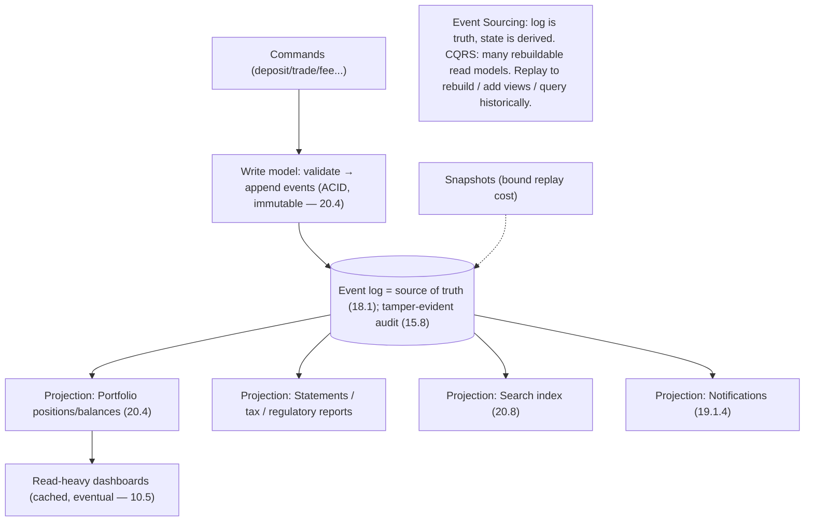

# Lesson 20.7 — CQRS + Event Sourcing for the Ledger & Audit Trail

> Part 20 · Enterprise Capstone · Difficulty: ⚫ · *Capstone*
>
> **Prerequisites:** [18.1 Distributed Log], [12.4 CQRS/Data Management], [9.8 CDC/Outbox], [20.4 Portfolio/Ledger], [15.8 Audit/Compliance], [10.5 Consistency].
> **Unlocks:** [20.8 Search/Recs], [20.12 Observability].

---

## 1. Learning Objectives

After this lesson you will be able to:

- Apply **Event Sourcing** (store state as an immutable sequence of events) to the ledger + audit trail (18.1/20.4).
- Apply **CQRS** (separate write and read models — 12.4) to serve fast, varied read views from the event log.
- Explain how event sourcing gives a **tamper-evident audit trail** "for free" — a compliance requirement (15.8/SOX).
- Build **materialized read models / projections** (portfolio, reporting, search) from the event stream, and rebuild them by **replay** (18.1).
- Handle deep dives: **snapshots**, **eventual consistency** of projections, **schema/versioning** of events, and **why this fits finance**.

---

## 2. Motivation

A financial platform must answer not just **"what is the balance now?"** but **"exactly how did it get there, and can you prove it?"** — a complete, immutable, **auditable history** (15.8/SOX). It must also serve **many different read shapes** (dashboards, statements, tax reports, search) from the same financial truth, fast. **Event Sourcing + CQRS** (12.4/18.1) answer both: store the truth as an **immutable event log** (audit) and derive **multiple optimized read models** from it (CQRS). This lesson formalizes the write/read split introduced in 20.4.

---

## 3. The design (framework — 1.3.1)

### 3.1 Event Sourcing (18.1)

`[CS]` Instead of storing only **current state** (and overwriting it), store the **full sequence of state-changing events** as an **immutable, append-only log** `[BP]`:
- The ledger's events (`FundsDeposited`, `OrderExecuted`, `FeeCharged`, `DividendPaid`…) **are** the source of truth; **current state is a fold/replay** over the events (18.1 — "everything is a materialization of the log").
- **Immutable + append-only** → a **complete, tamper-evident audit trail** (never lose history; corrections are new events — 20.4). This directly satisfies **SOX/audit** (15.8) — you can reconstruct any past state + prove how it was reached.
- `[BP]` **Event sourcing = the log is the truth; state is derived.** Audit is a *property of the model*, not a bolt-on.

### 3.2 CQRS (12.4)

`[CS]` **Command Query Responsibility Segregation** — separate the **write model** from the **read model(s)** `[BP]`:
- **Write side (command):** validate + append events to the log (the ledger — strongly consistent, the source of truth — 20.4).
- **Read side (query):** one or more **materialized read models / projections** built by **consuming the event stream**, each **shaped for its queries** (portfolio positions, account statements, tax reports, search index — 20.8). Read models are **derived, cached, eventually consistent** (10.5).
- `[BP]` **CQRS lets each read view be optimized independently** from the write model — the portfolio dashboard, reporting, and search each get a purpose-built projection, all fed from the one event log.

### 3.3 Projections + replay (18.1)

`[BP]`
- A **projection** consumes events (via the log / CDC — 9.8) and **materializes** a read model (e.g., "current positions per account"). Multiple projections, each independent.
- **Rebuildable by replay:** since the event log is complete + immutable, you can **rebuild any read model from scratch** by replaying events (18.1) — invaluable for fixing a corrupted projection, adding a **new** read view, or migrating (bug in a projection? fix the code + replay).
- **Snapshots:** replaying from the beginning is expensive for long-lived accounts → periodically **snapshot** current state so rebuild = latest snapshot + replay the tail (like 19.2.1 docs op-log — 18.1).
- `[BP]` **Projections + replay + snapshots** = flexible, rebuildable read models over an immutable truth.

### 3.4 Why this fits finance

`[BP]`
- **Audit for free** (§3.1): the immutable event log **is** the audit trail (15.8/SOX) — the biggest reason ES fits finance.
- **Temporal queries:** "what was the balance on date X?" = replay to that point — natural with events.
- **Correctness:** append-only + compensating events (never mutate) matches the **double-entry immutable ledger** (20.4).
- **Multiple consumers:** reporting, search, recs, notifications all derive from the same event stream (event-driven — Part 9) — no coupling to the write model.
- `[BP]` ES/CQRS is a **natural fit for a ledger-centric financial platform** — it's how 20.4's write/read split is actually implemented.

### 3.5 Deep dives + bottlenecks

`[BP]`
- **Eventual consistency of read models** (10.5): projections lag the write log slightly → reads may be a moment stale. Acceptable for dashboards/reports; **never** authorize a money operation off a lagging projection — check the authoritative write side (20.4).
- **Event schema evolution** (4.3.1): events are stored forever → must **version** them + handle old formats on replay (schema evolution — 4.3.1). A real operational concern.
- **Snapshots** (§3.3): bound replay cost for long histories.
- **Complexity:** ES/CQRS is **more complex** than CRUD — justified here by audit + multi-view + correctness needs, **not** something to apply everywhere (`[OPINION]` — overkill for simple contexts; use plain CRUD for those).
- **Rebuild/replay cost:** large logs → snapshot + parallel replay; the log itself must be durable + retained (18.1).
- **Bottleneck:** projection lag under high write rates → scale projection workers + partition (7.3); write side is append-only (fast — 18.1).
- `[BP]` **The lesson:** ledger + audit = **Event Sourcing (immutable event log = truth + tamper-evident audit — 15.8) + CQRS (multiple purpose-built, rebuildable, eventually-consistent read projections — 12.4)**, with **snapshots** for replay cost and **event versioning** for evolution. It implements 20.4's write/read split and feeds reporting/search/recs — but apply it **only where audit/multi-view/correctness justify the complexity**.

---

## 4. Visual Intuition

---

## 5. Real-World Analogy

Think of a **bank's transaction journal versus the many reports printed from it**.

- **Event sourcing = the journal of every transaction, in order, never erased:** the bank doesn't just keep your **current balance** — it keeps the **entire ordered history** of deposits, withdrawals, trades, and fees. Your balance is simply the **running total** of that journal. Because nothing is erased, an auditor can **replay the journal** and prove exactly how you got to today's number — and even reconstruct **last March's** balance by replaying up to that date.
- **CQRS = different reports from one journal:** from that single journal, the bank prints a **monthly statement**, a **tax summary**, a **performance chart**, and a **searchable index** — each **formatted for its purpose**, all derived from the same source of truth. Nobody recomputes them from scratch every time; each is a **maintained projection**.
- **Snapshots = period-opening balances:** rather than replaying from the day you opened the account, the bank keeps **month-opening balances** so it only replays this month's entries — much faster.
- **Rebuild by replay = reprinting a report after fixing a formula:** if the tax report had a bug, they fix the formula and **re-derive it from the journal** — the truth was never lost.
- **Don't do this for everything:** you wouldn't keep an immutable journal of every time someone changes their profile photo — that's overkill. Reserve it for the money.

---

## 6. Industry Example

- **Event sourcing for financial ledgers** `[CONV]`: immutable event log as the source of truth + audit (§3.1, 18.1). *(Representative.)*
- **CQRS with materialized read models** `[CONV]`: separate optimized read projections from the write log (§3.2, 12.4). *(Representative.)*
- **Replay to rebuild projections / add views** `[CONV]`: reprocessing the immutable log (§3.3, 18.1). *(Representative.)*
- **Snapshots + event versioning** `[CONV]`: bounding replay cost + schema evolution (§3.3/3.5, 4.3.1). *(Representative.)*

---

## 7. Implementation Details

- **Event sourcing:** append immutable events (the ledger — 20.4) as the source of truth (18.1); corrections = new events (§3.1).
- **CQRS:** write side appends events; read side = multiple projections (portfolio/reporting/search/notifications) built from the stream (12.4/9.8) (§3.2/3.3).
- **Projections** rebuildable by replay; **snapshots** to bound cost; **version events** for evolution (4.3.1) (§3.3/3.5).
- **Eventual consistency** for read models (10.5) — never authorize money off a lagging projection (check write side — 20.4) (§3.5).
- Apply **only where audit/multi-view/correctness justify** the complexity (§3.5).

---

## 8–14. (Condensed)

**Advantages:** tamper-evident audit trail for free (compliance — 15.8/SOX); temporal queries (replay to any point); many optimized read views from one truth; rebuildable projections; natural fit for the immutable ledger (20.4).
**Disadvantages/cautions:** more complex than CRUD; eventual consistency of read models; event schema evolution burden; replay cost (need snapshots); overkill for simple contexts.
**When NOT to:** don't apply ES/CQRS to simple CRUD contexts (over-engineering); don't authorize money off a lagging read model; don't mutate events.
**Common mistakes:** using read models as the source of truth; no snapshots (slow replay); ignoring event versioning (replay breaks); applying ES everywhere; expecting read-your-writes without handling projection lag (10.3).
**Interview Qs:** 🟢 What is event sourcing + why is audit "free"? 🟡 What is CQRS + why separate read/write models? 🔴 How do you rebuild a read model, and handle snapshots + event versioning? ⚫ Design ledger + reporting + search with ES/CQRS; justify where it fits and where it's overkill.
**Production pitfalls:** projection lag (stale reads); replay cost without snapshots; event-schema breakage on replay; unbounded log growth; using stale projections for authorization.
**Optimizations:** snapshots; partitioned/parallel projection workers (7.3); CDC-driven projections (9.8); cache read models (Part 6); versioned events + upcasters; retention/archival of the log.

---

## 15. Summary

A financial platform must answer not just **"what is the balance now?"** but **"exactly how did it get there, and can you prove it?"** — a complete, immutable, **auditable history** (15.8/SOX) — while serving **many read shapes** (dashboards, statements, tax reports, search) fast. **Event Sourcing + CQRS** (18.1/12.4) answer both and **implement 20.4's write/read split**. **Event Sourcing** stores the **full sequence of state-changing events** as an **immutable, append-only log** rather than only current (overwritten) state: the ledger's events (`FundsDeposited`, `OrderExecuted`, `FeeCharged`…) **are** the source of truth, and **current state is a fold/replay** over them ("everything is a materialization of the log" — 18.1) — so the immutable log **is** a **complete, tamper-evident audit trail** (audit is a *property of the model*, not a bolt-on), directly satisfying SOX/audit and matching the **double-entry immutable ledger** (20.4, corrections = new compensating events). **CQRS** separates the **write model** (validate + append events — strongly consistent source of truth) from **read models** — one or more **materialized projections**, each **shaped for its queries** (portfolio positions, statements, tax, search — 20.8), **derived, cached, and eventually consistent** (10.5) — letting each read view be optimized independently, all fed from the one event log. **Projections** consume events (via the log/CDC — 9.8) and are **rebuildable by replay** (fix a corrupted projection, add a **new** read view, or migrate by replaying the immutable log), with **snapshots** to bound replay cost for long-lived accounts (latest snapshot + tail replay — like 19.2.1). This **fits finance** for four reasons: **audit for free**, **temporal queries** ("balance on date X" = replay to that point), **correctness** (append-only + compensating events, never mutate), and **multiple decoupled consumers** (reporting/search/recs/notifications all derive from the same stream). **Deep dives:** projections are **eventually consistent** (never authorize money off a lagging projection — check the authoritative write side — 20.4); **event schema must be versioned** since events live forever and are replayed (4.3.1); **snapshots** bound replay cost; and ES/CQRS is **more complex than CRUD** — justified here by audit + multi-view + correctness but **overkill for simple contexts** (`[OPINION]` — use plain CRUD there). The **bottleneck** — projection lag under high write rates — is handled by scaling/partitioning projection workers (the append-only write side is fast — 18.1). In one line: **Event Sourcing (immutable event log = truth + tamper-evident audit) + CQRS (many purpose-built, rebuildable, eventually-consistent read projections), with snapshots and event versioning — applied where audit/multi-view/correctness justify the complexity**.

---

## 16. Revision Notes (flashcard-ready)

- **Q:** Event sourcing? **A:** Store state as an immutable append-only sequence of events; current state = replay/fold over events (18.1).
- **Q:** Why is audit "free"? **A:** The immutable event log IS the tamper-evident audit trail (SOX — 15.8); corrections are new events, never mutations.
- **Q:** CQRS? **A:** Separate write model (append events) from read model(s) (materialized projections shaped per query) — 12.4.
- **Q:** How build/fix a read view? **A:** A projection consumes events; rebuild by replaying the immutable log (add views, fix bugs, migrate) — 18.1.
- **Q:** Snapshots? **A:** Periodic state snapshots so rebuild = latest snapshot + tail replay (bound replay cost).
- **Q:** Temporal query ("balance on date X")? **A:** Replay events up to that point — natural with ES.
- **Q:** Read-model consistency? **A:** Eventually consistent (lags the log); never authorize money off a lagging projection — check the write side (20.4).
- **Q:** Event versioning? **A:** Events live forever + are replayed → must version + handle old formats (schema evolution — 4.3.1).
- **Q:** When NOT to use ES/CQRS? **A:** Simple CRUD contexts — it's overkill; reserve for audit/multi-view/correctness-critical (the ledger).

---

## 17. Further Reading + Knowledge-Graph Links

**Foundations:** [18.1 Distributed Log] · [12.4 CQRS/Data Management] · [9.8 CDC/Outbox] · [20.4 Portfolio/Ledger] · [15.8 Audit/Compliance] · [4.3.1 Schema Evolution] · [10.5 Consistency].
**External:** Fowler on Event Sourcing/CQRS; Young; Kafka as an event store. *(Representative.)*

> **Knowledge-graph:** `18.1 log` + `12.4 CQRS` + `20.4 ledger` + `15.8 audit` → **`20.7 ES/CQRS`** (immutable event log = truth + audit; rebuildable projections) → implements 20.4 split, feeds 20.8 search/recs.
