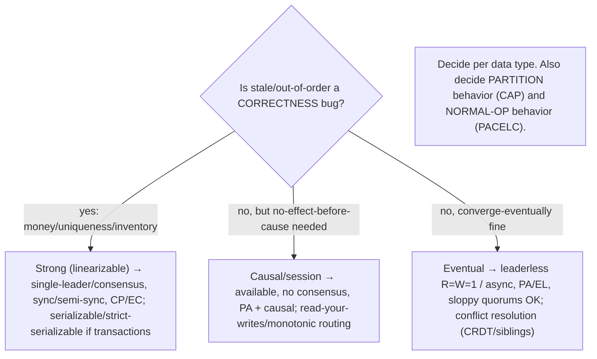

# Reference — Consistency, CAP/PACELC & Replication Decision Tree

Pairs with [Part 10] (10.1–10.9). Core idea: **replication forces consistency-vs-availability-vs-latency tradeoffs; pick the weakest consistency that's still correct per data type; decide behavior both under partition (CAP) and in normal operation (PACELC).**

---

## 1. Replication topologies (10.1)

| Topology | Writes | Pros | Cons |
|---|---|---|---|
| **Single-leader** | all → one leader | no conflicts, simple, strong ordering | leader bottleneck + failover point |
| **Multi-leader** | any leader (per DC) | local writes, multi-DC/offline | write CONFLICTS |
| **Leaderless** | any replica (quorums) | high availability, tunable | eventual, conflicts, quorum subtleties |

**Default: single-leader** (shard for write scale — one leader per shard). Multi-leader for multi-DC/offline. Leaderless (Dynamo) for availability. **Tension: single-orderer (no conflicts) vs write-anywhere (conflicts).**

---

## 2. Sync vs async replication (10.2)

```
Sync : wait for replicas → NO loss on failover (RPO=0), fresh | slower, blocks on slow/down replica (less available)
Async: ack immediately → fast, available | replicas LAG (stale), failover LOSES un-replicated writes (RPO>0)
Semi-sync: one sync replica (durability) + rest async (latency/read-scaling) ← common default
```
Maps to acks/ISR (9.3): acks=all+min-ISR ≈ sync; acks=1 ≈ async. Monitor **replication lag**. It's the PACELC "else" lever (async=EL, sync=EC).

---

## 3. Lag anomalies & session guarantees (10.3)

| Anomaly | Guarantee | Fix |
|---|---|---|
| "I don't see my own write" | **Read-your-writes** | read own recent data from leader/caught-up replica |
| Data "goes backward" | **Monotonic reads** | sticky reads (pin to one replica) / read-timestamp |
| Effect before cause (reply before question) | **Consistent prefix** | causal tracking / related writes → same partition |

Session/client-centric guarantees: make ONE client's experience sensible; between eventual and strong; combined ≈ causal; cheap (no consensus).

---

## 4. Conflict detection & resolution (10.4)

- **Detect:** version vectors (8.2.2) — neither dominates → concurrent (conflict); one dominates → ordered (supersede). NOT timestamps.
- **Resolve:**
  - **LWW** — keep highest timestamp — simple but **LOSSY** + clock-skew-prone (use logical ts; loss-tolerant data only).
  - **Siblings + app merge** — keep both, domain merge (union carts) — no loss, needs merge logic.
  - **CRDTs** — commutative/associative/idempotent → auto-merge, no loss, no coordination (strong eventual consistency); counters/sets/sequences/registers.
- **CRDTs CANNOT enforce global invariants** (uniqueness, non-negative balance) → need consensus/single-leader.

---

## 5. Consistency spectrum (10.5)

```
Eventual → Session guarantees → Causal → Sequential → Strong/Linearizable
(weaker: cheaper, available, anomalies)  →  (stronger: coordination, latency, less available)
```
- **Linearizable:** single-copy illusion, real-time recency; needs consensus.
- **Causal:** happens-before preserved (no effect-before-cause); NO consensus → available. **SWEET SPOT.**
- **Eventual:** converge if writes stop; cheapest/most available; anomalies + conflicts.
- **Rule:** choose the WEAKEST consistency that's still correct per data type; confine strong to a small core.

---

## 6. Linearizability vs Serializability (10.6)

| | Linearizability | Serializability |
|---|---|---|
| About | single-object **recency** in real time | **transaction isolation** |
| Guarantee | reads latest; real-time order (single copy) | txns ≡ some serial order (not necessarily real-time) |
| World | replication (CAP-C) | ACID isolation (5.2.2) |
| From | consensus/leader read | 2PL/SSI |

- **Orthogonal:** serializable-not-linearizable (stale replica reads); linearizable-not-serializable (single-object KV, no txns).
- **Strict serializability = both** (Spanner "external consistency" — 8.2.4). **CAP's "C" = linearizability** (NOT serializability).

---

## 7. CAP (10.7)

```
Under a PARTITION: choose Consistency (linearizable) OR Availability — not both.
P is NOT optional (partitions happen) → real choice is C or A → systems are CP or AP. "CA" is not real.
```
- **CP:** refuse on minority side (ZooKeeper/etcd, Spanner, single-leader strong). Money/coordination.
- **AP:** stay available, reconcile later (Dynamo/Cassandra, DNS). Carts/feeds.
- **Myths:** "pick 2 of 3" (P mandatory), "C = any consistency" (it's linearizability), CAP covers normal ops (it doesn't — use PACELC).

---

## 8. PACELC (10.8) — the fuller framing

```
IF Partition → Availability or Consistency   [= CAP]
ELSE (normal operation, ~always) → Latency or Consistency   [CAP ignores this!]
```
- **Key insight:** consistency costs latency even without a partition (coordination on every write). Partitions rare → the "else" tradeoff matters MORE daily.
- **PA/EL:** Dynamo/Cassandra/Riak (available + fast, eventual).
- **PC/EC:** Spanner/VoltDB (consistent in both, accept latency + unavailability).
- **Else lever = sync/async replication (10.2); If-P lever = quorum/consensus. Decide BOTH per data type.**

---

## 9. Quorum tuning & sloppy quorums (10.9)

- **N/R/W** (leaderless): `R+W>N` → read sees latest write. Tune per operation:
  - `R=W=majority` (balanced/strong-ish) · `W=N,R=1` (read-heavy) · `R=N,W=1` (write-heavy) · `R=W=1` (eventual, max available).
  - Higher R/W = stronger consistency, higher latency, lower availability. **= the CAP/PACELC dial per operation.**
- **Quorum ≠ linearizability** — need conflict resolution (10.4) + read repair + anti-entropy (or a leader/consensus for true linearizability).
- **Sloppy quorum:** write to any W REACHABLE nodes (non-home) during failure → stay writable (AP); weakens the read guarantee.
- **Hinted handoff:** non-home node stores write + hint → delivers to home replica on recovery → converge.

---

## 10. Decision flow



---

## 11. Red flags

- Multi-leader/leaderless **without conflict resolution** → silent loss/divergence.
- **Wall-clock LWW** for important data → skew-induced silent loss.
- **Async replication assuming no failover loss** (RPO>0).
- Reading freshness-critical data (money) from **lagging replicas**.
- Serving a user's own write from a **lagging replica** (read-your-writes violation → retries/duplicates).
- **Strong consistency everywhere** (needless latency/availability loss) OR **eventual for money** (correctness bugs).
- **CRDTs/eventual to enforce invariants** (uniqueness/balance) — impossible; need consensus.
- **"pick 2 of 3"** / "C = any consistency" / claiming "CA" for a distributed system.
- Ignoring the **PACELC "else"** (normal-op latency-vs-consistency) — the everyday tradeoff.
- **`R+W≤N` expecting consistency**; **sloppy quorums** unaware of weakened guarantee; **even N**.
- Conflating **linearizability and serializability** ("strong consistency" gives both — it doesn't).

---

*Cross-references: [10.1–10.9], [8.1.1 partitions], [8.1.2 clocks/LWW], [8.2.2 vector clocks/CRDTs], [8.2.3 total vs partial order], [8.2.4 Spanner/TrueTime], [8.3 consensus], [8.3.4 quorums], [5.2.2 isolation/serializability], [5.4.2 replicas/failover], [7.5 read scaling], [9.8 CDC], [Part 11 fault tolerance], [Part 13 multi-region], [Part 18 Dynamo/Spanner], [Part 20 capstone].*
