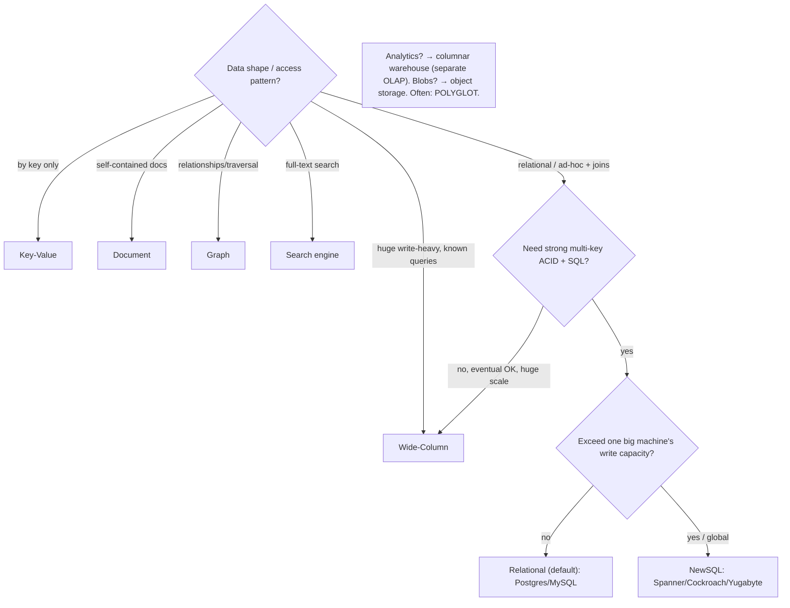

# Reference — Database Selection Decision Tree

Pairs with [Part 5 Module 5.1 & 5.4] (5.1.1, 5.1.3, 5.4.1). Choose by **requirements**, not labels (1.1.5). The answer is often **polyglot** (5.1.3) — multiple stores for different parts.

---

## 1. Selection order (most decisive first)

```
1. Data model / access patterns (5.1.1)  ← biggest signal
2. Transactions & consistency needs (5.2 / Part 10)
3. Scale: will you exceed one big machine's WRITE capacity? (Part 7)
4. Operational reality: team expertise, maturity, managed service, cost (Part 14)
→ Default to a mature relational DB unless a concrete driver points elsewhere; consider polyglot.
```

---

## 2. Data model → store (5.1.1)

| Access pattern / data shape | Model | Examples (representative) |
|---|---|---|
| Ad-hoc queries, joins, transactions | **Relational** | Postgres, MySQL |
| Self-contained objects, flexible schema | **Document** | MongoDB, Couchbase |
| Get/put by key only (cache, session, lookup) | **Key-value** | Redis, Memcached, DynamoDB-KV |
| Massive write-heavy, known access patterns (time-series, events) | **Wide-column** | Cassandra, ScyllaDB, HBase, Bigtable |
| Relationship traversal, connected data | **Graph** | Neo4j, Neptune |
| Full-text / faceted search | **Search** | Elasticsearch, OpenSearch |
| Analytics / aggregation over huge data (OLAP) | **Columnar / warehouse** | BigQuery, Redshift, Snowflake |
| Large blobs (media, backups, files) | **Object storage** | S3, GCS, Azure Blob (4.1.3/4.3.2) |

---

## 3. SQL vs NoSQL vs NewSQL (5.4.1)

| | SQL (Relational) | NoSQL | NewSQL |
|---|---|---|---|
| Transactions | full ACID | often eventual/limited (BASE) | distributed ACID |
| Consistency | strong | often eventual (Part 10) | strong (coordination cost) |
| Joins/SQL | yes | usually no | yes |
| Scaling | vertical + replicas; sharding hard | horizontal (built-in) | horizontal (built-in) |
| Schema | rigid/enforced | flexible/none | rigid/enforced |
| Best for | transactional, complex queries (**default**) | huge scale, flexible/simple access | ACID + SQL **at scale** |

> Myths: "SQL can't scale" (it scales hugely — only horizontal *write* scaling is hard), "NoSQL is faster" (for its patterns, because it does less), "NewSQL is free" (pays coordination latency).

---

## 4. Decision flow



---

## 5. Scale the easy way first (5.4.2, Part 7)

Before sharding/NoSQL/NewSQL, a relational DB scales a long way:
1. **Vertical** (bigger machine).
2. **Read replicas** + read/write splitting (scales **reads**, not writes; mind lag/read-your-writes).
3. **Caching** (Part 6) to offload reads.
4. **Connection pooler** (avoid connection exhaustion — 3.3.4/5.4.2).
5. Only then: **sharding** (Part 7) or **NewSQL/NoSQL** for write scale.

---

## 6. Polyglot building blocks (5.1.3)

| Concern | Store |
|---|---|
| Transactional system of record | Relational (or NewSQL at scale) |
| Cache / sessions | Key-value (Redis) — Part 6 |
| Full-text search | Search engine (Elasticsearch) |
| Analytics (OLAP) | Columnar warehouse (separate from OLTP) |
| Time-series / events | Wide-column / time-series |
| Recommendations / fraud | Graph |
| Blobs / media / backups | Object storage (+ CDN) |

**Rules:** one **source of truth** per datum; sync via **CDC / outbox** (not dual writes); accept bounded **eventual consistency** across stores (Part 10).

---

## 7. Red flags

- Choosing by **buzzword** instead of requirements.
- **Premature NoSQL** "to scale" when replicas + caching would do → losing ACID/joins for nothing.
- **Premature polyglot** → operational burden before there's a real access-pattern need.
- **Schemaless = no schema** → app-side inconsistency.
- **Adopting NewSQL** single-region/moderate-scale → coordination latency for no benefit.
- **A store the team can't operate** (backups, failover, upgrades) → reliability risk (Part 14).
- **Running analytics on the OLTP database** → degrades operations (separate OLAP).

---

*Cross-references: [5.1.1 Data Models], [5.1.3 Polyglot], [5.4.1 SQL/NoSQL/NewSQL], [5.4.2 replicas/failover], [4.2.4 B-tree vs LSM], [Part 6 Caching], [Part 7 Scalability], [Part 10 Consistency], [Part 18 case studies].*
